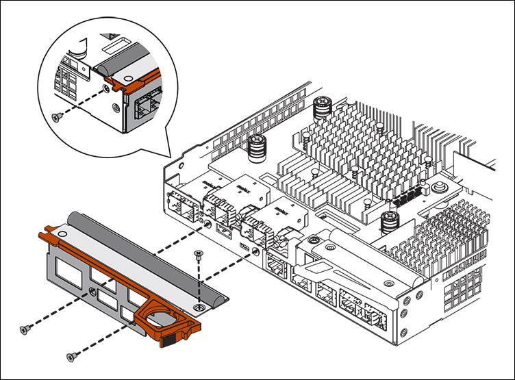
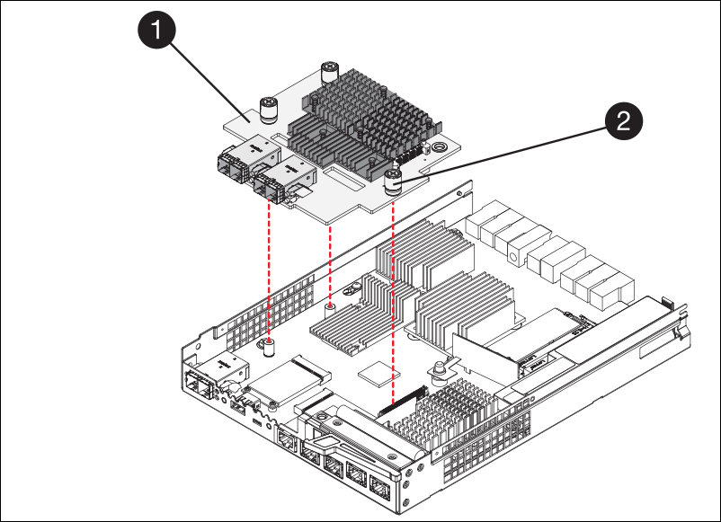
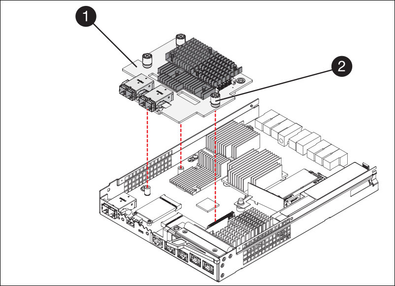

//HIC replacement procedure for E2800 series controllers

== Move HIC to new controller, if needed
.Steps

 . If the failed controller includes a host interface card (HIC), move the HIC from the failed controller to the replacement controller.
+
A separate HIC is used for the E2800B controller only. The HIC is mounted to the main controller board and includes two SPF connectors.  
+
NOTE: The illustrations in this procedure show a 2-port HIC. The HIC in your controller might have a different number of ports.  

 . If the controller does not have a HIC (E2800A), replace the controller cover. If the controller does have a HIC (E2800B), proceed to <<move_the_HIC_to_the_replacement_controller, move the HIC from the failed controller to the replacement controller>>.

 .. [[move_the_HIC_to_the_replacement_controller]]If equipped with a HIC, move the HIC from the failed controller to the replacement controller.
.. Remove any SFPs from the HIC.
.. Using a #1 Phillips screwdriver, remove the screws that attach the HIC faceplate to the controller.
+
There are four screws: one on the top, one on the side, and two on the front.
+

.. Remove the HIC faceplate.
.. Using your fingers or a Phillips screwdriver, loosen the three thumbscrews that secure the HIC to the controller card.
.. Carefully detach the HIC from the controller card by lifting the card up and sliding it back.
+
CAUTION: Be careful not to scratch or bump the components on the bottom of the HIC or on the top of the controller card.
+

+
[cols="1a,2a" options="header"]
|===
| Label| Description
a|
1
a|
Host interface card
a|
2
a|
Thumbscrews
|===

.. Place the HIC on a static-free surface.
.. Using a #1 Phillips screwdriver, remove the four screws that attach the blank faceplate to the replacement controller, and remove the faceplate.
.. Align the three thumbscrews on the HIC with the corresponding holes on the replacement controller, and align the connector on the bottom of the HIC with the HIC interface connector on the controller card.
+
Be careful not to scratch or bump the components on the bottom of the HIC or on the top of the controller card.

.. Carefully lower the HIC into place, and seat the HIC connector by pressing gently on the HIC.
+
CAUTION: *Possible equipment damage* -- Be very careful not to pinch the gold ribbon connector for the controller LEDs between the HIC and the thumbscrews.
+

+
[cols="1a,2a" options="header"]
|===
| Label| Description
a|
1
a|
Host interface card
a|
2
a|
Thumbscrews
|===

.. Hand-tighten the HIC thumbscrews.
+
Do not use a screwdriver, or you might over tighten the screws.

.. Using a #1 Phillips screwdriver, attach the HIC faceplate you removed from the original controller to the new controller with four screws.
+

.. Reinstall any removed SFPs into the HIC.