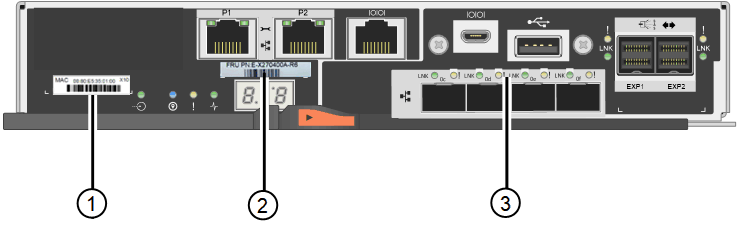

//E2800 series controllers ports 

These figures shows the E2800A controller and the E2800B controller. The procedure for replacing the E2800 series controllers and the EF570 controller is identical.

*E2800A storage controller*

image::../media/e2800_labels_on_controller.gif[MAC and FRU labels on E2800A controller]

*E2800B storage controller*

[cols="1a,2a,3a" options=header] 
|===
| Label| component| Description
a|
1
a|
MAC address
a|
The MAC address for management port 1 ("`P1 on the E2800A and 0a on the E2800B`"). If you used DHCP to obtain the original controller's IP address, you will need this address to connect to the new controller.
a|
2
a|
FRU part number
a|
The FRU part number. This number must match the replacement part number for the currently installed controller.
a|
3
a|
4-port HIC
a|
The 4-port host interface card (HIC). This card must be moved to the new controller when you perform the replacement. 

*Note*: the E2800A controller does not have a HIC. 
|===