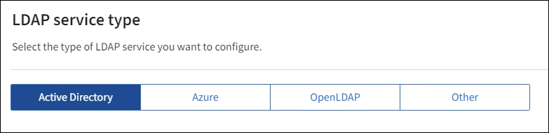
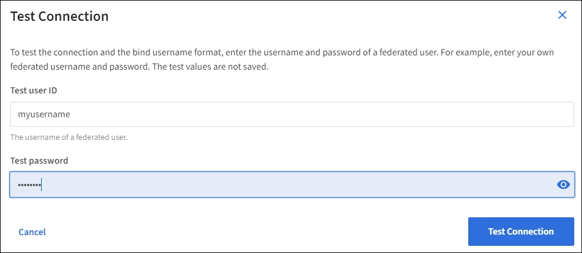

//These are the shared steps for configuring identity federation in the tenant manager and the grid manager//

. Select *Enable identity federation*.
. In the LDAP service type section, select the type of LDAP service you want to configure.
+

+
Select *Other* to configure values for an LDAP server that uses Oracle Directory Server.

. If you selected *Other*, complete the fields in the LDAP Attributes section. Otherwise, go to the next step.
 ** *User Unique Name*: The name of the attribute that contains the unique identifier of an LDAP user. This attribute is equivalent to `sAMAccountName` for Active Directory and `uid` for OpenLDAP. If you are configuring Oracle Directory Server, enter `uid`.
 ** *User UUID*: The name of the attribute that contains the permanent unique identifier of an LDAP user. This attribute is equivalent to `objectGUID` for Active Directory and `entryUUID` for OpenLDAP. If you are configuring Oracle Directory Server, enter `nsuniqueid`. Each user's value for the specified attribute must be a 32-digit hexadecimal number in either 16-byte or string format, where hyphens are ignored.
 ** *Group Unique Name*: The name of the attribute that contains the unique identifier of an LDAP group. This attribute is equivalent to `sAMAccountName` for Active Directory and `cn` for OpenLDAP. If you are configuring Oracle Directory Server, enter `cn`.
 ** *Group UUID*: The name of the attribute that contains the permanent unique identifier of an LDAP group. This attribute is equivalent to `objectGUID` for Active Directory and `entryUUID` for OpenLDAP. If you are configuring Oracle Directory Server, enter `nsuniqueid`. Each group's value for the specified attribute must be a 32-digit hexadecimal number in either 16-byte or string format, where hyphens are ignored.

. For all LDAP service types, enter the required LDAP server and network connection information in the Configure LDAP server section.
 ** *Hostname*: The fully qualified domain name (FQDN) or IP address of the LDAP server.
 ** *Port*: The port used to connect to the LDAP server.
+
NOTE: The default port for STARTTLS is 389, and the default port for LDAPS is 636. However, you can use any port as long as your firewall is configured correctly.

 ** *Username*: The full path of the distinguished name (DN) for the user that will connect to the LDAP server.
+
For Active Directory, you can also specify the Down-Level Logon Name or the User Principal Name.
+
The specified user must have permission to list groups and users and to access the following attributes:

  *** `sAMAccountName` or `uid`
  *** `objectGUID`, `entryUUID`, or `nsuniqueid`
  *** `cn`
  *** `memberOf` or `isMemberOf`
  *** *Active Directory*: `objectSid`, `primaryGroupID`, `userAccountControl`, and `userPrincipalName`
  *** *Azure*: `accountEnabled` and `userPrincipalName`

 ** *Password*: The password associated with the username.
 ** *Group Base DN*: The full path of the distinguished name (DN) for an LDAP subtree you want to search for groups. In the Active Directory example (below), all groups whose Distinguished Name is relative to the base DN (DC=storagegrid,DC=example,DC=com) can be used as federated groups.
+
NOTE: The *Group unique name* values must be unique within the *Group Base DN* they belong to.

 ** *User Base DN*: The full path of the distinguished name (DN) of an LDAP subtree you want to search for users.
+
NOTE: The *User unique name* values must be unique within the *User Base DN* they belong to.

** *Bind username format* (optional): The default username pattern StorageGRID should use if the pattern cannot be determined automatically.
+
Providing *Bind username format* is recommended because it can allow users to sign in if StorageGRID is unable to bind with the service account.
+
Enter one of these patterns:
+
*** *UserPrincipalName pattern (Active Directory and Azure)*: `[USERNAME]@_example_.com`
*** *Down-level logon name pattern (Active Directory and Azure)*: `_example_\[USERNAME]`
*** *Distinguished name pattern*: `CN=[USERNAME],CN=Users,DC=_example_,DC=com`
+
Include *[USERNAME]* exactly as written.

. In the Transport Layer Security (TLS) section, select a security setting.

 ** *Use STARTTLS*: Use STARTTLS to secure communications with the LDAP server. This is the recommended option for Active Directory, OpenLDAP, or Other, but this option is not supported for Azure.

 ** *Use LDAPS*: The LDAPS (LDAP over SSL) option uses TLS to establish a connection to the LDAP server. You must select this option for Azure.
 ** *Do not use TLS*: The network traffic between the StorageGRID system and the LDAP server will not be secured. This option is not supported for Azure.
+
NOTE: Using the *Do not use TLS* option is not supported if your Active Directory server enforces LDAP signing. You must use STARTTLS or LDAPS.

. If you selected STARTTLS or LDAPS, choose the certificate used to secure the connection.
 ** *Use operating system CA certificate*: Use the default Grid CA certificate installed on the operating system to secure connections.
 ** *Use custom CA certificate*: Use a custom security certificate.
+
If you select this setting, copy and paste the custom security certificate into the CA certificate text box.

=== Test the connection and save the configuration
After entering all values, you must test the connection before you can save the configuration. StorageGRID verifies the connection settings for the LDAP server and the bind username format, if you provided one.

.  Select *Test connection*.

. If you did not provide a bind username format:
+
* A "`Test connection successful`" message appears if the connection settings are valid. Select *Save* to save the configuration.
+
* A "`test connection could not be established`" message appears if the connection settings are invalid. Select *Close*. Then, resolve any issues and test the connection again.

. If you provided a bind username format, enter the username and password of a valid federated user.
+
For example, enter your own username and password. Do not include any special characters in the username, such as @ or /.
+

+
* A "`Test connection successful`" message appears if the connection settings are valid. Select *Save* to save the configuration.
+
* An error message appears if the connection settings, bind username format, or test username and password are invalid. Resolve any issues and test the connection again.
