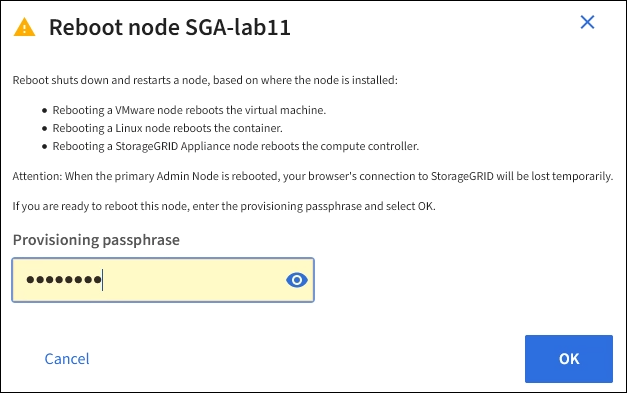

.Steps

. Select *NODES*.
. Select the grid node you want to reboot.
. Select the *Tasks* tab.
+
image::../media/maintenance_mode.png[Nodes > Tasks > Reboot button]
. Select *Reboot*.
+
A confirmation dialog box appears.
+

+
NOTE: If you are rebooting the primary Admin Node, the confirmation dialog box reminds you that your browser's connection to the Grid Manager will be lost temporarily when services are stopped.

. Enter the provisioning passphrase, and click *OK*.
. Wait for the node to reboot.
+
It might take some time for services to shut down.
+
When the node is rebooting, the gray icon (Administratively Down) appears on the left side of the *Nodes* page. When all services have started again and the node is successfully connected to the grid, the *Nodes* page should display a normal status (no icons to the left of the node name), indicating that no alerts are active and the node is connected to the grid.
