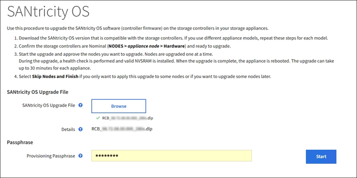

//steps for upgrading the SANtricity OS on storage controllers using the Grid Manager. For the SG5600, SG5700, and SG6000.

[.lead]
For storage controllers currently using SANtricity OS 08.42.20.00 (11.42) or newer, you must use the Grid Manager to apply an upgrade.

.What you'll need

* You have consulted the NetApp Interoperability Matrix Tool (IMT) to confirm that the SANtricity OS version you are using for the upgrade is compatible with your appliance.
* You have the Maintenance or Root access permission.
* You are signed in to the Grid Manager using a xref:../admin/web-browser-requirements.adoc[supported web browser].
* You have the provisioning passphrase.
* You have access to the NetApp downloads page for SANtricity OS.

.About this task

You cannot perform other software updates (StorageGRID software upgrade or a hotfix) until you have completed the SANtricity OS upgrade process. If you attempt to start a hotfix or a StorageGRID software upgrade before the SANtricity OS upgrade process has finished, you are redirected to the SANtricity OS upgrade page.

The procedure will not be complete until the SANtricity OS upgrade has been successfully applied to all applicable nodes that have been selected for the upgrade. It might take more than 30 minutes to load the SANtricity OS on each node (sequentially) and up to 90 minutes to reboot each StorageGRID storage appliance.

CAUTION: The following steps are only applicable when you are using the Grid Manager to perform the upgrade. The storage controllers in the appliance cannot be upgraded using the Grid Manager when the controllers are using SANtricity OS older than 08.42.20.00 (11.42).

NOTE: This procedure will automatically upgrade the NVSRAM to the most recent version associated with the SANtricity OS upgrade. You do not need to apply a separate NVSRAM upgrade file.

.Steps

. [[download_santricity_os]] Download the new SANtricity OS Software file from the NetApp support site.
+
Be sure to choose the SANtricity OS version for your storage controllers.
+
https://mysupport.netapp.com/site/products/all/details/eseries-santricityos/downloads-tab[NetApp Downloads: SANtricity OS^]

. Select *MAINTENANCE* > *System* > *Software update*.

+
image::../media/software_update_landing.png[Software Update Landing Page]

. In the SANtricity OS update section, select *Update*.
+
The SANtricity OS upgrade page appears.
+
image::../media/santricity_os_upgrade_first.png[screenshot showing StorageGRID first SANtricity OS page]

. Select the SANtricity OS upgrade file you downloaded from the NetApp support site.
 .. Select *Browse*.
 .. Locate and select the file.
 .. Select *Open*.
+
The file is uploaded and validated. When the validation process is done, the file name is shown next to the *Browse* button.
+
NOTE: Do not change the file name since it is part of the verification process.
+
[SANtricity OS upgrade valid file]
. Enter the provisioning passphrase.
+
The *Start* button is enabled.
+

. Select *Start*.
+
A warning box appears stating that your browser's connection might be lost temporarily as services on nodes that are upgraded are restarted.
+
image::../media/santricity_upgrade_warning.png[screenshot showing connection will be temporarily lost dialog box]

. Select *OK* to stage the SANtricity OS upgrade file to the primary Admin Node.
+
When the SANtricity OS upgrade starts:

 .. The health check is run. This process checks that no nodes have the status of Needs Attention.
+
NOTE: If any errors are reported, resolve them and select *Start* again.

 .. The SANtricity OS Upgrade Progress table appears. This table shows all Storage Nodes in your grid and the current stage of the upgrade for each node.
+
NOTE: The table shows all appliance Storage Nodes. Software-based Storage Nodes are not displayed. Select *Approve* for all nodes that require the upgrade.

+
image::../media/santricity_upgrade_progress_table.png[screenshot showing the SANtricity OS Upgrade Progress part of the SANtricity OS Upgrade page]

. Optionally, sort the list of nodes in ascending or descending order by *Site*, *Name*, *Progress*, *Stage*, *Details*, or *Current Controller Firmware Version*. Or, enter a term in the *Search* box to search for specific nodes.
+
You can scroll through the list of nodes by using the left and right arrows at the bottom right corner of the section.

. Approve the grid nodes you are ready to add to the upgrade queue. Approved nodes of the same type are upgraded one at a time. 
+
IMPORTANT: Do not approve the SANtricity OS upgrade for an appliance storage node unless you are sure the node is ready to be stopped and rebooted. When the SANtricity OS upgrade is approved on a node, the services on that node are stopped and the upgrade process begins. Later, when the node is finished upgrading, the appliance node is rebooted. These operations might cause service interruptions for clients that are communicating with the node.

 ** Select either of the *Approve All* buttons to add all Storage Nodes to the SANtricity OS upgrade queue. 
+
NOTE: If the order in which nodes are upgraded is important, approve nodes or groups of nodes one at a time and wait until the upgrade is complete on each node before approving the next node(s).

+
** Select one or more *Approve* buttons to add one or more nodes to the SANtricity OS upgrade queue.

+
After you select *Approve*, the upgrade process determines if the node can be upgraded. If a node can be upgraded, it is added to the upgrade queue. 

+
For some nodes, the selected upgrade file is intentionally not applied and you can complete the upgrade process without upgrading these specific nodes. Nodes intentionally not upgraded show a stage of Complete (upgrade attempted) and list the reason the node was not upgraded in the Details column. 

[start=10]
. If you need to remove a node or all nodes from the SANtricity OS upgrade queue, select *Remove* or *Remove All*.

+
When the stage progresses beyond Queued, the *Remove* button is hidden and you can no longer remove the node from the SANtricity OS upgrade process. 

[start=11]
. Wait while the SANtricity OS upgrade is applied to each approved grid node.

* If any node shows a stage of Error while the SANtricity OS upgrade is being applied, the upgrade has failed for the node. With the assistance of technical support, you might need to place the appliance in maintenance mode to recover it.

* If the firmware on the node is too old to be upgraded with the Grid Manager, the node shows a stage of Error with the details: "`You must use maintenance mode to upgrade SANtricity OS on this node. See the installation and maintenance instructions for your appliance. After the upgrade, you can use this utility for future upgrades.`" To resolve the error, do the following:

 .. Use maintenance mode to upgrade SANtricity OS on the node that shows a stage of Error.
 .. Use the Grid Manager to restart and complete the SANtricity OS upgrade.

+
When the SANtricity OS upgrade is complete on all approved nodes, the SANtricity OS Upgrade Progress table closes and a green banner shows the date and time the SANtricity OS upgrade was completed.

image::../media/santricity_upgrade_finish_banner.png[screenshot of SANtricity OS upgrade page after the upgrade completes]

[start=12]
. If a node cannot be upgraded, note the reason shown in the Details column and take the appropriate action:

* "`Storage Node was already upgraded.`"
No further action required.

* "`SANtricity OS upgrade is not applicable to this node.`"
The node does not have a storage controller that can be managed by the StorageGRID system. Complete the upgrade process without upgrading the node displaying this message.

* "`SANtricity OS file is not compatible with this node.`"
The node requires a SANtricity OS file different than the one you selected.
After completing the current upgrade, download the correct SANtricity OS file for the node and repeat the upgrade process.

IMPORTANT: The SANtricity OS upgrade process will not be complete until you approve the SANtricity OS upgrade on all the listed Storage Nodes.

[start=13]
[Skip Nodes and Finish,Skip Nodes and Finish]
. If you want to end approving nodes and return to the SANtricity OS page to allow for an upload of a new SANtricity OS file, do the following: 

.. Select *Skip Nodes and Finish*. 
+

A warning appears asking if you are sure you want to finish the upgrade process without upgrading all nodes. 

+
[start=2]
.. Select *OK* to return to the *SANtricity OS* page.
.. When you are ready to continue approving nodes, go to <<download_santricity_os,Download the SANtricity OS>> to restart the upgrade process.

+
NOTE: Nodes already approved and upgraded without errors remain upgraded. 

[start=14]
. Repeat this upgrade procedure for any nodes with a stage of Complete that require a different SANtricity OS upgrade file.

+
NOTE: For any nodes with a status of Needs Attention, use maintenance mode to perform the upgrade.

+
NOTE: When you repeat the upgrade procedure, you have to approve previously upgraded nodes.