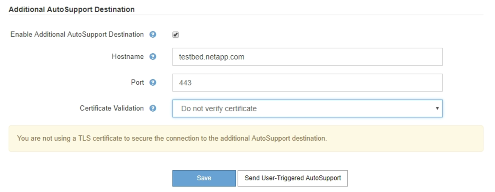
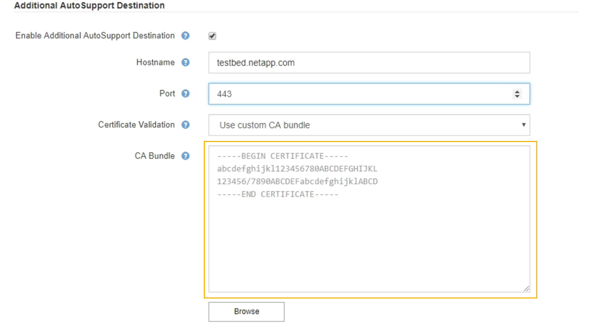

= Adding an additional AutoSupport destination
:icons: font
:imagesdir: ../media/

[.lead]
When you enable AutoSupport, heath and status messages are sent to NetApp support. You can specify one additional destinations for all AutoSupport messages.

* You must be signed in to the Grid Manager using a supported browser.
* You must have the Root Access or Other Grid Configuration permission.

To verify or change the protocol used to send AutoSupport messages, see the instructions for specifying an AutoSupport protocol.

NOTE: You cannot use the SMTP protocol to send AutoSupport messages to an additional destination.

xref:specifying_protocol_for_autosupport_messages.adoc[Specifying the protocol for AutoSupport messages]

. Select *Support* > *Tools* > *AutoSupport*.
+
The AutoSupport page appears with the *Settings* tab selected.

. Select *Enable additional AutoSupport destination*.
+
The Additional AutoSupport Destination fields appear.
+

. Enter the server hostname or IP address of an additional AutoSupport destination server.
+
NOTE: You can enter only one additional destination.

. Enter the port used to connect to an additional AutoSupport destination server (default is port 80 for HTTP or port 443 for HTTPS).
. To send your AutoSupport messages with certificate validation, select *Use custom CA bundle* in the *Certificate Validation* drop-down. Then, do one of the following:
 ** Use an editing tool to copy and paste all the contents of each of the PEM-encoded CA certificate files into the *CA bundle* field, concatenated in certificate chain order. You must include ----BEGIN CERTIFICATE---- and ----END CERTIFICATE---- in your selection.
+

 ** Select *Browse*, navigate to the file containing the certificates, and then select *Open* to upload the file.
Certificate validation ensures that the transmission of AutoSupport messages is secure.
. To send your AutoSupport messages without certificate validation, select *Do not verify certificate* in the *Certificate Validation* drop-down.
+
Select this choice only when you have a good reason not to use certificate validation, such as when there is a temporary problem with a certificate.
+
A caution a message appears: "You are not using a TLS certificate to secure the connection to the additional AutoSupport destination."

. Select *Save*.
+
All future weekly, event-triggered, and user-triggered AutoSupport messages will be sent to the additional destination.
