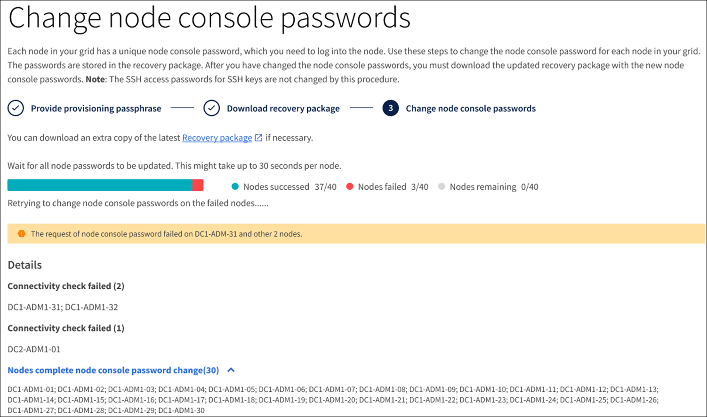

= Change node console passwords
:icons: font
:imagesdir: ../media/

[.lead]
Each node in your grid has a unique node console password, which you need to log in to the node. Use these steps to change each unique node console password for each node in your grid.

.What you'll need

* You are signed in to the Grid Manager using a xref:../admin/web-browser-requirements.adoc[supported web browser].
* You have the Maintenance or Root Access permission.
* You have the current provisioning passphrase.

.About this task

Use the node console password to log in to a node as “admin” using SSH, or to the root user on a VM/physical console connection. The change node console password process creates new passwords for each node in your grid and stores the passwords in an updated `Passwords.txt` file in the recovery package. The passwords are listed in the Password column in the Passwords.txt file. 

NOTE: There are separate SSH access passwords for the SSH keys used for communication between nodes. The SSH access passwords are not changed by this procedure.

== Access the wizard
. Select *CONFIGURATION* > *Access control* > *Grid passwords*.
+
image::../media/grid_password_change_node_console.png[Grid passwords]

. Select *Make a change* under *Change node console passwords*.

== Enter the provisioning passphrase
. Enter your provisioning passphrase.
+
image::../media/node-console-provisioning-passphrase.png[Enter provisioning passphrase]

[start=2]
. Select *Continue*.

== Download the current recovery package
. Select *Download recovery package*.
+
You can use the old passwords in the current recovery package if the password change process fails for any node.
+
image::../media/node-console-download-current-recovery-package.png[Download current recovery package]

[start=2]
. Copy the recovery package file (.zip) to two safe, secure, and separate locations.

+
CAUTION: The recovery package file must be secured because it contains encryption keys and passwords that can be used to obtain data from the StorageGRID system.

[start=3]
. Select *Continue*.

== Change node console passwords
. Select *Yes* to confirm you want to change the node console passwords.

+
image::../media/node-console-start-passwords-change.png[Start passwords change]

+
When you select *Yes*, a new recovery package is generated with the new passwords. It might take a few minutes to generate the new recovery package with the new passwords.

+
When you select *Cancel* you are returned to the previous page.

[start=2]
. Select *Download new recovery package*.

+
image::../media/node-console-download-new-recovery-package.png[Download new recovery package.png]

[start=3]
. When the download completes:
 .. Open the .zip file.
 .. Extract the contents of the .zip file.
 .. Confirm you can open the `Passwords.txt` file and that the contents are readable.
. Copy the new recovery package file (.zip) to two safe, secure, and separate locations.
+
CAUTION: Do not overwrite the old recovery package.
+
You should either just view the `Passwords.txt` file, or if that is not possible, delete the extracted `Passwords.txt` file before copying the recovery package to the two separate secure locations. The recovery package file must be secured because it contains encryption keys and passwords that can be used to obtain data from the StorageGRID system.

[start=5]
. Select the check box to indicate you have downloaded the new recovery package and verified the content.

. Select *Change node console passwords*.
+
Wait for all node passwords to be updated. This might take a few minutes.
+
If there was an error during the process, a banner message lists the number of nodes that failed. The system will automatically retry the process on any node that failed to have the password changed. If the process ends with some nodes still not having a changed password, the *Retry* button appears.
+

+
Review the error for each failed node. After resolving any issues, select *Retry* to try changing passwords on the nodes listed.

+
NOTE: Retrying only changes the node console passwords on the nodes that failed during previous password change attempts. 

+
The system displays a green success banner when process is complete. After the passwords for all nodes have been changed, you can delete the old recovery package.

[start=7]
. Use the *Recovery package* link to download an additional copy of the new recovery package, if necessary.
