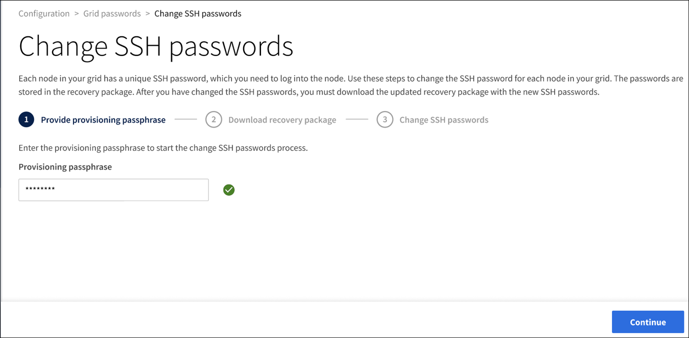
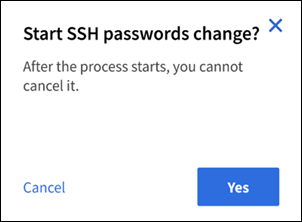
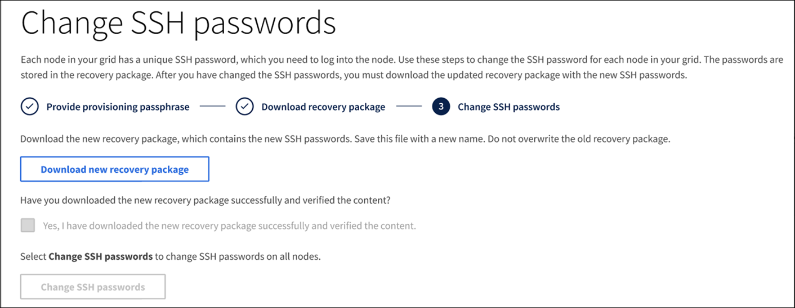

= Change the SSH password
:icons: font
:imagesdir: ../media/

[.lead]
Each node in your grid has a unique SSH password, which you need to log into the node. Use these steps to change the SSH password for each node in your grid.

.What you'll need

* You must be signed in to the Grid Manager using a xref:../admin/web-browser-requirements.adoc[supported web browser].
* You must have Maintenance or Root Access permissions.
* You must have the current provisioning passphrase.

.About this task

Use the SSH password to log into a node as “admin” via SSH, or to the root user on a VM/physical console connection. The change SSH password process creates new passwords for each node in your grid and stores the passwords in an updated recovery package.

== Access the wizard
. Select *CONFIGURATION* > *Security* > *Grid Passwords*.
+

. Select *Make a change*.

== Enter provisioning password
. Enter your provisioning passphrase.
+

[start=2]
. Select *Continue*.

== Download the current recovery package
. Select *Download recovery package*.
+
You can use the old passwords in the current recovery package if the password change process fails for any node.
+

[start=2]
. Copy the downloaded Recovery Package file (.zip) to two safe, secure, and separate locations.

+
*IMPORTANT*: The Recovery Package file must be secured because it contains encryption keys and passwords that can be used to obtain data from the StorageGRID system.

[start=3]
. Select *Continue*.

== Change SSH passwords
. Select *Yes* to confirm you want to change the SSH passwords.

+

+
When you select *Yes*, a new recovery package is generated with the new passwords. It might take a minute to generate the new recovery package with the new passwords.

[start=2]
. Select *Download new recovery package*.

+

[start=3]
. When the download completes:
 .. Open the .zip file.
 .. Extract the inner .zip file.
 .. Confirm you can open the `Passwords.txt` file.
. Copy the downloaded new Recovery Package file (.zip) to two safe, secure, and separate locations. Do not overwrite the old recovery package.

+
*IMPORTANT*: The Recovery Package file must be secured because it contains encryption keys and passwords that can be used to obtain data from the StorageGRID system.

[start=5]
. Select the check box to indicate you have downloaded the new recovery package and verified the content.
+
The *Change SSH passwords* button is highlighted.

. Select *Change SSH passwords*.
+
Wait for all node passwords to be updated. This might take up to 30 seconds per node.
+
The system displays a green success banner when the change SSH password process is complete. Once the passwords for all nodes have been changed successfully, you can delete the old recovery package.

. Use the *Recovery package* link to download an additional copy of the new recovery package, if necessary.
