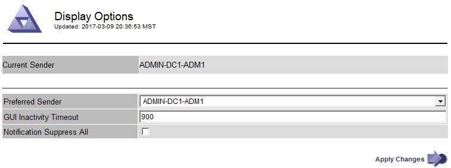

= Change the browser session timeout
:icons: font
:imagesdir: ../media/

[.lead]
You can control whether Grid Manager and Tenant Manager users are signed out if they are inactive for more than a certain amount of time.

.What you'll need

* You are signed in to the Grid Manager using a xref:../admin/web-browser-requirements.adoc[supported web browser].
* You have specific access permissions.

.About this task

The GUI Inactivity Timeout defaults to 900 seconds (15 minutes). If a user's browser session is not active for this amount of time, the session times out.

As required, you can increase or decrease the timeout period by setting the GUI Inactivity Timeout display option.

If single sign-on (SSO) is enabled and a user's browser session times out, the system behaves as if the user selected *Sign Out* manually. The user must reenter their SSO credentials to access StorageGRID again. See xref:configuring-sso.adoc[Configure single sign-on].

[NOTE]
====
User session timeout can also be controlled by the following:

* A separate, non-configurable StorageGRID timer, which is included for system security. By default, each user's authentication token expires 16 hours after the user signs in. When a user's authentication expires, that user is automatically signed out, even if the value for the GUI Inactivity Timeout has not been reached. To renew the token, the user must sign back in.
* Timeout settings for the identity provider, assuming SSO is enabled for StorageGRID. 
====

.Steps
. Select  *CONFIGURATION* > *System* > *Display options*.
. For *GUI Inactivity Timeout*, enter a timeout period of 60 seconds or more.
+
Set this field to 0 if you do not want to use this functionality. Users are signed out 16 hours after they sign in, when their authentication tokens expire.
+

. Select *Apply Changes*.
+
The new setting does not affect currently signed in users. Users must sign in again or refresh their browsers for the new timeout setting to take effect.
