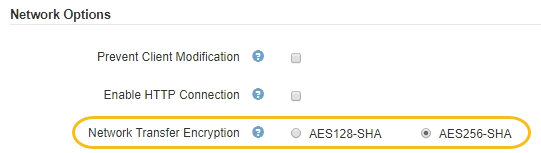

= Change network transfer encryption
:icons: font
:imagesdir: ../media/

[.lead]
The StorageGRID system uses Transport Layer Security (TLS) to protect internal control traffic between grid nodes. The Network Transfer Encryption option sets the algorithm used by TLS to encrypt control traffic between grid nodes. This setting does not affect data encryption.

.What you'll need
* You are signed in to the Grid Manager using a xref:../admin/web-browser-requirements.adoc[supported web browser].
* You have specific access permissions.

.About this task
By default, network transfer encryption uses the AES256-SHA algorithm. Control traffic can also be encrypted using the AES128-SHA algorithm.

.Steps
. Select *CONFIGURATION* > *System* > *Grid options*.
. In the Network Options section, change Network Transfer Encryption to *AES128-SHA* or *AES256-SHA* (default).
+

. Select *Save*.
