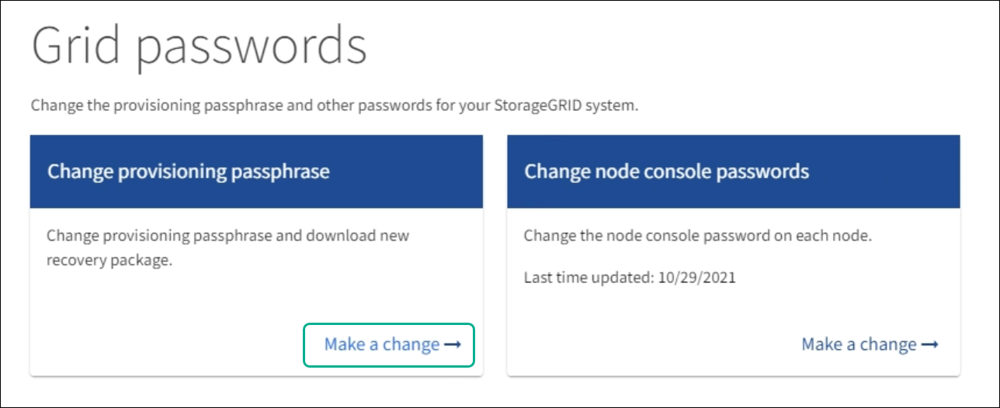
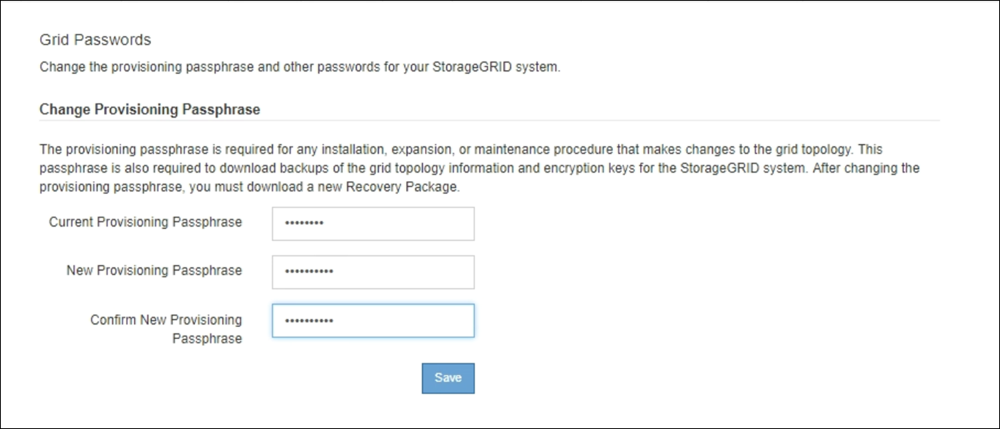
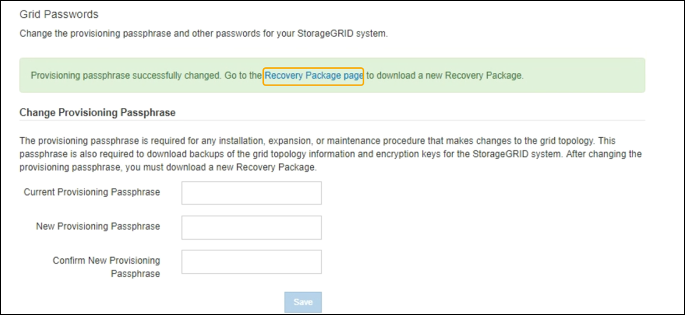

= Change the provisioning passphrase
:icons: font
:imagesdir: ../media/

[.lead]
Use this procedure to change the StorageGRID provisioning passphrase. The passphrase is required for recovery, expansion, and maintenance procedures. The passphrase is also required to download Recovery Package backups that include the grid topology information, grid node console passwords, and encryption keys for the StorageGRID system.

.What you'll need

* You are signed in to the Grid Manager using a xref:../admin/web-browser-requirements.adoc[supported web browser].
* You have Maintenance or Root access permissions.
* You have the current provisioning passphrase.

.About this task

The provisioning passphrase is required for many installation and maintenance procedures, and for xref:../maintain/downloading-recovery-package.adoc[downloading the Recovery Package]. The provisioning passphrase is not listed in the `Passwords.txt` file. Make sure to document the provisioning passphrase and keep it in a safe and secure location.

.Steps
. Select *CONFIGURATION* > *Access control*> *Grid passwords*.
+

+
. Select *Make a change* under *Change provisioning passphrase*.
+

. Enter your current provisioning passphrase.
. Enter the new passphrase. The passphrase must contain at least 8 and no more than 32 characters. Passphrases are case-sensitive.
. Store the new provisioning passphrase in a secure location. It is required for installation, expansion, and maintenance procedures.

. Re-enter the new passphrase, and select *Save*.
+
The system displays a green success banner when the provisioning passphrase change is complete. 
+

. Select *Recovery Package*.
. Enter the new provisioning passphrase to download the new Recovery Package.
+
CAUTION: After changing the provisioning passphrase, you must immediately download a new Recovery Package. The Recovery Package file allows you to restore the system if a failure occurs.
