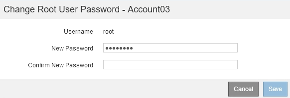

= Changing the password for a tenant's local root user
:icons: font
:imagesdir: ../media/

[.lead]
You might need to change the password for a tenant's local root user if the root user is locked out of the account.

.What you'll need
* You must be signed in to the Grid Manager using a supported browser.
* You must have specific access permissions.

.About this task

If single sign-on (SSO) is enabled for your StorageGRID system, the local root user cannot sign in to the tenant account. To perform root user tasks, users must belong to a federated group that has the Root Access permission for the tenant.

.Steps
. Select *Tenants*.
+
The Tenant Accounts page appears and lists all existing tenant accounts.
+
image::../media/tenant_accounts_page.png[Tenant Accounts page]

. Select the tenant account you want to edit.
+
If your system includes more than 20 items, you can specify how many rows are shown on each page at one time. Use the search box to search for a tenant account by display name or tenant ID.
+
The View Details, Edit, and Actions buttons become enabled.

. From the *Actions* drop-down, select *Change Root Password*.
+

. Enter the new password for the tenant account.
. Select *Save*.

.Related information

xref:controlling_administrator_access_to_storagegrid.adoc[Controlling administrator access to StorageGRID]
