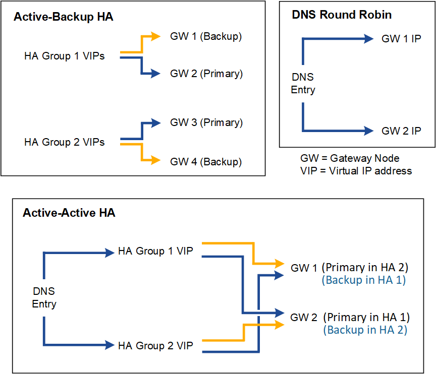

= Configuration options for HA groups
:icons: font
:imagesdir: ../media/

[.lead]
The following diagram provides examples of different ways you can configure HA groups. Each option has advantages and disadvantages.

The table summarizes the benefits of each HA configuration shown in the diagram.

[cols="1a,2a,2a" options="header"]
|===
| Configuration| Advantages| Disadvantages

|Active-Backup HA
|
* Managed by StorageGRID with no external dependencies.
* Fast failover.

|
* Only one node in an HA group is active. At least one node per HA group will be idle.

|DNS Round Robin
|
* Increased aggregate throughput.
* No idle hosts.

|
* Slow failover, which could depend on client behavior.
* Requires configuration of hardware outside of StorageGRID.
* Needs a customer-implemented health check.

|Active-Active HA
|
* Traffic is distributed across multiple HA groups.
* High aggregate throughput that scales with the number of HA groups.
* Fast failover.

|
* More complex to configure.
* Requires configuration of hardware outside of StorageGRID.
* Needs a customer-implemented health check.

|===
