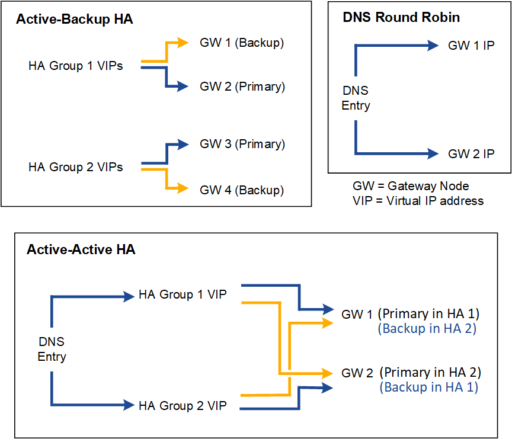

= Configuration options for HA groups
:icons: font
:imagesdir: ../media/

[.lead]
The following diagrams provide examples of different ways you can configure HA groups. Each option has advantages and disadvantages.

When creating multiple overlapping HA groups as shown in the Active-Active HA example, the total throughput scales with the number of nodes and HA groups. With three or more nodes and three or more HA groups, you also gain the ability to continue operations using any of the VIPs even during maintenance procedures that require you to take a node offline.

The table summarizes the benefits of each HA configuration shown in the diagram. 

[cols="1a,1a,1a" options="header"]
|===
| Configuration| Advantages| Disadvantages
a|
Active-Backup HA
a|

* Managed by StorageGRID with no external dependencies.
* Fast failover.

a|

* Only one node in an HA group is active. At least one node per HA group will be idle.

a|
DNS Round Robin
a|

* Increased aggregate throughput.
* No idle hosts.

a|

* Slow failover, which could depend on client behavior.
* Requires configuration of hardware outside of StorageGRID.
* Needs a customer-implemented health check.

a|
Active-Active
a|

* Traffic is distributed across multiple HA groups.
* High aggregate throughput that scales with the number of HA groups.
* Fast failover.

a|

* More complex to configure.
* Requires configuration of hardware outside of StorageGRID.
* Needs a customer-implemented health check.

|===
