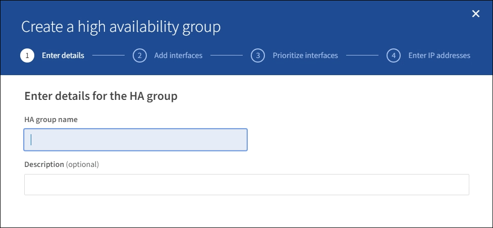
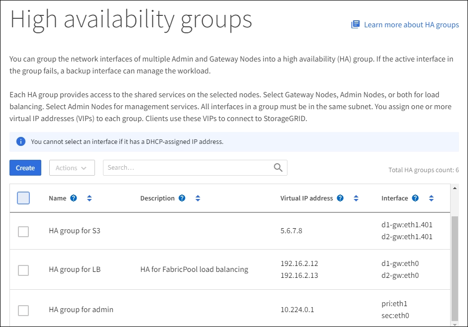

= Configure high availability groups
:icons: font
:imagesdir: ../media/

[.lead]
You can configure high availability (HA) groups to provide highly available access to the services on Admin Nodes or Gateway Nodes.

.What you'll need

* You are signed in to the Grid Manager using a xref:../admin/web-browser-requirements.adoc[supported web browser].
* You have the Root Access permission.
* If you plan to use a VLAN interface in an HA group, you have already created the VLAN interface. See xref:../admin/configure-vlan-interfaces.adoc[Configure VLAN interfaces].

== Create a high availability group

When you create a high availability group, you select one or more interfaces and organize them in failover order. Then, you assign one or more VIP addresses to the group.

An interface must be for a Gateway Node or an Admin Node to be included in an HA group. An HA group can only use one interface for any given node; however, other interfaces for the same node can be used in other HA groups.

=== Access the wizard

. Select *CONFIGURATION* > *Network* > *High availability groups*.

. Select *Create*.

=== Enter details for the HA group

. Provide a unique name for the HA group.
+

. Optionally, enter a description for the HA group.

. Select *Continue*.

=== Add interfaces to the HA group

. Select one or more interfaces to add to this HA group.
+ 
Use the column headers to sort the rows, or enter a search term to locate interfaces more quickly.
+
image::../media/ha_group_add_interfaces.png[HA Groups Add Interfaces]
+
.Guidelines for selecting interfaces

* You must select at least one interface.

* You can select only one interface for a node.

* If the HA group is for HA protection of Admin Node services, which include the the Grid Manager and the Tenant Manager, select interfaces on Admin Nodes only.

* If the HA group is for HA protection of S3 or Swift client traffic, select interfaces on either Admin Nodes or Gateway Nodes.

* If the HA group is for HA protection of the deprecated CLB service, select interfaces on Gateway Nodes only.

* If you select interfaces on different types of nodes, an informational note appears. You are reminded that if a failover occurs, services provided by the previously active node might not be available on the newly active node. For example, a failover Gateway Node would not be able to provide HA protection of Admin Node services.

. Select *Continue*.

=== Determine the failover order

. Determine the Primary interface and any Backup (failover) interfaces for this HA group.
+
Drag and drop rows to change the values in the *Failover order* column.
+
image::../media/ha_group_determine_failover.png[HA Groups determine failover order]
+

IMPORTANT: If the HA group provides access to the Grid Manager, you must select an interface on the primary Admin Node to be the Primary interface. Some maintenance procedures can only be performed from the primary Admin Node.
+
The first interface in the list is the Primary interface. The Primary interface is the active interface unless a failure occurs.
+
If the HA group includes more than one interface and the Primary interface fails, the VIP addresses move to the first Backup interface in the failover order. If that interface fails, the VIP addresses move to the next Backup interface, and so on.

. Select *Continue*.

=== Enter IP addresses

. If the virtual IP addresses for this HA group are on a different subnet than the ones used by S3 and Swift clients or by Grid Manager and Tenant Manager users, specify the gateway and subnet prefix length for the VIP subnet.
+
image::../media/ha_group_select_virtual_ips.png[HA Groups enter VIPs]
+
Enter the gateway using CIDR notation: an IPv4 address followed by a slash and the subnet length (0-32). For example, `192.16.2.1/22`.
+
Client and admin users will use this gateway to access the virtual IP addresses.
+
NOTE: Do not specify the the broadcast or network address of the VIP subnet.

. Enter one or more virtual IP addresses for the HA group. You can add up to 10 IP addresses.
+
You must provide at least one IPv4 address. Optionally, you can specify additional IPv4 and IPv6 addresses.
+
NOTE: If you specified a value for *Gateway CIDR*, all VIPs must be in the same subnet as the gateway.

. Select *Create HA group* and select *Finish*.
+
The HA Group is created, and you can now use the configured virtual IP addresses.

=== Next steps

If you will use this HA group for load balancing, create a load balancer endpoint to determine the port and network protocol and to attach any required certificates: xref:managing-load-balancing.adoc[Managing load balancing].

== Edit a high availability group

You can edit a high availability (HA) group to change its name and description, add or remove interfaces, change the failover order, or add or update virtual IP addresses.

For example, you might need to edit an HA group if you want to remove the node associated with a selected interface in a site or node decommission procedure.

.Steps

. Select *CONFIGURATION* > *Network* > *High availability groups*.
+
The High availability groups page shows all existing HA groups.
+

. Select the check box for the HA group you want to edit. 

. Do one of the following, based on what you want to update:
** Select *Actions* > *Edit virtual IP address* to add or remove VIP addresses.
** Select *Actions* > *Edit HA group* to update the group's name or description, add or remove interfaces, change the failover order, or add or remove VIP addresses.

. If you selected *Edit virtual IP address*:

.. Update the virtual IP addresses for the HA group.
.. Select *Save*.
.. Select *Finish*.

. If you selected *Edit HA group*:

.. Optionally, update the group's name or description.
.. Optionally, select or unselect the check boxes to add or remove interfaces.
+
NOTE: If the HA group provides access to the Grid Manager, you must select an interface on the primary Admin Node to be the Primary interface. Some maintenance procedures can only be performed from the primary Admin Node

.. Optionally, drag and drop rows to change the failover order of the Primary interface and any Backup interfaces for this HA group.
.. Optionally, update the virtual IP addresses.

.. Select *Save* and then select *Finish*.

==  Remove a high availability group

You can remove one or more high availability (HA) groups at a time.

To prevent client disruptions, update any affected S3 or Swift client applications before you remove an HA group. Update each client to connect using another IP address, for example, the virtual IP address of a different HA group or the IP address that was configured for an interface during installation.

.Steps

. Select *CONFIGURATION* > *Network* > *High availability groups*.

. Select the check box for each HA group you want to remove. Then, select *Actions* > *Remove HA group*.

. Review the message and select *Delete HA group* to confirm your selection.
+ 
All HA groups you selected are removed. A green success banner appears on the High availability groups page.
