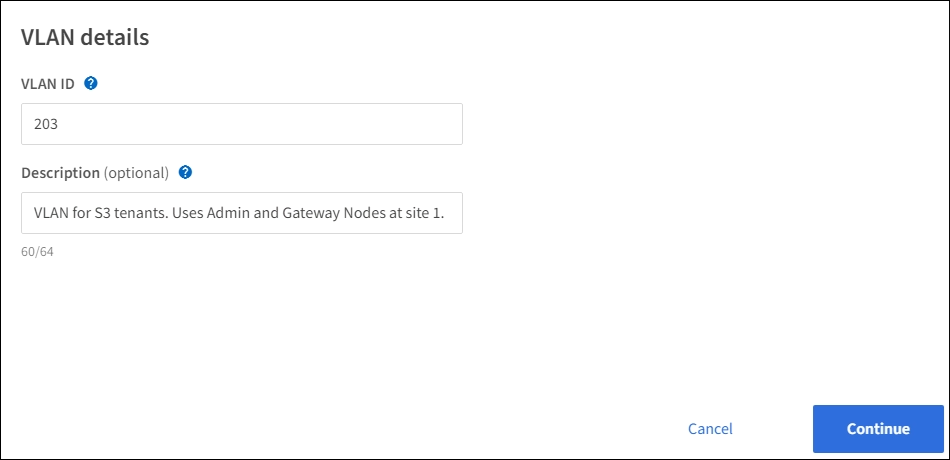

= Configure VLAN interfaces
:icons: font
:imagesdir: ../media/

[.lead]
You can create virtual LAN (VLAN) interfaces for Admin Nodes and Gateway Nodes to isolate and partition client and tenant traffic for security, flexibility, and performance. 

.What you'll need

* You are signed in to the Grid Manager using a xref:../admin/web-browser-requirements.adoc[supported web browser].
* You have the Root Access permission.
* You have configured the VLANs you want to use and you know their VLAN IDs.

== Create a VLAN interface

When you create a VLAN interface, you select one or more parent interfaces.

A parent interface must meet the following conditions:

* The interface must be for a Gateway Node or an Admin Node.
* The interface must be configured with fixed or static IP addressing, not with DHCP.

=== Access the wizard

. Select *CONFIGURATION* > *Network* > *VLAN interfaces*.

. Select *Create*.

=== Enter details for the VLAN interfaces

. Specify the ID of the VLAN in your network. You can enter any value between 1 and 4094.
+
VLAN IDs do not need to be unique. If you specify an ID that has already been used, a message appears. You can continue creating another VLAN interface for the same VLAN ID, or you can select *Cancel* and then edit the existing ID.

. Optionally, enter a short description for the VLAN interface.
+

. Select *Continue*.

=== Choose parent interfaces
The table lists the Grid Network, Admin Network, and Client Network interfaces for all Admin Nodes and Gateway Nodes at each site in your grid.  

. Select one or more parent interfaces to attach this VLAN to.
+
For example, you might want to attach a VLAN to the Client Network (eth2) interface for two Admin Nodes at a site.  
+
image::../media/vlan-create-parent-interfaces.png[VLAN create wizard parent interfaces]

+
.Guidelines for selecting interfaces

* You must select at least one parent interface.
* For each VLAN interface, you can only select one parent interface for a given node. For example, you are prevented from selecting both the Grid Network interface and the Admin Network interface on the same Gateway Node.
* You can enter a search term to locate interfaces more quickly.
 
* Select interfaces on Admin Nodes, Gateway Nodes, or both if this VLAN will be used for S3 and Swift client traffic.

* Select interfaces on Admin Nodes if this VLAN will be used for administrator access to the Grid Manager or the Tenant Manager.

. Select *Continue*.

=== Confirm the settings

. Review the parent interfaces you selected for the VLAN and make any changes.

* If you need to change the VLAN ID or description, select *Enter VLAN details* at the top of the page.

* If you need to change a parent interface, select *Choose parent interfaces* at the top of the page or select *Previous*.

* If you need to remove a parent interface, select the trash can .

. Select *Save*.
+
The VLAN interface is created. You can now add it to a high availability (HA) group. See xref:configure-high-availability-group.adoc[Configure high availability groups] for instructions.

== Edit a VLAN interface

You can edit a VLAN interface group to change its VLAN ID, description, or parent interfaces.

For example, you might need to remove a parent interface from a VLAN interface if you want to remove the associated node in a site or node decommission procedure.

Note that you can't change the VLAN ID or remove a parent interface if the VLAN is currently used in a HA group. You must remove the VLAN interface from the HA group before you can update these values.

.Steps

. Select *CONFIGURATION* > *Network* > *VLAN interfaces*.

. Select the radio button for the VLAN interface you want to edit. Then, select *Actions* > *Edit*.

. Optionally, update VLAN ID or the description. Then, select *Continue*.
+
You can't update a VLAN ID if the VLAN is used to an HA group.

. Optionally, select or unselect the check boxes to add or remove parent interfaces. Then, select *Continue*.
+
You can't remove a parent interface if the VLAN is used in an HA group.

. Confirm your changes and select *Save*.

==  Remove a VLAN interfaces

You can remove one or more VLAN interfaces.

Note that you can't remove a VLAN interface if it is currently used in a HA group. You must remove the VLAN interface from the HA group before you can remove it.

.Steps

. Select *CONFIGURATION* > *Network* > *VLAN interfaces*.

. Select the check box for each VLAN interface you want to remove. Then, select *Actions* > *Delete*.

. Select *Yes* to confirm your selection. All VLAN interfaces you selected are removed. A green success banner appears on the VLAN interfaces page.
