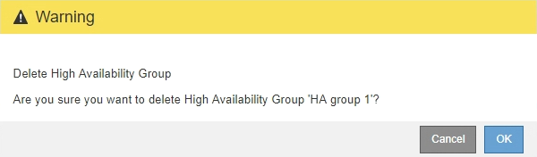

= Configure high availability groups
:icons: font
:imagesdir: ../media/

[.lead]
You can configure one or more high availability (HA) groups to provide highly available access to the services on Admin Nodes or Gateway Nodes.

.What you'll need

* You are signed in to the Grid Manager using a xref:../admin/web_browser_requirements.adoc[supported web browser].
* You have the Root Access permission.

== Create a high availability group

When you create a high availability group, you select one or more interfaces and organize them in failover order. Then, you assign one or more VIP addresses to the group.

An interface must meet the following conditions to be included in an HA group:

* The interface must be for a Gateway Node or an Admin Node.
* The interface must be configured with fixed or static IP addressing, not with DHCP.

=== Access the wizard

. Select *CONFIGURATION* > *Network* > *High availability groups*.

. Select *Create*.

=== Enter details for the HA group

. Provide a unique name for the HA group.
+

image::../media/ha-group-create-wizard.png[HA Groups create wizard]

. Optionally, enter a description for the HA group.

. Select *Continue*.

=== Add interfaces to the HA group

. Select one or more interfaces to add to this HA group. Use the column headers to sort the rows, or enter a search term to locate interfaces more quickly.
+
image::../media/ha_group_add_interfaces.png[HA Groups Add Interfaces]
+
An interface does not appear in the list if its IP address is assigned by DHCP.
+
.Guidelines for selecting interfaces

* You must select at least one interface.
* You can select only one interface for a node.
+
IP addresses will be restricted to the smallest subnet (the one with the largest prefix).

* Select interfaces on two or more Admin Nodes, Gateway Nodes, or both for HA protection of the Load Balancer service.

* Select interfaces on two or more Admin Nodes for HA protection of the Grid Manager or the Tenant Manager.

* Select interfaces on two or more Gateway Nodes for HA protection of the (deprecated) CLB service.

* If you select interfaces on different types of nodes, an information note appears. Only the services common to the selected nodes will be available on the virtual IPs.
+
image::../media/ha_groups_different_node_types.png[HA Groups Different Node Types]

. Select *Continue*.

=== Determine the failover order

. Determine the Primary interface and any Backup (failover) interfaces for this HA group.

+
Drag and drop rows to change the values in the *Failover order* column.
+
image::../media/ha_group_determine_failover.png[HA Groups Determine failover order]
+
IMPORTANT: If the HA group provides access to the Grid Manager, you must select an interface on the primary Admin Node to be the Primary interface. Some maintenance procedures can only be performed from the primary Admin Node.

+
The first interface in the list is the Primary interface. The Primary interface is the active interface unless a failure occurs.
+
If the HA group includes more than one interface and the Primary interface fails, the VIP addresses move to the first Backup interface in the failover order. If that interface fails, the VIP addresses move to the next Backup interface, and so on.

. Select *Continue*.

=== Enter IP addresses

. If the virtual IP addresses for this HA group are on a different subnet than the ones used by S3 and Swift clients or by Grid Manager and Tenant Manager users, specify the gateway for the VIP subnet.
+
image::../media/ha_group_select_virtual_ips.png[HA Groups enter VIPs]
+
Enter the gateway using CIDR notation: an IPv4 address followed by a slash and the subnet length (0-32). For example, `192.16.2.1/22`.
+
Client and admin users will use this gateway to access the virtual IP addresses.
+
NOTE: Do not specify the address of the subnet itself unless the subnet length is greater than 30.

. Enter one or more virtual IP addresses for the HA group. You can add up to 10 IP addresses.
+
You must provide at least one IPv4 address. Optionally, you can specify additional IPv4 and IPv6 addresses.
+
NOTE: If you specified a value for *Gateway CIDR*, all VIPs must be in the same subnet as the gateway.

. Select *Create HA group*.
+
The HA Group is created, and you can now use the configured virtual IP addresses.

=== Next steps

Configure one or more load balancer endpoints: xref:managing_load_balancing.adoc[Managing load balancing]

== Edit a high availability group

You can edit a high availability (HA) group to change its name and description, add or remove interfaces, or add or update a virtual IP address.

For example, you might need to remove the interface from an HA group if you want to remove a node in a site or node decommission procedure.

.Steps

. Select *CONFIGURATION* > *Network* > *High Availability Groups*.
+
The High Availability Groups page appears.
+
image::../media/ha_groups_page_with_two_groups.png[HA Groups Page With Two Groups]

. Select the HA group you want to edit, and select *Actions* > *Edit*.

. Optionally, update the group's name or description.
. Optionally, select or unselect the check boxes to add or remove interfaces.
. Optionally, drag and drop rows to change the failover order of the Primary interface and any Backup interfaces for this HA group.
+
NOTE: If the HA group provides access to the Grid Manager, you must select an interface on the primary Admin Node to be the preferred Master. Some maintenance procedures can only be performed from the primary Admin Node.

. Optionally, update the virtual IP addresses for the HA group.

. Select *Save*.

==  Remove a high availability group

You can remove a high availability (HA) group that you are no longer using.

If you remove an HA group, any S3 or Swift clients that are configured to use one of the group's virtual IP addresses will no longer be able to connect to StorageGRID. To prevent client disruptions, you should update all affected S3 or Swift client applications before you remove an HA group. Update each client to connect using another IP address, for example, the virtual IP address of a different HA group or the IP address that was configured for an interface during installation or using DHCP.

.Steps

. Select *CONFIGURATION* > *Network* > *High Availability Groups*.

. Select the HA group you want to remove, and select *Actions* > *Remove HA group*.
+
The Delete High Availability Group warning appears.
+

. Select *Ok*.
+
The HA group is removed.
