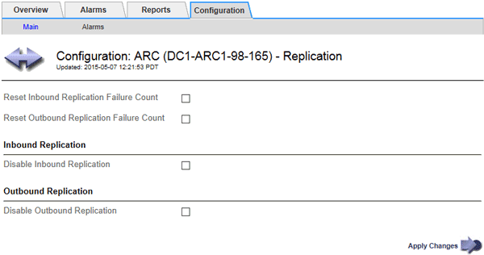

= Configure Archive Node replication
:icons: font
:imagesdir: ../media/

[.lead]
You can configure the replication settings for an Archive Node and disable inbound and outbound replication, or reset the failure counts being tracked for the associated alarms.

.What you'll need

* You are signed in to the Grid Manager using a xref:../admin/web-browser-requirements.adoc[supported web browser].
* You have specific access permissions.

.Steps

. Select *SUPPORT* > *Tools* > *Grid topology*.
. Select *_Archive Node_* > *ARC* > *Replication*.
. Select *Configuration* > *Main*.
+

. Modify the following settings, as necessary:
 ** *Reset Inbound Replication Failure Count*: Select to reset the counter for inbound replication failures. This can be used to clear the RIRF (Inbound Replications -- Failed) alarm.
 ** *Reset Outbound Replication Failure Count*: Select to reset the counter for outbound replication failures. This can be used to clear the RORF (Outbound Replications -- Failed) alarm.
 ** *Disable Inbound Replication*: Select to disable inbound replication as part of a maintenance or testing procedure. Leave cleared during normal operation.
+
When inbound replication is disabled, object data can be retrieved from the ARC service for replication to other locations in the StorageGRID system, but objects cannot be replicated to this ARC service from other system locations. The ARC service is read‐only.

 ** *Disable Outbound Replication*: Select the check box to disable outbound replication (including content requests for HTTP retrievals) as part of a maintenance or testing procedure. Leave unchecked during normal operation.
+
When outbound replication is disabled, object data can be copied to this ARC service to satisfy ILM rules, but object data cannot be retrieved from the ARC service to be copied to other locations in the StorageGRID system. The ARC service is write‐only.
. Select *Apply Changes*.
