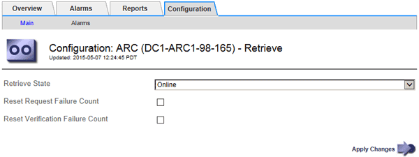

= Configure Archive Node retrieve settings
:icons: font
:imagesdir: ../media/

[.lead]
You can configure the retrieve settings for an Archive Node to set the state to Online or Offline, or reset the failure counts being tracked for the associated alarms.

.What you'll need

* You are signed in to the Grid Manager using a xref:../admin/web-browser-requirements.adoc[supported web browser].
* You have specific access permissions.

.Steps

. Select *SUPPORT* > *Tools* > *Grid topology*.
. Select *Archive Node* > *ARC* > *Retrieve*.
. Select *Configuration* > *Main*.
+

. Modify the following settings, as necessary:
 ** *Retrieve State*: Set the component state to either:
  *** Online: The grid node is available to retrieve object data from the archival media device.
  *** Offline: The grid node is not available to retrieve object data.
 ** Reset Request Failures Count: Select the check box to reset the counter for request failures. This can be used to clear the ARRF (Request Failures) alarm.
 ** Reset Verification Failure Count: Select the check box to reset the counter for verification failures on retrieved object data. This can be used to clear the ARRV (Verification Failures) alarm.
. Select *Apply Changes*.
