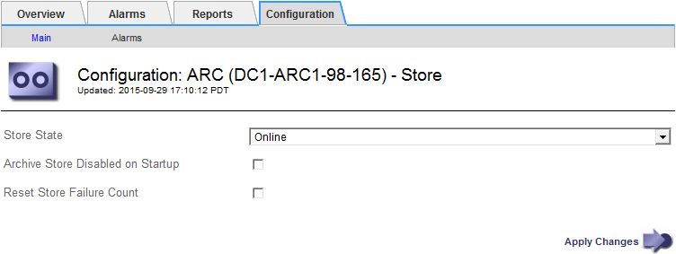

= Configure the archive state and counters for TSM
:icons: font
:imagesdir: ../media/

[.lead]
If your Archive Node connects to a TSM middleware server, you can configure an Archive Node's archive store state to Online or Offline. You can also disable the archive store when the Archive Node first starts up, or reset the failure count being tracked for the associated alarm.

.What you'll need

* You are signed in to the Grid Manager using a xref:../admin/web-browser-requirements.adoc[supported web browser].
* You have specific access permissions.

.Steps

. Select *SUPPORT* > *Tools* > *Grid topology*.
. Select *_Archive Node_* > *ARC* > *Store*.
. Select *Configuration* > *Main*.
+

. Modify the following settings, as necessary:
 ** Store State: Set the component state to either:
  *** Online: The Archive Node is available to process object data for storage to the archival storage system.
  *** Offline: The Archive Node is not available to process object data for storage to the archival storage system.
 ** Archive Store Disabled on Startup: When selected, the Archive Store component remains in the Read-only state when restarted. Used to persistently disable storage to the targeted the archival storage system. Useful when the targeted archival storage system is unable to accept content.
 ** Reset Store Failure Count: Reset the counter for store failures. This can be used to clear the ARVF (Stores Failure) alarm.
. Select *Apply Changes*.

.Related information

xref:managing-archive-node-when-tsm-server-reaches-capacity.adoc[Manage an Archive Node when TSM server reaches capacity]
