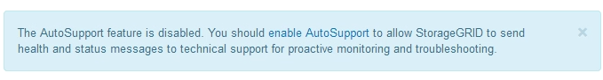
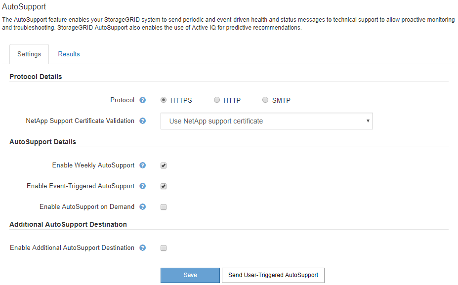

= Configuring AutoSupport
:icons: font
:imagesdir: ../media/

[.lead]
The AutoSupport feature enables your StorageGRID system to send health and status messages to technical support. Using AutoSupport can significantly speed problem determination and resolution. Technical support can also monitor the storage needs of your system and help you determine if you need to add new nodes or sites. Optionally, you can configure AutoSupport messages to be sent to one additional destination.

== Information included in AutoSupport messages

AutoSupport messages include information such as the following:

* StorageGRID software version
* Operating system version
* System-level and location-level attribute information
* Recent alerts and alarms (legacy system)
* Current status of all grid tasks, including historical data
* Events information as listed on the *Nodes* > *_Grid Node_* > *Events* page
* Admin Node database usage
* Number of lost or missing objects
* Grid configuration settings
* NMS entities
* Active ILM policy
* Provisioned grid specification file
* Diagnostic metrics

You can enable the AutoSupport feature and the individual AutoSupport options when you first install StorageGRID, or you can enable them later. If AutoSupport is not enabled, a message appears on the Grid ManagerDashboard. The message includes a link to the AutoSupport configuration page.

You can select the "`x`" symbol  to close the message. The message will not appear again until your browser cache is cleared, even if AutoSupport remains disabled.

== Using Active IQ

Active IQ is a cloud-based digital advisor that leverages predictive analytics and community wisdom from NetApp's installed base. Its continuous risk assessments, predictive alerts, prescriptive guidance, and automated actions help you prevent problems before they occur, leading to improved system health and higher system availability.

You must enable AutoSupport if you want to use the Active IQ dashboards and functionality on the NetApp Support site.

https://docs.netapp.com/us-en/active-iq/index.html[Active IQ Digital Advisor Documentation]

== Accessing AutoSupport settings

You configure AutoSupport using the Grid Manager (*Support* > *Tools* > *AutoSupport*). The *AutoSupport* page has two tabs: *Settings* and *Results*.

== Protocols for sending AutoSupport messages

You can choose one of three protocols for sending AutoSupport messages:

* HTTPS
* HTTP
* SMTP

If you send AutoSupport messages using HTTPS or HTTP, you can configure a non-transparent proxy server between Admin Nodes and technical support.

If you use SMTP as the protocol for AutoSupport messages, you must configure an SMTP mail server.

== AutoSupport options

You can use any combination of the following options to send AutoSupport messages to technical support:

* *Weekly*: Automatically send AutoSupport messages once per week. Default setting: Enabled.
* *Event-triggered*: Automatically send AutoSupport messages every hour or when significant system events occur. Default setting: Enabled.
* *On Demand*: Allow technical support to request that your StorageGRID system send AutoSupport messages automatically, which is useful when they are actively working an issue (requires HTTPS AutoSupport transmission protocol). Default setting: Disabled.
* *User-triggered*: Manually send AutoSupport messages at any time.

.Related information

https://mysupport.netapp.com/site/global/dashboard[NetApp Support^]
