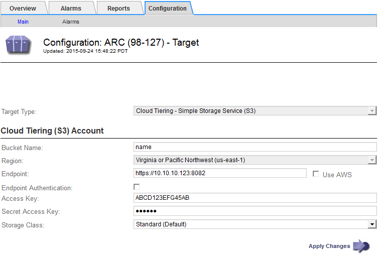

= Configure connection settings for the S3 API
:icons: font
:imagesdir: ../media/

[.lead]
If you are connecting to an Archive Node using the S3 interface, you must configure the connection settings for the S3 API. Until these settings are configured, the ARC service remains in a Major alarm state as it is unable to communicate with the external archival storage system.

[IMPORTANT]

====
Moving objects from an Archive Node to an external archival storage system through the S3 API has been replaced by ILM Cloud Storage Pools, which offer more functionality. The *Cloud Tiering - Simple Storage Service (S3)* option is still supported, but you might prefer to implement Cloud Storage Pools instead.

If you are currently using an Archive Node with the *Cloud Tiering - Simple Storage Service (S3)* option, consider migrating your objects to a Cloud Storage Pool. See xref:../ilm/index.adoc[Manage objects with ILM].

====

.What you'll need

* You are signed in to the Grid Manager using a xref:../admin/web-browser-requirements.adoc[supported web browser].
* You have specific access permissions.
* You have created a bucket on the target archival storage system:
 ** The bucket is dedicated to a single Archive Node. It cannot be used by other Archive Nodes or other applications.
 ** The bucket has the appropriate region selected for your location.
 ** The bucket should be configured with versioning suspended.
* Object Segmentation is enabled and the Maximum Segment Size is less than or equal to 4.5 GiB (4,831,838,208 bytes). S3 API requests that exceed this value will fail if S3 is used as the external archival storage system.

.Steps

. Select *SUPPORT* > *Tools* > *Grid topology*.
. Select *Archive Node* > *ARC* > *Target*.
. Select *Configuration* > *Main*.
+

. Select *Cloud Tiering - Simple Storage Service (S3)* from the Target Type drop-down list.
+
NOTE: Configuration settings are unavailable until you select a Target Type.

. Configure the cloud tiering (S3) account through which the Archive Node will connect to the target external S3 capable archival storage system.
+
Most of the fields on this page are self-explanatory. The following describes fields for which you might need guidance.

 ** *Region*: Only available if *Use AWS* is selected. The region you select must match the bucket's region.
 ** *Endpoint* and *Use AWS*: For Amazon Web Services (AWS), select *Use AWS*. *Endpoint* is then automatically populated with an endpoint URL based on the Bucket Name and Region attributes. For example:
+
`\https://bucket.region.amazonaws.com`
+
For a non-AWS target, enter the URL of the system hosting the bucket, including the port number. For example:
+
`\https://system.com:1080`

 ** *End Point Authentication*: Enabled by default. If the network to the external archival storage system is trusted, you can unselect the check box to disable endpoint SSL certificate and hostname verification for the targeted external archival storage system. If another instance of a StorageGRID system is the target archival storage device and the system is configured with publicly signed certificates, you can keep the check box selected.
 ** *Storage Class*: Select *Standard (Default)* for regular storage. Select *Reduced Redundancy* only for objects that can be easily recreated. *Reduced Redundancy* provides lower cost storage with less reliability. If the targeted archival storage system is another instance of the StorageGRID system, *Storage Class* controls how many interim copies of the object are made at ingest on the target system, if dual commit is used when objects are ingested there.

. Select *Apply Changes*.
+
The specified configuration settings are validated and applied to your StorageGRID system. Once configured, the target cannot be changed.

