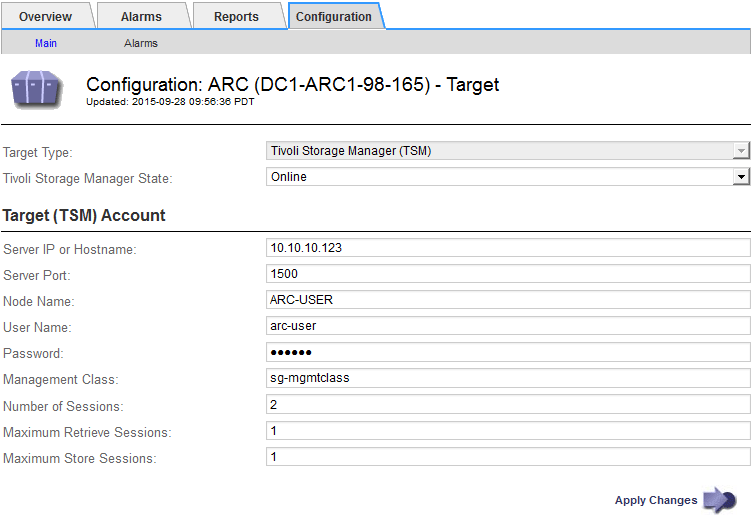

= Configure connections to TSM middleware
:icons: font
:imagesdir: ../media/

[.lead]
Before the Archive Node can communicate with Tivoli Storage Manager (TSM) middleware, you must configure a number of settings.

.What you'll need

* You are signed in to the Grid Manager using a xref:../admin/web-browser-requirements.adoc[supported web browser].
* You have specific access permissions.

.About this task

Until these settings are configured, the ARC service remains in a Major alarm state as it is unable to communicate with the Tivoli Storage Manager.

.Steps

. Select *SUPPORT* > *Tools* > *Grid topology*.
. Select *_Archive Node_* > *ARC* > *Target*.
. Select *Configuration* > *Main*.
+

. From the *Target Type* drop-down list, select *Tivoli Storage Manager (TSM)*.
. For the *Tivoli Storage Manager State*, select *Offline* to prevent retrievals from the TSM middleware server.
+
By default, the Tivoli Storage Manager State is set to Online, which means that the Archive Node is able to retrieve object data from the TSM middleware server.

. Complete the following information:
 ** *Server IP or Hostname*: Specify the IP address or fully qualified domain name of the TSM middleware server used by the ARC service. The default IP address is 127.0.0.1.
 ** *Server Port*: Specify the port number on the TSM middleware server that the ARC service will connect to. The default is 1500.
 ** *Node Name*: Specify the name of the Archive Node. You must enter the name (arc‐user) that you registered on the TSM middleware server.
 ** *User Name*: Specify the user name the ARC service uses to log in to the TSM server. Enter the default user name (arc‐user) or the administrative user you specified for the Archive Node.
 ** *Password*: Specify the password used by the ARC service to log in to the TSM server.
 ** *Management Class*: Specify the default management class to use if a management class is not specified when the object is being saved to the StorageGRID system, or the specified management class is not defined on the TSM middleware server.
 ** *Number of Sessions*: Specify the number of tape drives on the TSM middleware server that are dedicated to the Archive Node. The Archive Node concurrently creates a maximum of one session per mount point plus a small number of additional sessions (less than five).
+
You must change this value to be the same as the value set for MAXNUMMP (maximum number of mount points) when the Archive Node was registered or updated. (In the register command, the default value of MAXNUMMP used is 1, if no value is set.)
+
You must also change the value of MAXSESSIONS for the TSM server to a number that is at least as large as the Number of Sessions set for the ARC service. The default value of MAXSESSIONS on the TSM server is 25.

 ** *Maximum Retrieve Sessions*: Specify the maximum number of sessions that the ARC service can open to the TSM middleware server for retrieve operations. In most cases, the appropriate value is Number of Sessions minus Maximum Store Sessions. If you need to share one tape drive for storage and retrieval, specify a value equal to the Number of Sessions.
 ** *Maximum Store Sessions*: Specify the maximum number of concurrent sessions that the ARC service can open to the TSM middleware server for archive operations.
+
This value should be set to one except when the targeted archival storage system is full and only retrievals can be performed. Set this value to zero to use all sessions for retrievals.
. Select *Apply Changes*.
