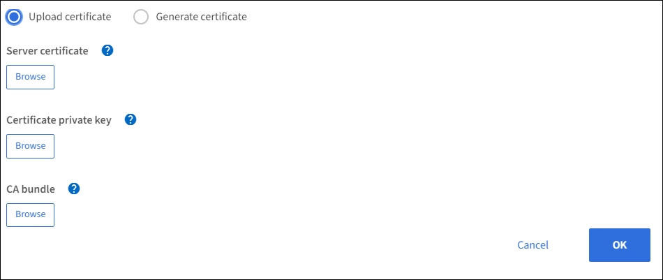
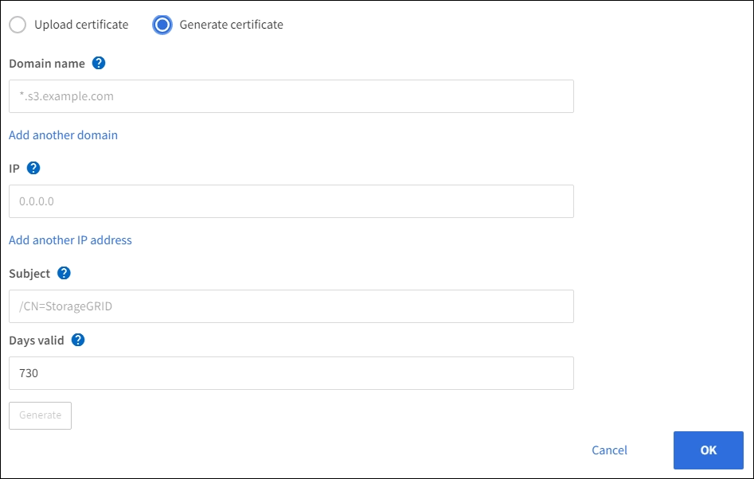

= Configure load balancer endpoints
:icons: font
:imagesdir: ../media/

[.lead]
Load balancer endpoints determine the ports and network protocols S3 and Swift clients can use when connecting to the StorageGRID load balancer on Gateway and Admin Nodes.

.What you'll need

* You are signed in to the Grid Manager using a xref:../admin/web-browser-requirements.adoc[supported web browser].

* You have the Root Access permission.

* If you previously remapped a port you intend to use for the load balancer endpoint, you have xref:../maintain/removing-port-remaps.adoc[removed the port remap].

*  You have created any high availability (HA) groups you plan to use. See xref:managing-high-availability-groups.adoc[Manage high availability groups].

*  You have configured any VLAN interfaces you plan to use. See xref:configure-vlan-interfaces.adoc[Configure VLAN interfaces].

* If you are creating an HTTPS endpoint (recommended), you have the information for the server certificate.
** To upload a certificate, you need the server certificate, the certificate private key, and optionally, a CA bundle.

** To generate a certificate, you need all domain names and IP addresses the S3 or Swift clients will use to access the endpoint. You must also know the subject (Distinguished Name).

** If you want to use the StorageGRID S3 and Swift certificate, you have already replaced the default certificate with a custom certificate signed by an external certificate authority.
+
The certificate can use wildcards to represent the fully qualified domain names of all Admin Nodes and Gateway Nodes running the Load Balancer service. For example, `*.storagegrid._example_.com` uses the * wildcard to represent `adm1.storagegrid._example_.com` and `gn1.storagegrid._example_.com`. See xref:configuring-s3-api-endpoint-domain-names.adoc[Configuring S3 API endpoint domain names] for more information.

== Create a load balancer endpoint

Each load balancer endpoint specifies a port, a client type (S3 or Swift), and a network protocol (HTTP or HTTPS).

=== Access the wizard

. Select *CONFIGURATION* > *Network* > *Load balancer endpoints*.

. Select *Create*.

=== Enter endpoint details

. Enter details for the endpoint.
+
image::../media/load_balancer_endpoint_create_http.png[Create LB Endpoint]
+
[cols="1a,2a" options="header"]
|===
| Field| Description

|Name
|A descriptive name for the endpoint, which will appear in the table on the Load balancer endpoints page.

|Port
|The port clients will use to connect to the Load Balancer service on Admin Nodes and Gateway Nodes.

Accept the suggested port number or enter any external port that is not used by another grid service. Enter a value between 1 and 65535.

If you enter *80* or *443*, the endpoint is configured only on Gateway Nodes. These ports are reserved on Admin Nodes.

xref:../network/index.adoc[Networking guidelines]

|Client type
|The type of client application that will use this endpoint, either *S3* or *Swift*.

|Network protocol
|The network protocol that clients will use when connecting to this endpoint.

*  Select *HTTPS* for secure, TLS encrypted communication. You must attach a security certificate before you can save the endpoint.

* Select *HTTP* for less secure, unencrypted communication. Use HTTP only for a non-production grid.
|===

. Select *Continue*.

=== Select the binding mode

. Select a binding mode for the endpoint to control how the endpoint is accessed--using any IP address or using specific IP addresses and network interfaces.
+
[cols="1a,2a" options="header"]
|===
| Option | Description

|Global (default)
|Clients can access the endpoint using the IP address of any Gateway Node or Admin Node, or the virtual IP address of any HA group on any network.

Use the *Global* setting (default) unless you need to restrict the accessibility of this endpoint.

|Virtual IPs of HA groups
|Clients can only access the endpoint using a virtual IP address of an HA group.

Endpoints using this mode can all use the same port number, as long as the HA groups you select for the endpoints do not overlap.

|Node interfaces
|Clients can only access the endpoint using the IP address of a selected node and network interface.

Endpoints using this mode can all use the same port number as long as the interfaces you select for the endpoints do not overlap.

|===
+
[NOTE]
If you use the same port for more than one endpoint, an endpoint using *Virtual IPs of HA groups* mode overrides an endpoint using *Node interfaces* mode, which overrides an endpoint using *Global* mode.

. If you selected *Virtual IPs of HA groups*, select one or more HA groups.
+
image::../media/load_balancer_endpoint_ha_group_vips_binding_mode.png[Endpoint HA Group VIPs Binding Mode]

+
. If you selected *Node interfaces*, select one or more node interfaces for each Admin Node or Gateway Node that you want to associate with this endpoint.
+
image::../media/load_balancer_endpoint_node_interfaces_binding_mode.png[Endpoint Node Interfaces Binding Mode]

. If you are creating an *HTTP* endpoint, you do not need to attach a certificate. Select *Create* and go to <<After-you-finish,After you finish>>. Otherwise, select *Continue* to attach the certificate.

=== Attach certificate

. If you are creating an *HTTPS* endpoint, select the type of security certificate you want to attach to the endpoint.
+
The certificate secures the connections between S3 and Swift clients and the Load Balancer service on Admin Node or Gateway Nodes.
+
[cols="1a,2a" options="header"]
|===
| Option| Description

|Upload certificate
|You can upload a custom certificate for this endpoint.

|Generate certificate
|You can generate a custom certificate for this endpoint.

|Use StorageGRID S3 and Swift certificate
|The S3 and Swift API certificate is generated during StorageGRID installation and is signed by the grid certificate authority ("`grid CA`"). If you use this global certificate for a load balancer endpoint, you  must replace the default certificate with a custom certificate signed by an external certificate authority.

//See ...tbd... for instructions.//

|===
+
. If you selected *Upload certificate*, browse for the server certificate, the certificate private key, and the optional CA bundle.
+

. If you selected *Generate certificate*, enter information for the certificate.
+

+
[cols="1a,2a" options="header"]
|===
| Field| Description

|Domain name
|A domain name for the certificate. Use a wildcard (*) to represent more than one fully qualified domain name.

Select *Add another domain* to add any other domain names.

|IP address
|An IP address for the generated certificate.

Select *Add another IP address* to add any other IP addresses.

If you are using high availability (HA) groups, add the domain names and IP addresses of the HA virtual IPs.

|Subject
|Optionally, enter an X.509 subject, also referred to as the Distinguished Name (DN), to identify who owns the certificate.

|Days valid
|Optionally, enter the number of days the generated certificate is valid, starting at the time it is generated. The default is 730 days.

|===

. Select *Generate*.

. Select *Create*.

=== [[After-you-finish]]After you finish
Provide S3 and Swift clients with the information needed to connect to the endpoint:

* Port number
* IP address, which might be the VIP of an HA group or the IP address of a Gateway or Admin Node
* Any required certificate details

== Edit load balancer endpoints

For an unsecured (HTTP) endpoint, you can change the endpoint service type between S3 and Swift. For a secured (HTTPS) endpoint, you can edit the endpoint service type and view or change the security certificate.

.Steps

. Select *CONFIGURATION* > *Network* > *Load balancer endpoints*.
. Select the radio button for the endpoint you want to edit.
. Click *Actions* > *Edit*.
. Make the desired changes to the endpoint.

+
For an unsecured (HTTP) endpoint, you can:
+
 * Change the endpoint service type between S3 and Swift.
 * Change the endpoint binding mode.
+
For a secured (HTTPS) endpoint, you can:

 * Change the endpoint service type between S3 and Swift.
 * Change the endpoint binding mode.
 * View the security certificate.
 * Upload or generate a new security certificate when the current certificate is expired or about to expire.
* Display information about the default StorageGRID server certificate or a CA signed certificate that was uploaded.
+
NOTE: To change the protocol for an existing endpoint, for example from HTTP to HTTPS, you must create a new endpoint. Follow the instructions for creating load balancer endpoints, and select the desired protocol.

. Select *Save*.

== Remove load balancer endpoints

You can remove one or more load balancer endpoints.

To prevent client disruptions, update any affected S3 or Swift client applications before you remove a load balancer endpoint. Update each client to connect using a port assigned to another load balancer endpoint. Be sure to update any required certificate information as well.

.Steps

. Select *CONFIGURATION* > *Network* > *Load balancer endpoints*.
. Do one of the following:
** Select the load balancer endpoint name. Then, select *Remove* on the details page.
** Select the check box for each endpoint you want to remove. Then, select *Actions* > *Remove load balancer endpoint*.

. Select *OK* to confirm your selection. All endpoints you selected are removed, and a green success banner appears on the Load balancer endpoints page.