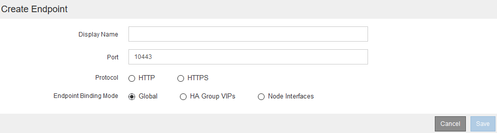
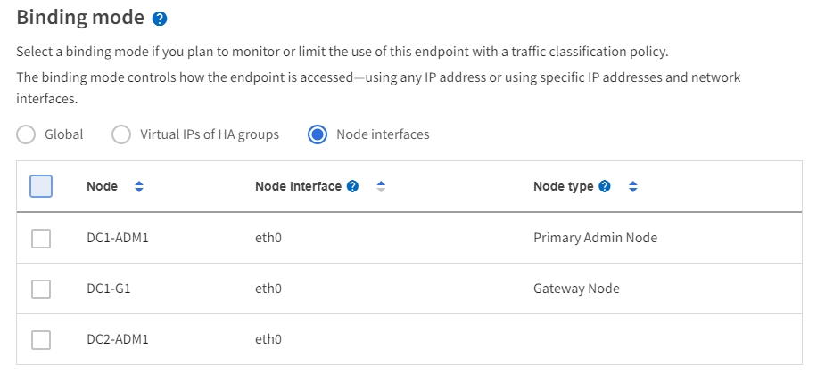
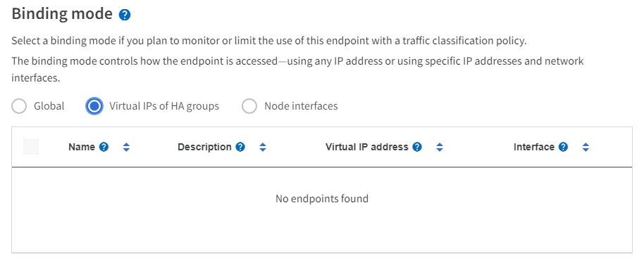
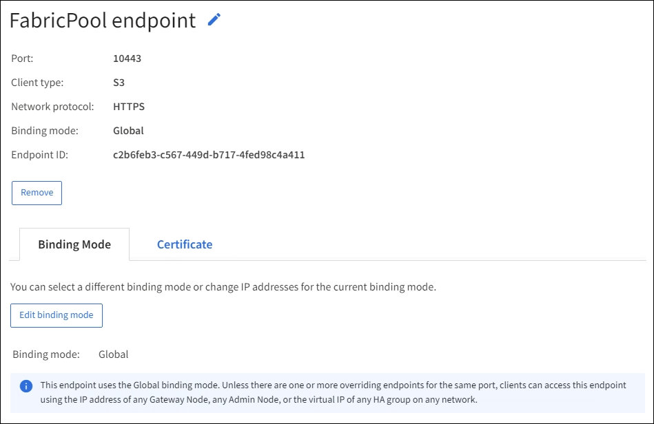

= Configure load balancer endpoints
:icons: font
:imagesdir: ../media/

[.lead]
Load balancer endpoints determine the ports and network protocols S3 and Swift clients can use when connecting to the StorageGRID load balancer on Gateway and Admin Nodes.

.What you'll need

* You are signed in to the Grid Manager using a xref:../admin/web-browser-requirements.adoc[supported web browser].

* You have the Root access permission.

* If you previously remapped a port you intend to use for the load balancer endpoint, you have xref:../maintain/removing-port-remaps.adoc[removed the port remap].

* You have created any high availability (HA) groups you plan to use. HA groups are recommended, but not required. See xref:managing-high-availability-groups.adoc[Manage high availability groups].

* If the load balancer endpoint will be used by xref:../admin/manage-s3-select-for-tenant-accounts.adoc[S3 tenants for S3 Select], it must not use the IP addresses or FQDNs of any bare-metal nodes. Only SG100 or SG1000 appliances and VMware-based software nodes are allowed for the load balancer endpoints used for S3 Select.

*  You have configured any VLAN interfaces you plan to use. See xref:configure-vlan-interfaces.adoc[Configure VLAN interfaces].

* If you are creating an HTTPS endpoint (recommended), you have the information for the server certificate.
+
NOTE: Changes to an endpoint certificate can take up to 15 minutes to be applied to all nodes.

** To upload a certificate, you need the server certificate, the certificate private key, and optionally, a CA bundle.

** To generate a certificate, you need all of the domain names and IP addresses that S3 or Swift clients will use to access the endpoint. You must also know the subject (Distinguished Name).

** If you want to use the StorageGRID S3 and Swift API certificate (which can also be used for connections directly to Storage Nodes), you have already replaced the default certificate with a custom certificate signed by an external certificate authority. See 
xref:../admin/configuring-custom-server-certificate-for-storage-node-or-clb.adoc[Configure S3 and Swift API certificates].
+
The certificate can use wildcards to represent the fully qualified domain names of all Admin Nodes and Gateway Nodes running the Load Balancer service. For example, `*.storagegrid._example_.com` uses the * wildcard to represent `adm1.storagegrid._example_.com` and `gn1.storagegrid._example_.com`. See xref:configuring-s3-api-endpoint-domain-names.adoc[Configure S3 API endpoint domain names].

== Create a load balancer endpoint

Each load balancer endpoint specifies a port, a client type (S3 or Swift), and a network protocol (HTTP or HTTPS).

=== Access the wizard

. Select *CONFIGURATION* > *Network* > *Load balancer endpoints*.

. Select *Create*.

=== Enter endpoint details

. Enter details for the endpoint.
+

+
[cols="1a,3a" options="header"]
|===
| Field| Description

|Name
|A descriptive name for the endpoint, which will appear in the table on the Load balancer endpoints page.

|Port
|The port clients will use to connect to the Load Balancer service on Admin Nodes and Gateway Nodes.

Accept the suggested port number or enter any external port that is not used by another grid service. Enter a value between 1 and 65535.

If you enter *80* or *443*, the endpoint is configured only on Gateway Nodes. These ports are reserved on Admin Nodes.

See the xref:../network/index.adoc[Networking guidelines] for information about external ports.

|Client type
|The type of client application that will use this endpoint, either *S3* or *Swift*.

|Network protocol
|The network protocol that clients will use when connecting to this endpoint.

*  Select *HTTPS* for secure, TLS encrypted communication (recommended). You must attach a security certificate before you can save the endpoint.

* Select *HTTP* for less secure, unencrypted communication. Use HTTP only for a non-production grid.
|===

. Select *Continue*.

=== Select the binding mode

. Select a binding mode for the endpoint to control how the endpoint is accessed.
+
[cols="1a,3a" options="header"]
|===
| Option | Description

|Global (default)
|Clients can access the endpoint using a fully qualified domain name (FQDN), the IP address of any Gateway Node or Admin Node, or the virtual IP address of any HA group on any network.

Use the *Global* setting (default) unless you need to restrict the accessibility of this endpoint.

|Node interfaces
|Clients must use the IP address of a selected node and network interface to access this endpoint.

|Virtual IPs of HA groups
|Clients must use a virtual IP address of an HA group to access this endpoint.

Endpoints with this binding mode can all use the same port number, as long as the HA groups you select for the endpoints do not overlap.

Endpoints with this mode can all use the same port number as long as the interfaces you select for the endpoints do not overlap.

|===
+
[NOTE]
If you use the same port for more than one endpoint, an endpoint using *Virtual IPs of HA groups* mode overrides an endpoint using *Node interfaces* mode, which overrides an endpoint using *Global* mode.

. If you selected *Node interfaces*, select one or more node interfaces for each Admin Node or Gateway Node that you want to associate with this endpoint.
+

. If you selected *Virtual IPs of HA groups*, select one or more HA groups.
+

+

. If you are creating an *HTTP* endpoint, you do not need to attach a certificate. Select *Create* to add the new load balancer endpoint. Then, go to <<After-you-finish,After you finish>>. Otherwise, select *Continue* to attach the certificate.

=== Attach certificate

. If you are creating an *HTTPS* endpoint, select the type of security certificate you want to attach to the endpoint.
+
The certificate secures the connections between S3 and Swift clients and the Load Balancer service on Admin Node or Gateway Nodes.
+
* *Upload certificate*. Select this option if you have custom certificates to upload.

* *Generate certificate*. Select this option if you have the values needed to generate a custom certificate.

* *Use StorageGRID S3 and Swift certificate*. Select this option if you want to use the global S3 and Swift API certificate, which can also be used for connections directly to Storage Nodes. 
+
You cannot select this option unless you have replaced the default S3 and Swift API certificate, which is signed by the grid CA, with a custom certificate signed by an external certificate authority. See
xref:../admin/configuring-custom-server-certificate-for-storage-node-or-clb.adoc[Configure S3 and Swift API certificates].

. If you are not using the StorageGRID S3 and Swift certificate, upload or generate the certificate.
//tabbed blocks start here
+
[role="tabbed-block"]
====

.Upload certificate
--

.. Select *Upload certificate*.
.. Upload the required server certificate files:
 ** *Server certificate*: The custom server certificate file in PEM encoding.
 ** *Certificate private key*: The custom server certificate private key file (`.key`).
+
NOTE: EC private keys must be 224 bits or larger. RSA private keys must be 2048 bits or larger.

 ** *CA bundle*: A single optional file containing the certificates from each intermediate issuing certificate authority (CA). The file should contain each of the PEM-encoded CA certificate files, concatenated in certificate chain order.

.. Expand *Certificate details* to see the metadata for each certificate you uploaded. If you uploaded an optional CA bundle, each certificate displays on its own tab.
+
* Select *Download certificate* to save the certificate file or select *Download CA bundle* to save the certificate bundle.
+
Specify the certificate file name and download location. Save the file with the extension `.pem`.
+
For example: `storagegrid_certificate.pem`
* Select *Copy certificate PEM* or *Copy CA bundle PEM* to copy the certificate contents for pasting elsewhere.

.. Select *Create*. +
The load balancer endpoint is created. The custom certificate is used for all subsequent new connections between S3 and Swift clients and the endpoint.

--
//end Upload, begin Generate

.Generate certificate
--

.. Select *Generate certificate*.
.. Specify the certificate information:
 ** *Domain name*: One or more fully qualified domain names to include in the certificate. Use an * as a wildcard to represent multiple domain names.
 ** *IP*: One or more IP addresses to include in the certificate.
 ** *Subject*: X.509 subject or distinguished name (DN) of the certificate owner.
 ** *Days valid*: Number of days after creation that the certificate expires.

.. Select *Generate*.

.. Select  *Certificate details* to see the metadata for the generated certificate.

* Select *Download certificate* to save the certificate file.
+
Specify the certificate file name and download location. Save the file with the extension `.pem`.
+
For example: `storagegrid_certificate.pem`
* Select *Copy certificate PEM* to copy the certificate contents for pasting elsewhere.

.. Select *Create*.
+
The load balancer endpoint is created. The custom certificate is used for all subsequent new connections between S3 and Swift clients and this endpoint.

--

====
//end tabbed blocks

=== [[After-you-finish]]After you finish

. If you use a domain name system (DNS), ensure that the DNS includes a record to associate the StorageGRID fully qualified domain name to each IP address that clients will use to make connections.
+
The IP address you enter in the DNS record depends on whether you are using an HA group of load-balancing nodes:

** If you have configured a HA group, clients will connect to the virtual IP addresses of that HA group.

** If you are not using a HA group, clients will connect to the StorageGRID Load Balancer service using the IP address of any Gateway Node or Admin Node.
+
You must also ensure that the DNS record references all required endpoint domain names, including any wildcard names.

. Provide S3 and Swift clients with the information needed to connect to the endpoint:

** Port number
** Fully qualified domain name or IP address
** Any required certificate details

== View and edit load balancer endpoints

You can view details for existing load balancer endpoints, including the certificate metadata for a secured endpoint. You can also change an endpoint's name or binding mode and update any associated certificates.

You cannot change the service type (S3 or Swift), the port, or the protocol (HTTP or HTTPS).

* To view basic information for all load balancer endpoints, review the table on the Load balancer endpoints page. 
+
image::../media/load_balancer_endpoint_table.png[Load balancer endpoint table]

* To view all details about a specific endpoint, including certificate metadata, select the endpoint's name in the table.
+

* To edit an endpoint, use the *Actions* menu on the Load balancer endpoints page or the details page for a specific endpoint.
+
IMPORTANT: After editing an endpoint, you might need to wait up to 15 minutes for your changes to be applied to all nodes.
+
[cols="1a, 2a,2a" options="header"]
|===
|Task | Actions menu | Details page

|Edit endpoint name

|.. Select the check box for the endpoint. 
.. Select *Actions* > *Edit endpoint name*.
.. Enter the new name.
.. Select *Save*.

|.. Select the endpoint name to display the details.
.. Select the edit icon image:../media/icon_edit_tm.png[Edit icon].
.. Enter the new name.
.. Select *Save*.

|Edit endpoint binding mode

|.. Select the check box for the endpoint. 
.. Select *Actions* > *Edit endpoint binding mode*.
.. Update the binding mode as required.
.. Select *Save changes*.

|.. Select the endpoint name to display the details.
.. Select *Edit binding mode*.
.. Update the binding mode as required.
.. Select *Save changes*.

|Edit endpoint certificate

|.. Select the check box for the endpoint. 
.. Select *Actions* > *Edit endpoint certificate*.
.. Upload or generate a new custom certificate or begin using the global S3 and Swift certificate, as required.
.. Select *Save changes*.

|.. Select the endpoint name to display the details.
.. Select the *Certificate* tab.
.. Select *Edit certificate*.
.. Upload or generate a new custom certificate or begin using the global S3 and Swift certificate, as required.
.. Select *Save changes*.

|===

== Remove load balancer endpoints

You can remove one or more endpoints using the *Actions* menu, or you can remove a single endpoint from the details page.

IMPORTANT: To prevent client disruptions, update any affected S3 or Swift client applications before you remove a load balancer endpoint. Update each client to connect using a port assigned to another load balancer endpoint. Be sure to update any required certificate information as well.

* To remove one or more endpoints:

.. From the Load balancer page, select the check box for each endpoint you want to remove. 
.. Select *Actions* > *Remove*.
.. Select *OK*.

* To remove one endpoint from the details page: 
.. From the Load balancer page. select the endpoint name.
.. Select *Remove* on the details page.
.. Select *OK*. 
