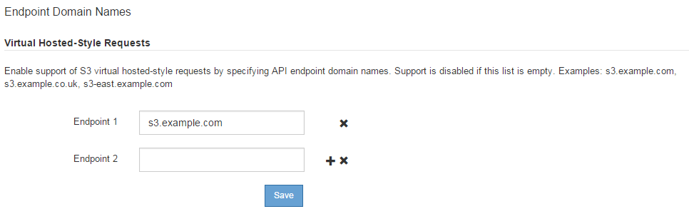

= Configure S3 API endpoint domain names
:icons: font
:imagesdir: ../media/

[.lead]
To support S3 virtual hosted-style requests, you must use the Grid Manager to configure the list of endpoint domain names that S3 clients connect to.

.What you'll need

* You are signed in to the Grid Manager using a xref:../admin/web-browser-requirements.adoc[supported web browser].
* You have specific access permissions.
* You have confirmed that a grid upgrade is not in progress.
+
CAUTION: Do not make any changes to the domain name configuration when a grid upgrade is in progress.

.About this task

To enable clients to use S3 endpoint domain names, you must do all of the following:

* Use the Grid Manager to add the S3 endpoint domain names to the StorageGRID system.
* Ensure that the certificate the client uses for HTTPS connections to StorageGRID is signed for all domain names that the client requires.
+
For example, if the endpoint is `s3.company.com`, you must ensure that the certificate used for HTTPS connections includes the `s3.company.com` endpoint and the endpoint's wildcard Subject Alternative Name (SAN): `*.s3.company.com`.

* Configure the DNS server used by the client. Include DNS records for the IP addresses that clients use to make connections, and ensure that the records reference all required endpoint domain names, including any wildcard names.
+
NOTE: Clients can connect to StorageGRID using the IP address of a Gateway Node, an Admin Node, or a Storage Node, or by connecting to the virtual IP address of a high availability group. You should understand how client applications connect to the grid so you include the correct IP addresses in the DNS records.

Clients that use HTTPS connections (recommended) to the grid can use either of these certificates:

* Clients that connect to a load balancer endpoint can use a custom certificate for that endpoint. Each load balancer endpoint can be configured to recognize different endpoint domain names.
 
* Clients that connect to a load balancer endpoint, directly to a Storage Node, or directly to the deprecated CLB service on a Gateway Node can customize the global S3 and Swift API certificate to include all required endpoint domain names.

.Steps

. Select *CONFIGURATION* > *Network* > *Domain names*.
+
The Endpoint Domain Names page appears.
+

. Enter the list of S3 API endpoint domain names in the *Endpoint* fields. Use the image:../media/icon_plus_sign_black_on_white_old.png[plus sign icon] icon to add additional fields.
+
If this list is empty, support for S3 virtual hosted-style requests is disabled.

. Select *Save*.
. Ensure that the server certificates that clients use match the required endpoint domain names.
 ** If clients connect to a load balancer endpoint that uses its own certificate, update the certificate associated with the endpoint.
 ** If clients connect to a load balancer endpoint that uses the global S3 and Swift API certificate, directly to Storage Nodes, or to the CLB service on Gateway Nodes, update the global S3 and Swift API certificate.
. Add the DNS records required to ensure that endpoint domain name requests can be resolved.

.Result

Now, when clients use the endpoint `bucket.s3.company.com`, the DNS server resolves to the correct endpoint and the certificate authenticates the endpoint as expected.

.Related information

* xref:../s3/index.adoc[Use S3]

* xref:viewing-ip-addresses.adoc[View IP addresses]

* xref:configure-high-availability-group.adoc[Configure high availability groups]

* xref:configuring-custom-server-certificate-for-storage-node-or-clb.adoc[Configure S3 and Swift API certificates]

* xref:configuring-load-balancer-endpoints.adoc[Configure load balancer endpoints]
