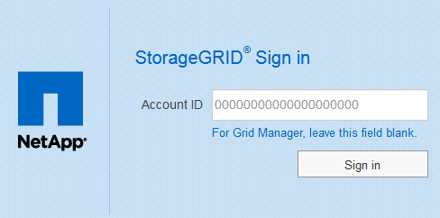
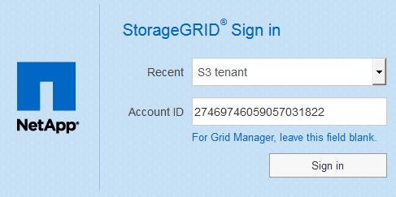
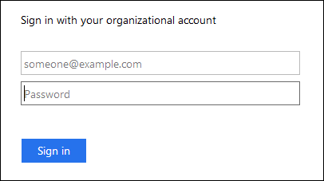

= Configure single sign-on
:icons: font
:imagesdir: ../media/

[.lead]
When single sign-on (SSO) is enabled, users can only access the Grid Manager, the Tenant Manager, the Grid Management API, or the Tenant Management API if their credentials are authorized using the SSO sign-in process implemented by your organization. Local users cannot sign in to StorageGRID.

== How single sign-on works

The StorageGRID system supports single sign-on (SSO) using the Security Assertion Markup Language 2.0 (SAML 2.0) standard.

Before enabling single sign-on (SSO), review how the StorageGRID sign-in and sign-out processes are affected when SSO is enabled.

=== Sign in when SSO is enabled

When SSO is enabled and you sign in to StorageGRID, you are redirected to your organization's SSO page to validate your credentials.

.Steps

. Enter the fully qualified domain name or IP address of any StorageGRID Admin Node in a web browser.
+
The StorageGRID Sign in page appears.

 ** If this is the first time you have accessed the URL on this browser, you are prompted for an account ID:
+

 ** If you have previously accessed either the Grid Manager or the Tenant Manager, you are prompted to select a recent account or to enter an account ID:
+

+
NOTE: The StorageGRID Sign in page is not shown when you enter the complete URL for a tenant account (that is, a fully qualified domain name or IP address followed by `/?accountId=_20-digit-account-id_`). Instead, you are immediately redirected to your organization's SSO sign-in page, where you can <<signin_sso,sign in with your SSO credentials>>.

. Indicate whether you want to access the Grid Manager or the Tenant Manager:
 ** To access the Grid Manager, leave the *Account ID* field blank, enter *0* as the account ID, or select *Grid Manager* if it appears in the list of recent accounts.
 ** To access the Tenant Manager, enter the 20-digit tenant account ID or select a tenant by name if it appears in the list of recent accounts.
. Select *Sign in*
+
StorageGRID redirects you to your organization's SSO sign-in page. For example:
+

. [[signin_sso]]Sign in with your SSO credentials.
+
If your SSO credentials are correct:

 .. The identity provider (IdP) provides an authentication response to StorageGRID.
 .. StorageGRID validates the authentication response.
 .. If the response is valid and you belong to a federated group with StorageGRID access permissions, you are signed in to the Grid Manager or the Tenant Manager, depending on which account you selected.
+
NOTE: If the service account is inaccessible, you can still sign in, as long as you are an existing user that belongs to a federated group with StorageGRID access permissions.

. Optionally, access other Admin Nodes, or access the Grid Manager or the Tenant Manager, if you have adequate permissions.
+
You do not need to reenter your SSO credentials.

=== Sign out when SSO is enabled

When SSO is enabled for StorageGRID, what happens when you sign out depends on what you are signed in to and where you are signing out from.

.Steps

. Locate the *Sign Out* link in the top-right corner of the user interface.
. Select *Sign Out*.
+
The StorageGRID Sign in page appears. The *Recent Accounts* drop-down is updated to include *Grid Manager* or the name of the tenant, so you can access these user interfaces more quickly in the future.
+
[cols="1a,1a,1a" options="header"]
|===
| If you are signed in to...| And you sign out from...| You are signed out of...
a|
Grid Manager on one or more Admin Nodes
a|
Grid Manager on any Admin Node
a|
Grid Manager on all Admin Nodes

*Note:* If you use Azure for SSO, it might take a few minutes to be signed out of all Admin Nodes.
a|
Tenant Manager on one or more Admin Nodes
a|
Tenant Manager on any Admin Node
a|
Tenant Manager on all Admin Nodes
.2+a|
Both Grid Manager and Tenant Manager
a|
Grid Manager
a|
The Grid Manager only. You must also sign out of the Tenant Manager to sign out of SSO.
a|
Tenant Manager
a|
The Tenant Manager only. You must also sign out of the Grid Manager to sign out of SSO.
|===

NOTE: The table summarizes what happens when you sign out if you are using a single browser session. If you are signed in to StorageGRID across multiple browser sessions, you must sign out of all browser sessions separately.
