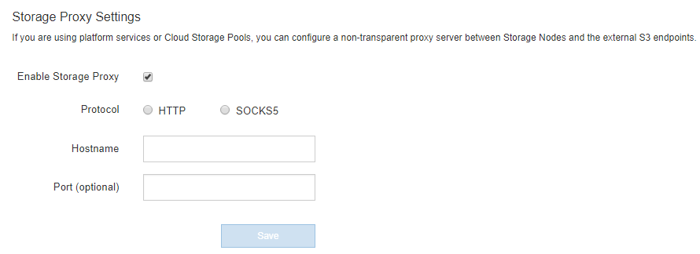

= Configure Storage proxy settings
:icons: font
:imagesdir: ../media/

[.lead]
If you are using platform services or Cloud Storage Pools, you can configure a non-transparent proxy between Storage Nodes and the external S3 endpoints. For example, you might need a non-transparent proxy to allow platform services messages to be sent to external endpoints, such as an endpoint on the internet.

.What you'll need

* You have specific access permissions.
* You are signed in to the Grid Manager using a xref:../admin/web-browser-requirements.adoc[supported web browser].

.About this task

You can configure the settings for a single Storage proxy.

.Steps

. Select *CONFIGURATION* > *Security* > *Proxy settings*.
+
The Storage Proxy Settings page appears. By default, *Storage* is selected in the sidebar menu.
+
image::../media/proxy_settings_menu_storage.png[Proxy Settings Menu - Storage]

. Select the *Enable Storage Proxy* check box.
+
The fields for configuring a Storage proxy appear.
+

. Select the protocol for the non-transparent Storage proxy.
. Enter the hostname or IP address of the proxy server.
. Optionally, enter the port used to connect to the proxy server.
+
You can leave this field blank if you use the default port for the protocol: 80 for HTTP or 1080 for SOCKS5.

. Select *Save*.
+
After the Storage proxy is saved, new endpoints for platform services or Cloud Storage Pools can be configured and tested.
+
NOTE: Proxy changes can take up to 10 minutes to take effect.

. Check the settings of your proxy server to ensure that platform service-related messages from StorageGRID will not be blocked.

.After you finish
If you need to disable a Storage proxy, deselect the *Enable Storage Proxy* check box, and select *Save*.

.Related information

* xref:networking-and-ports-for-platform-services.adoc[Network and ports for platform services]

* xref:../ilm/index.adoc[Manage objects with ILM]
