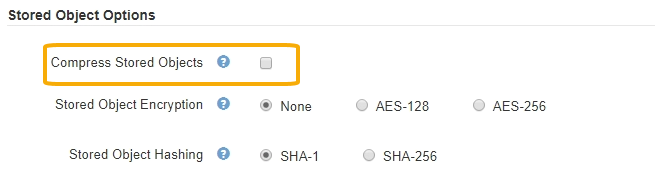

= Configure stored object compression
:icons: font
:imagesdir: ../media/

[.lead]
You can use the Compress Stored Objects grid option to reduce the size of objects stored in StorageGRID, so that objects consume less storage.

.What you'll need
* You are signed in to the Grid Manager using a xref:../admin/web-browser-requirements.adoc[supported web browser].
* You have specific access permissions.

.About this task
The Compress Stored Objects grid option is disabled by default. If you enable this option, StorageGRID attempts to compress each object when saving it, using lossless compression.

NOTE: If you change this setting, it will take about one minute for the new setting to be applied. The configured value is cached for performance and scaling.

Before enabling this option, be aware of the following:

* You should not enable compression unless you know that the data being stored is compressible.
* Applications that save objects to StorageGRID might compress objects before saving them. If a client application has already compressed an object before saving it to StorageGRID, enabling Compress Stored Objects will not further reduce an object's size.
* Do not enable compression if you are using NetApp FabricPool with StorageGRID.
* If the Compress Stored Objects grid option is enabled, S3 and Swift client applications should avoid performing GET Object operations that specify a range of bytes be returned. These "`range read`" operations are inefficient because StorageGRID must effectively uncompress the objects to access the requested bytes. GET Object operations that request a small range of bytes from a very large object are especially inefficient; for example, it is inefficient to read a 10 MB range from a 50 GB compressed object.
+
If ranges are read from compressed objects, client requests can time out.
+
NOTE: If you need to compress objects and your client application must use range reads, increase the read timeout for the application.

.Steps
. Select *CONFIGURATION* > *System* > *Grid options*.
. In the Stored Object Options section, select the *Compress Stored Objects* check box.
+

. Select *Save*.
