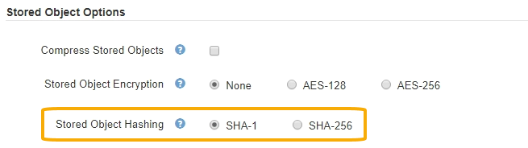

= Configure stored object hashing
:icons: font
:imagesdir: ../media/

[.lead]
The Stored Object Hashing option specifies the hashing algorithm used to verify object integrity.

.What you'll need

* You are signed in to the Grid Manager using a xref:../admin/web-browser-requirements.adoc[supported web browser].
* You have specific access permissions.

.About this task

By default, object data is hashed using the SHA-1 algorithm. The SHA-256 algorithm requires additional CPU resources and is generally not recommended for integrity verification.

NOTE: If you change this setting, it will take about one minute for the new setting to be applied. The configured value is cached for performance and scaling.

.Steps
. Select *CONFIGURATION* > *System* > *Grid options*.
. In the Stored Object Options section, change Stored Object Hashing to *SHA-1* (default) or *SHA-256*.
+

. Select *Save*.
