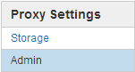
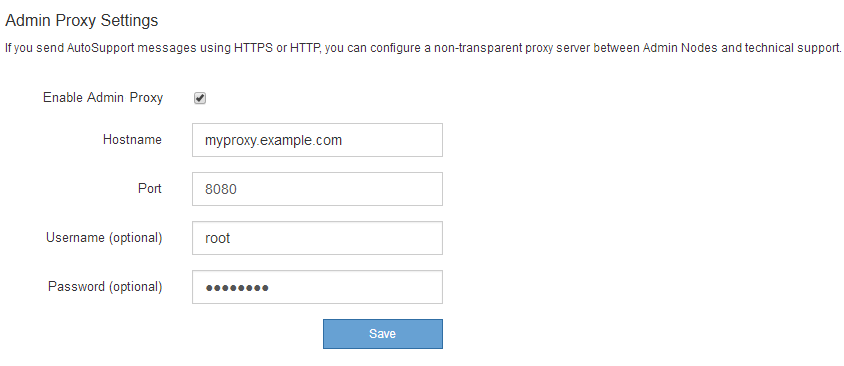

= Configuring Admin proxy settings
:icons: font
:imagesdir: ../media/

[.lead]
If you send AutoSupport messages using HTTP or HTTPS, you can configure a non-transparent proxy server between Admin Nodes and technical support (AutoSupport).

* You must have specific access permissions.
* You must be signed in to the Grid Manager using a supported browser.

You can configure the settings for a single Admin proxy.

. Select *Configuration* > *Network Settings* > *Proxy Settings*.
+
The Admin Proxy Settings page appears. By default, *Storage* is selected in the sidebar menu.

. From the sidebar menu, select *Admin*.
+

. Select the *Enable Admin Proxy* check box.
+

. Enter the hostname or IP address of the proxy server.
. Enter the port used to connect to the proxy server.
. Optionally, enter the proxy username.
+
Leave this field blank if your proxy server does not require a username.

. Optionally, enter the proxy password.
+
Leave this field blank if your proxy server does not require a password.

. Click *Save*.
+
After the Admin proxy is saved, the proxy server between Admin Nodes and technical support is configured.
+
NOTE: Proxy changes can take up to 10 minutes to take effect.

. If you need to disable the proxy, deselect the *Enable Admin Proxy* check box, and click *Save*.

.Related information

xref:specifying_protocol_for_autosupport_messages.adoc[Specifying the protocol for AutoSupport messages]
