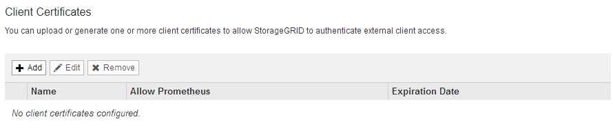
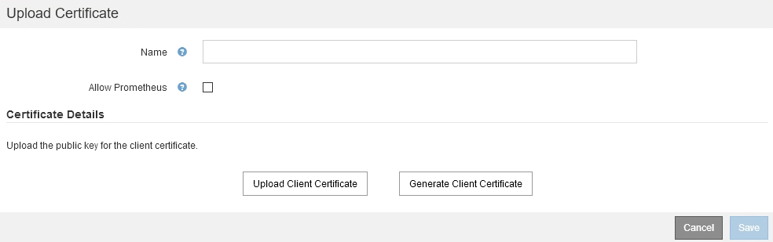
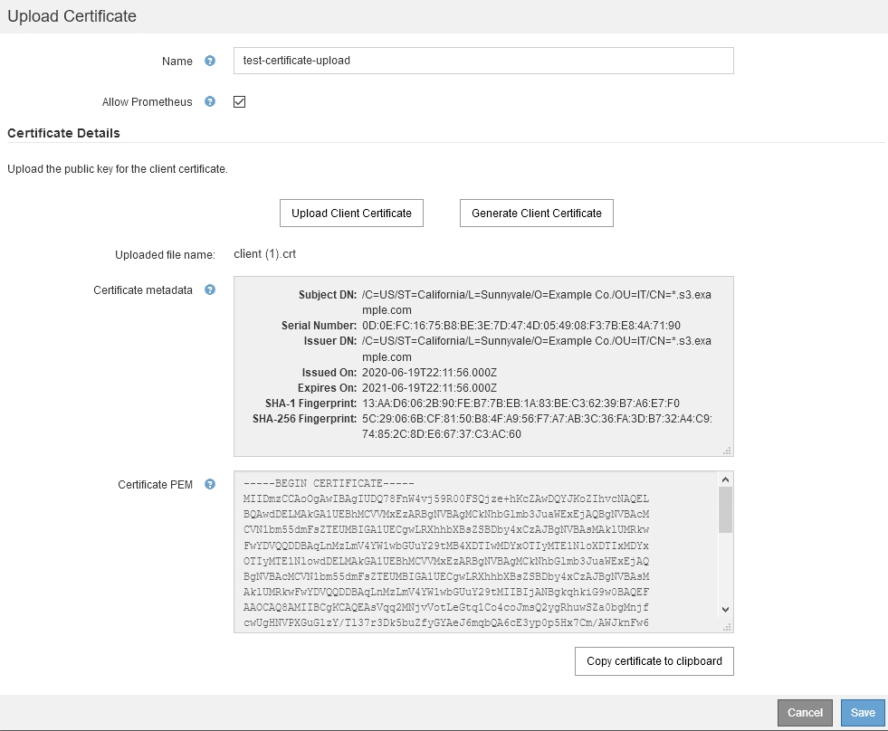
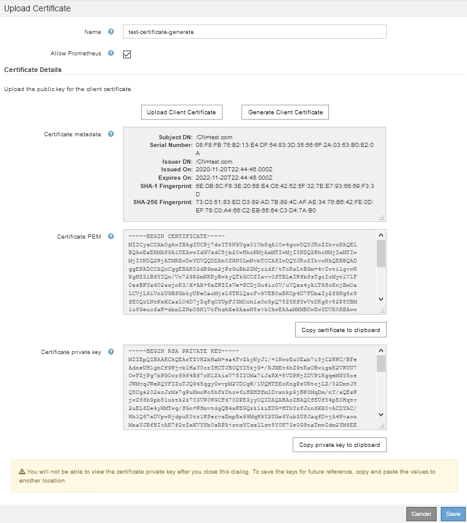
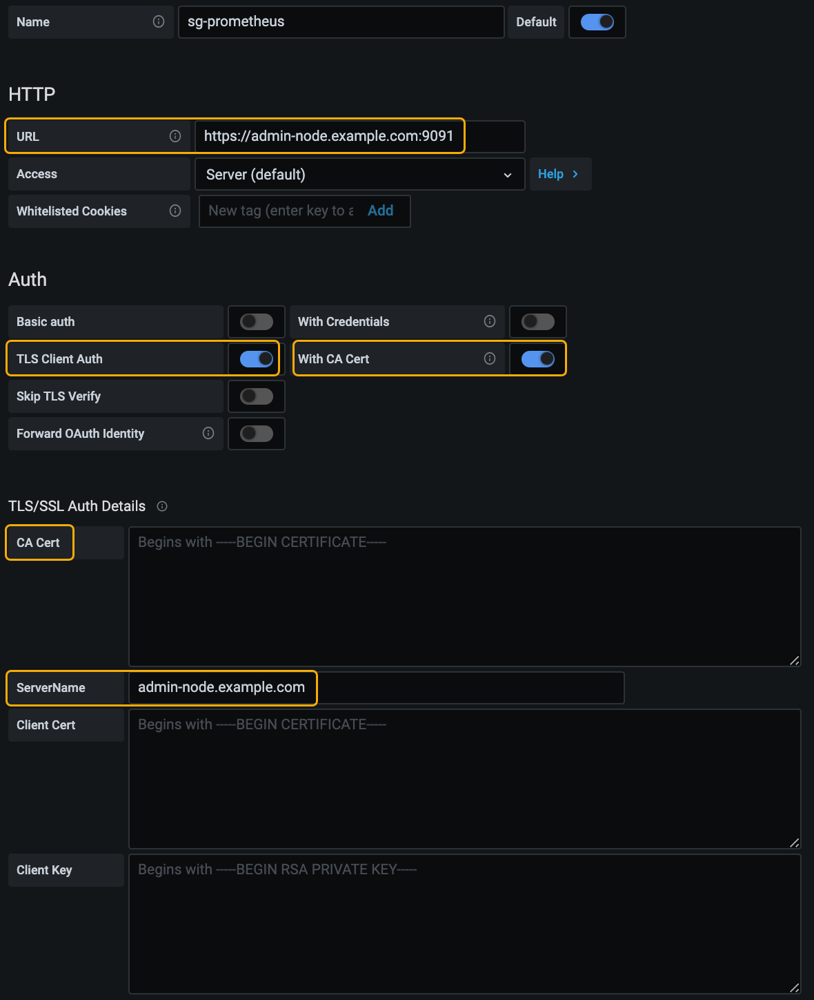
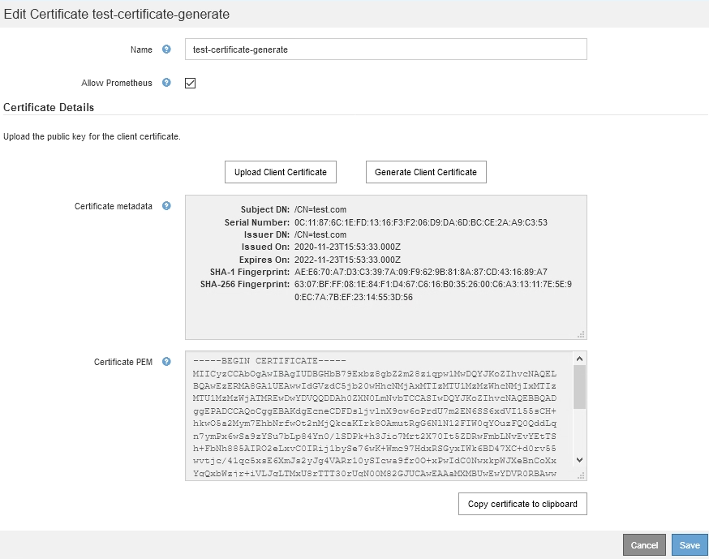
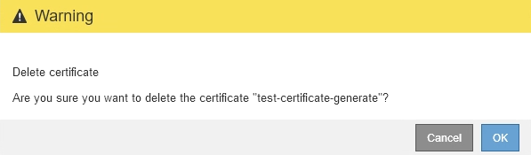

= Configuring administrator client certificates
:icons: font
:imagesdir: ../media/

[.lead]
You can use client certificates to allow authorized external clients to access the StorageGRID Prometheus database. Client certificates provide a secure way to use external tools to monitor StorageGRID.

If you need to access StorageGRID using an external monitoring tool, you must upload or generate a client certificate using the Grid Manager and copy the certificate information to the external tool.

== Adding administrator client certificates

To add a client certificate, you can provide your own certificate or generate one using the Grid Manager.

.What you'll need

* You must have the Root Access permission.
* You must be signed in to the Grid Manager using a supported browser.
* You must know the IP address or domain name of the Admin Node.
* You must have configured the StorageGRID Management Interface Server Certificate and have the corresponding CA bundle
* If you want to upload your own certificate, the public key and private key for the certificate must be available on your local computer.

.Steps

. In the Grid Manager, select *Configuration* > *Access Control* > *Client Certificates*.
+
The Client Certificates page appears.
+

. Select *Add*.
+
The Upload Certificate page appears.
+

. Type a name between 1 and 32 characters for the certificate.
. To access Prometheus metrics using your external monitoring tool, select the *Allow Prometheus* check box.
. Upload  or generate a certificate:
.. To upload a certificate, go <<upload_cert,here>>.
.. To generate a certificate, go <<generate_cert,here>>.

. [[upload_cert]]To upload a certificate:
 .. Select *Upload Client Certificate*.
 .. Browse for the public key for the certificate.
+
After you upload the public key for the certificate, the *Certificate metadata* and *Certificate PEM* fields are populated.
+

 .. Select *Copy certificate to clipboard* and paste the certificate to your external monitoring tool.
 .. Use an editing tool to copy and paste the private key to your external monitoring tool.
 .. Select *Save* to save the certificate in the Grid Manager.

. [[generate_cert]]To generate a certificate:
 .. Select *Generate Client Certificate*.
 .. Enter the domain name or IP address of the Admin Node.
 .. Optionally, enter an X.509 subject, also referred to as the Distinguished Name (DN), to identify the administrator who owns the certificate.
 .. Optionally, select the number of days the certificate is valid. The default is 730 days.
 .. Select *Generate*.
+
The *Certificate metadata*, *Certificate PEM*, and *Certificate private key* fields are populated.
+

 .. Select *Copy certificate to clipboard* and paste the certificate to your external monitoring tool.
 .. Select *Copy private key to clipboard* and paste the key to your external monitoring tool.
+
IMPORTANT: You will not be able to view the private key after you close the dialog box. Copy the key to a safe location.

 .. Select *Save* to save the certificate in the Grid Manager.
. Configure the following settings on your external monitoring tool, such as Grafana.
+
A Grafana example is shown in the following screenshot:
+

 .. *Name*: Enter a name for the connection.
+
StorageGRID does not require this information, but you must provide a name to test the connection.

 .. *URL*: Enter the domain name or IP address for the Admin Node. Specify HTTPS and port 9091.
+
For example: `+https://admin-node.example.com:9091+`

 .. Enable *TLS Client Authorization* and *With CA Cert*.
 .. Copy and paste the Management Interface Server Certificate or CA bundle to**CA Cert** under TLS/SSL Auth Details.
 .. *ServerName*: Enter the domain name of the Admin Node.
+
ServerName must match the domain name as it appears in the Management Interface Server Certificate.

 .. Save and test the certificate and private key that you copied from StorageGRID or a local file.
+
You can now access the Prometheus metrics from StorageGRID with your external monitoring tool.
+
For information about the metrics, see the instructions for monitoring and troubleshooting StorageGRID.

.Related information

xref:using_storagegrid_security_certificates.adoc[Using StorageGRID security certificates]

xref:configuring_custom_server_certificate_for_grid_manager_tenant_manager.adoc[Configuring a custom server certificate for the Grid Manager and the Tenant Manager]

xref:../monitor/index.adoc[Monitor & troubleshoot]

== Editing administrator client certificates

You can edit a certificate to change its name, enable or disable Prometheus access, or upload a new certificate when the current one has expired.

.What you'll need

* You must have the Root Access permission.
* You must be signed in to the Grid Manager using a supported browser.
* You must know the IP address or domain name of the Admin Node.
* If you want to upload a new certificate and private key, they must be available on your local computer.

.Steps

. Select *Configuration* > *Access Control* > *Client Certificates*.
+
The Client Certificates page appears. The existing certificates are listed.
+
Certificate expiration dates are listed in the table. If a certificate will expire soon or is already expired, a message appears in the table and an alert is triggered.
+
image::../media/certificate_admin_list.png[Certificate - Admin - List]

. Select the radio button to the left of the certificate you want to edit.
. Select *Edit*.
+
The Edit Certificate dialog box appears.
+

. Make the desired changes to the certificate.
. Select *Save* to save the certificate in the Grid Manager.
. If you uploaded a new certificate:
 .. Select *Copy certificate to clipboard* to paste the certificate to your external monitoring tool.
 .. Use an editing tool to copy and paste the new private key to your external monitoring tool.
 .. Save and test the certificate and private key in your external monitoring tool.
. If you generated a new certificate:
 .. Select *Copy certificate to clipboard* to paste the certificate to your external monitoring tool.
 .. Select *Copy private key to clipboard* to paste the certificate to your external monitoring tool.
+
IMPORTANT: You will not be able to view or copy the private key after you close the dialog box. Copy the key to a safe location.

 .. Save and test the certificate and private key in your external monitoring tool.

== Removing administrator client certificates

If you no longer need a certificate, you can remove it.

.What you'll need

* You must have the Root Access permission.
* You must be signed in to the Grid Manager using a supported browser.

.Steps

. Select *Configuration* > *Access Control* > *Client Certificates*.
+
The Client Certificates page appears. The existing certificates are listed.
+
image::../media/certificate_admin_list.png[Certificate - Admin - List]

. Select the radio button to the left of the certificate you want to remove.
. Select *Remove*.
+
A confirmation dialog box appears.
+

. Select *OK*.
+
The certificate is removed.
