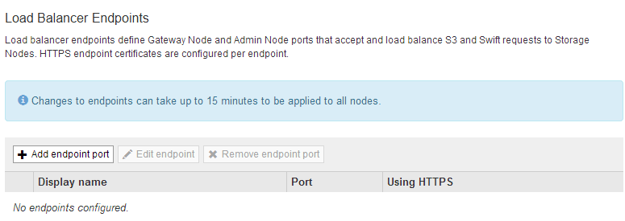
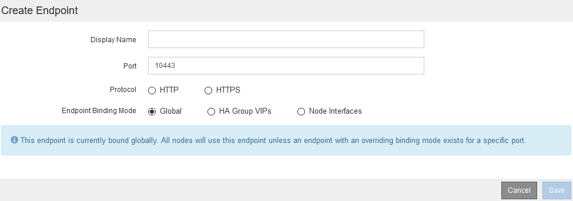
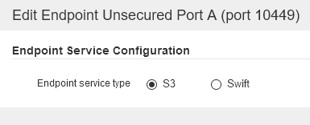
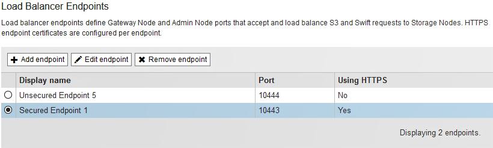
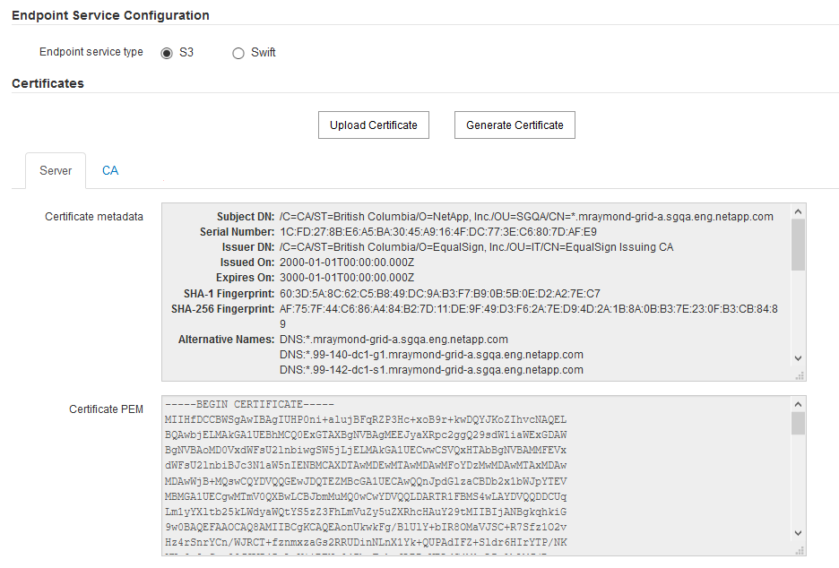
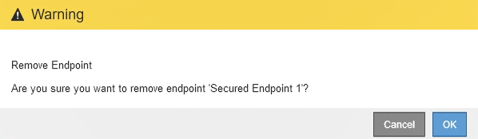

= Configuring load balancer endpoints
:icons: font
:imagesdir: ../media/

[.lead]
You can create, edit, and remove load balancer endpoints.

== Creating load balancer endpoints

[.lead]
Each load balancer endpoint specifies a port, a network protocol (HTTP or HTTPS), and a service type (S3 or Swift). If you create an HTTPS endpoint, you must upload or generate a server certificate.

* You must have the Root Access permission.
* You must be signed in to the Grid Manager using a supported browser.
* If you have previously remapped ports you intend to use for the Load Balancer service, you must have removed the remaps.
+
IMPORTANT: If you have remapped any ports, you cannot use the same ports to configure load balancer endpoints. You can create endpoints using remapped ports, but those endpoints will be remapped to the original CLB ports and service, not the Load Balancer service. Follow the steps in the recovery and maintenance instructions for removing port remaps.
+
NOTE: The CLB service is deprecated.

. Select *Configuration* > *Network Settings* > *Load Balancer Endpoints*.
+
The Load Balancer Endpoints page appears.
+

. Select *Add endpoint*.
+
The Create Endpoint dialog box appears.
+
image::../media/load_balancer_endpoint_create_http.png[Create LB Endpoint]

. Enter a display name for the endpoint, which will appear in the list on the Load Balancer Endpoints page.
. Enter a port number, or leave the pre-filled port number as is.
+
If you enter port number 80 or 443, the endpoint is configured only on Gateway Nodes, since these ports are reserved on Admin Nodes.
+
NOTE: Ports used by other grid services are not permitted. See the networking guidelines for a list of ports used for internal and external communications.

. Select *HTTP* or *HTTPS* to specify the network protocol for this endpoint.
. Select an endpoint binding mode.
 ** *Global* (default): The endpoint is accessible on all Gateway Nodes and Admin Nodes on the specified port number.
+

 ** *HA Group VIPs*: The endpoint is accessible only through the virtual IP addresses defined for the selected HA groups. Endpoints defined in this mode can reuse the same port number, as long as the HA groups defined by those endpoints do not overlap with each other.
+
Select the HA groups with the virtual IP addresses where you want the endpoint to appear.
+
image::../media/load_balancer_endpoint_ha_group_vips_binding_mode.png[Endpoint HA Group VIPs Binding Mode]

 ** *Node Interfaces*: The endpoint is accessible only on the designated nodes and network interfaces. Endpoints defined in this mode can reuse the same port number as long as those interfaces do not overlap with each other.
+
Select the node interfaces where you want the endpoint to appear.
+
image::../media/load_balancer_endpoint_node_interfaces_binding_mode.png[Endpoint Node Interfaces Binding Mode]
. Select *Save*.
+
The Edit Endpoint dialog box appears.

. Select *S3* or *Swift* to specify the type of traffic this endpoint will serve.
+

. If you selected *HTTP*, select *Save*.
+
The unsecured endpoint is created. The table on the Load Balancer Endpoints page lists the endpoint's display name, port number, protocol, and endpoint ID.

. If you selected *HTTPS* and you want to upload a certificate, select *Upload Certificate*.
+
image::../media/load_balancer_endpoint_upload_cert.png[Upload Cert]

 .. Browse for the server certificate and the certificate private key.
+
To enable S3 clients to connect using an S3 API endpoint domain name, use a multi-domain or wildcard certificate that matches all domain names that the client might use to connect to the grid. For example, the server certificate might use the domain name*.example.com.
+
xref:configuring_s3_api_endpoint_domain_names.adoc[Configuring S3 API endpoint domain names]

 .. Optionally browse for a CA bundle.
 .. Select *Save*.
+
The PEM-encoded certificate data for the endpoint appears.

. If you selected *HTTPS* and you want to generate a certificate, select *Generate Certificate*.
+
image::../media/load_balancer_endpoint_generate_cert.png[Generate Cert]

 .. Enter a domain name or an IP address.
+
You can use wildcards to represent the fully qualified domain names of all Admin Nodes and Gateway Nodes running the Load Balancer service. For example, `*.sgws.foo.com` uses the `*` wildcard to represent `gn1.sgws.foo.com` and `gn2.sgws.foo.com`.
+
xref:configuring_s3_api_endpoint_domain_names.adoc[Configuring S3 API endpoint domain names]

 .. Select image:../media/icon_plus_sign_black_on_white.gif[Plus Sign] to add any other domain names or IP addresses.
+
If you are using high availability (HA) groups, add the domain names and IP addresses of the HA virtual IPs.

 .. Optionally, enter an X.509 subject, also referred to as the Distinguished Name (DN), to identify who owns the certificate.
 .. Optionally, select the number of days the certificate is valid. The default is 730 days.
 .. Select *Generate*.
+
The certificate metadata and the PEM-encoded certificate data for the endpoint appear.

. Click *Save*.
+
The endpoint is created. The table on the Load Balancer Endpoints page lists the endpoint's display name, port number, protocol, and endpoint ID.

*Related information*

http://docs.netapp.com/sgws-115/topic/com.netapp.doc.sg-maint/home.html[Recovery and maintenance]

http://docs.netapp.com/sgws-115/topic/com.netapp.doc.sg-network/home.html[StorageGRID networking guidelines]

xref:managing_high_availability_groups.adoc[Managing high availability groups]

xref:managing_untrusted_client_networks.adoc[Managing untrusted Client Networks]

== Editing load balancer endpoints

[.lead]
For an unsecured (HTTP) endpoint, you can change the endpoint service type between S3 and Swift. For a secured (HTTPS) endpoint, you can edit the endpoint service type and view or change the security certificate.

* You must have the Root Access permission.
* You must be signed in to the Grid Manager using a supported browser.

. Select *Configuration* > *Network Settings* > *Load Balancer Endpoints*.
+
The Load Balancer Endpoints page appears. The existing endpoints are listed in the table.
+
Endpoints with certificates that will expire soon are identified in the table.
+

. Select the endpoint you want to edit.
. Click *Edit endpoint*.
+
The Edit Endpoint dialog box appears.
+
For an unsecured (HTTP) endpoint, only the Endpoint Service Configuration section of the dialog box appears. For a secured (HTTPS) endpoint, the Endpoint Service Configuration and the Certificates sections of the dialog box appear, as shown in the following example.
+

. Make the desired changes to the endpoint.
+
For an unsecured (HTTP) endpoint, you can:

 ** Change the endpoint service type between S3 and Swift.
 ** Change the endpoint binding mode.
For a secured (HTTPS) endpoint, you can:
 ** Change the endpoint service type between S3 and Swift.
 ** Change the endpoint binding mode.
 ** View the security certificate.
 ** Upload or generate a new security certificate when the current certificate is expired or about to expire.
+
Select a tab to display detailed information about the default StorageGRID server certificate or a CA signed certificate that was uploaded.

+
NOTE: To change the protocol for an existing endpoint, for example from HTTP to HTTPS, you must create a new endpoint. Follow the instructions for creating load balancer endpoints, and select the desired protocol.

. Click *Save*.

*Related information*

link:configuring_load_balancer_endpoints.md#[Creating load balancer endpoints]

== Removing load balancer endpoints

[.lead]
If you no longer need a load balancer endpoint, you can remove it.

* You must have the Root Access permission.
* You must be signed in to the Grid Manager using a supported browser.

. Select *Configuration* > *Network Settings* > *Load Balancer Endpoints*.
+
The Load Balancer Endpoints page appears. The existing endpoints are listed in the table.
+

. Select the radio button to the left of the endpoint you want to remove.
. Click *Remove endpoint*.
+
A confirmation dialog box appears.
+

. Click *OK*.
+
The endpoint is removed.
