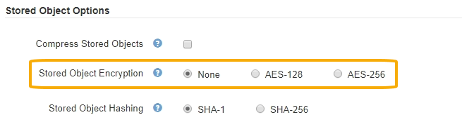

= Configuring stored object encryption
:icons: font
:imagesdir: ../media/

[.lead]
You can encrypt stored objects if you want to ensure that data cannot be retrieved in a readable form if an object store is compromised. By default, objects are not encrypted.

.What you'll need

* You must be signed in to the Grid Manager using a supported browser.
* You must have specific access permissions.

.About this task

Stored object encryption enables the encryption of all object data as it is ingested through S3 or Swift. When you enable the setting, all newly ingested objects are encrypted but no change is made to existing stored objects. If you disable encryption, currently encrypted objects remain encrypted but newly ingested objects are not encrypted.

NOTE: If you change this setting, it will take about one minute for the new setting to be applied. The configured value is cached for performance and scaling.

Stored objects can be encrypted using the AES‐128 or AES‐256 encryption algorithm.

The Stored Object Encryption setting applies only to S3 objects that have not been encrypted by bucket-level or object-level encryption.

.Steps

. Select *Configuration* > *System Settings* > *Grid Options*.
. In the Stored Object Options section, change Stored Object Encryption to *None* (default), *AES-128*, or *AES-256*.
+

. Click *Save*.
