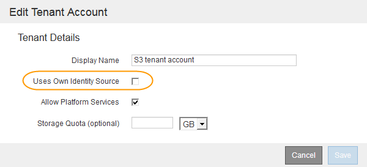

= Confirming federated users can sign in
:icons: font
:imagesdir: ../media/

[.lead]
Before you enable single sign-on (SSO), you must confirm that at least one federated user can sign in to the Grid Manager and in to the Tenant Manager for any existing tenant accounts.

.What you'll need

* You must be signed in to the Grid Manager using a supported browser.
* You must have specific access permissions.
* You are using Active Directory as the federated identity source and AD FS as the identity provider.
+
xref:requirements_for_sso.adoc[Requirements for using single sign-on]

.Steps

. If there are existing tenant accounts, confirm that none of the tenants is using its own identity source.
+
IMPORTANT: When you enable SSO, an identity source configured in the Tenant Manager is overridden by the identity source configured in the Grid Manager. Users belonging to the tenant's identity source will no longer be able to sign in unless they have an account with the Grid Manager identity source.

 .. Sign in to the Tenant Manager for each tenant account.
 .. Select *Access Control* > *Identity Federation*.
 .. Confirm that the *Enable Identity Federation* check box is not selected.
 .. If it is, confirm that any federated groups that might be in use for this tenant account are no longer required, unselect the check box, and click *Save*.

. Confirm that a federated user can access the Grid Manager:
 .. From Grid Manager, select *Configuration* > *Access Control* > *Admin Groups*.
 .. Ensure that at least one federated group has been imported from the Active Directory identity source and that it has been assigned the Root Access permission.
 .. Sign out.
 .. Confirm you can sign back in to the Grid Manager as a user in the federated group.
. If there are existing tenant accounts, confirm that a federated user who has Root Access permission can sign in:
 .. From the Grid Manager, select *Tenants*.
 .. Select the tenant account, and click *Edit Account*.
 .. If the *Uses Own Identity Source* check box is selected, uncheck the box and click *Save*.
+

+
The Tenant Accounts page appears.

 .. Select the tenant account, click *Sign In*, and sign in to the tenant account as the local root user.
 .. From the Tenant Manager, click *Access Control* > *Groups*.
 .. Ensure that at least one federated group from the Grid Manager has been assigned the Root Access permission for this tenant.
 .. Sign out.
 .. Confirm you can sign back in to the tenant as a user in the federated group.

.Related information

xref:requirements_for_sso.adoc[Requirements for using single sign-on]

link:managing_admin_groups.md#[Creating admin groups]

link:managing_admin_groups.md#[Admin group permissions]

http://docs.netapp.com/sgws-115/topic/com.netapp.doc.sg-tenant-admin/home.html[Using tenant accounts]
