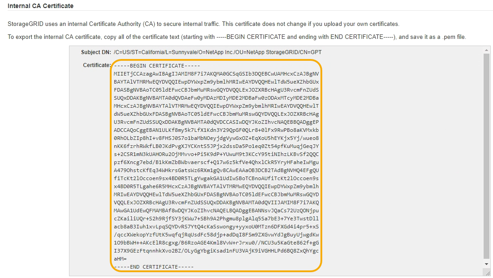

= Copying the StorageGRID system's CA certificate
:icons: font
:imagesdir: ../media/

[.lead]
StorageGRID uses an internal Certificate Authority (CA) to secure internal traffic. This certificate does not change if you upload your own certificates.

.What you'll need

* You must be signed in to the Grid Manager using a supported browser.
* You must have specific access permissions.

.About this task

If a custom server certificate has been configured, client applications should verify the server using the custom server certificate. They should not copy the CA certificate from the StorageGRID system.

.Steps

. Select *Configuration* > *Network Settings* > *Server Certificates*.
. In the Internal CA Certificate section, select all of the certificate text.
+
You must include `-----BEGIN CERTIFICATE-----` and `-----END CERTIFICATE-----` in your selection.
+

. Right-click the selected text, and select *Copy*.
. Paste the copied certificate into a text editor.
. Save the file with the extension `.pem`.
+
For example: `storagegrid_certificate.pem`
