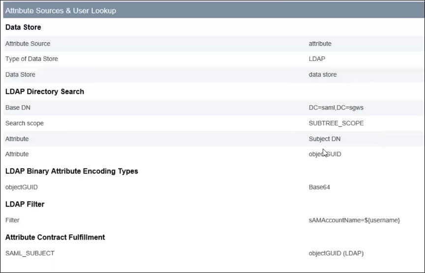

= Create SP connections in PingFederate
:icons: font
:imagesdir: ../media/

[.lead]
You use PingFederate to create a service provider (SP) connection for each Admin Node in your system. To speed the process, you will import the SAML metadata from StorageGRID.

.What you'll need

* You have configured single sign-on for StorageGRID and you selected *Ping Federate* as the SSO type.
* *Sandbox mode* is selected on the Single sign-on page in Grid Manager.
* You have the *SP connection ID* for each Admin Node in your system.
* You have downloaded the *SAML metadata* for each Admin Node in your system.

* You have experience creating SP connections in PingFederate Server.

* You have the
https://docs.pingidentity.com/bundle/pingfederate-103/page/kfj1564002962494.html"[Administrator's Reference Guide^] for PingFederate Server. The PingFederate documentation provides detailed step-by-step instructions and explanations.

* You have the Admin permission for PingFederate Server.

.About this task
These instructions summarize how to configure PingFederate Server version 10.3 as an SSO provider for StorageGRID. If you are using another version of PingFederate, you might need to adapt these instructions. Refer to the PingFederate Server documentation for detailed instructions for your release.

== Complete prerequisites in PingFederate
Before you can create the SP connections you will use for StorageGRID, you must complete prerequisite tasks in PingFederate. You will use information from these prerequisites when you configure the SP connections.

=== Create data store[[data-store]]

If you haven't already, create a data store to connect PingFederate to the AD FS LDAP server. Use the values you used when xref:../admin/using-identity-federation.adoc[configuring identity federation] in StorageGRID. 

* *Type*: Directory (LDAP)
* *LDAP Type*: Active Directory  
* *Binary Attribute Name*: Enter *objectGUID* on the LDAP Binary Attributes tab exactly as shown.

=== Create password credential validator[[password-validator]]

If you haven't already, create a password credential validator.

* *Type*: LDAP Username Password Credential Validator
* *Data store*: Select the data store you created.
* *Search base*: Enter information from LDAP (for example, DC=saml,DC=sgws).
* *Search filter*: sAMAccountName=${username}
* *Scope*: Subtree

=== Create IdP adapter instance[[adapter-instance]]
If you haven't already, create an IdP adapter instance.

. Go to *Authentication* > *Integration* > *IdP Adapters*.
. Select *Create New Instance*.
. On the Type tab, select *HTML Form IdP Adapter*.
. On the IdP Adapter tab, select *Add a new row to 'Credential validators'*.
. Select the <<password-validator, password credential validator>> you created.
. On the Adapter Attributes tab, select the *username* attribute for *Pseudonym*.
. Select *Save*.

=== Create signing certificate
If you haven't already, create a signing certificate.

. Go to *Security* > *Signing & Decryption Keys & Certificates* > *Create New*.
. Create a signing certificate for your domain name and country.

== Create an SP connection in PingFederate

When you create an SP connection in PingFederate, you import the SAML metadata you downloaded from StorageGRID for the Admin Node. The metadata file contains many of the specific values you need.

[IMPORTANT] 
====
You must create an SP connection for each Admin Node in your StorageGRID system, so that users can securely sign in to and out of any node. Use these instructions to create the first SP connection. Then, use *Select Action > Copy* to create a copy of the initial SP connection for each additional Admin Node. Simply enter the new Connection ID for the copy, so the new metadata can be used. 

All SP connections use identical settings, with the exception of the Partner's Entity ID and Base URL.
====

=== Choose SP connection type

. Go to *Applications* > *Integration* > *SP Connections*.
. Select *Create Connection*.
. Select *Do not use a template for this connection*.
. Select *Browser SSO Profiles* and *SAML 2.0* as the protocol. 

=== Import SP metadata

. On the Import Metadata tab, select *File*. 
. Choose the SAML metadata file you downloaded from the StorageGRID Single sign-on page for the Admin Node. 
. Review the Metadata Summary and the information on the General Info tab. 
+
The Partner's Entity ID and the Connection Name are set to the StorageGRID SP connection ID. (for example, 10.96.105.200-DC1-ADM1-105-200). The Base URL is the IP of the StorageGRID Admin Node.
. Select *Next*.

=== Configure IdP Browser SSO

. From the Browser SSO tab, select *Configure Browser SSO*.

. On the SAML profiles tab, select the *SP-initiated SSO* and *SP-initial SLO* options.

. Select *Next*.

. On the Assertion Lifetime tab, make no changes.

. On the Assertion Creation tab, select *Configure Assertion Creation*.

.. On the Identity Mapping tab, select *Standard*.

.. On the Attribute Contract tab, use the *SAML_SUBJECT* as the Attribute Contract and the unspecified name format that was imported.
. For Extend the Contract, select *Delete* to remove the `urn:oid`, which is not used.

=== Map adapter instance

. On the Authentication Source Mapping tab, select *Map New Adapter Instance*.
. On the Adapter instance tab, select the <<adapter-instance, adapter instance>> you created.
. On the Mapping Method tab, select *Retrieve Additional Attributes From a Data Store*.
. On the Attribute Source & User Lookup tab, select *Add Attribute Source*.
. On the Data Store tab, provide a description and select the <<data-source, data source>> you added.
. On the LDAP Directory Search tab: 
* Enter the *Base DN*, which should exactly match the value you entered in StorageGRID for the LDAP server. 
* For the Search Scope, select *Subtree*.
* For the Root Object Class, search for the *objectGUID* attribute and add it.

. On the LDAP Binary Attribute Encoding Types tab, select *Base64* for the *objectGUID* attribute.

. On the LDAP Filter tab, enter *sAMAccountName=${username}*.

. On the Attribute Contract Fulfillment tab, select *LDAP (attribute)* from the Source drop-down and select *objectGUID* from the Value drop-down.

. Review and then save the attribute source. For example:
+

.	On the Failsave Attribute Source tab, select *Abort the SSO Transaction*.

. Review the summary and select *Done*.

. Select *Done*.

=== Configure protocol settings

. On the *SP Connection* > *Browser SSO* > *Protocol Settings* tab, select *Configure Protocol Settings*.

. On the Assertion Consumer Service URL tab, accept the default values, which were imported from the StorageGRID SAML metadata (*POST* for Binding and `/api/saml-response` for Endpoint URL).

. On the SLO Service URLs tab, accept the default values, which were imported from the StorageGRID SAML metadata (*REDIRECT* for Binding and `/api/saml-logout` for Endpoint URL.

. On the Allowable SAML Bindings tab, unselect *ARTIFACT* and *SOAP*. Only *POST* and *REDIRECT* are required.

. On the Signature Policy tab, select *Always Sign Assertion*.

. On the Encryption Policy tab, select *None*.

. Review the summary and select *Done* to save the protocol settings.

. Review the summary and select *Done* to save the Browser SSO settings.

=== Configure credentials

. From the SP Connection tab, select *Credentials*. 
. From the Credentials tab, select *Configure Credentials*.

. Select *Done* to save the credentials.

. On the Signature Verifications Settings tab, select *Manage Signature Verification Settings*.

.. On the Trust Model tab, select *Unanchored*.
.. On the Signature Verification Certificate tab, review the signing certificate information, which was imported from the StorageGRID SAML metadata. 

. Review the summary screens and select *Save* to save the SP connection.

