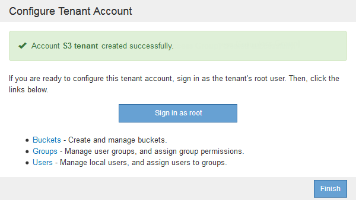
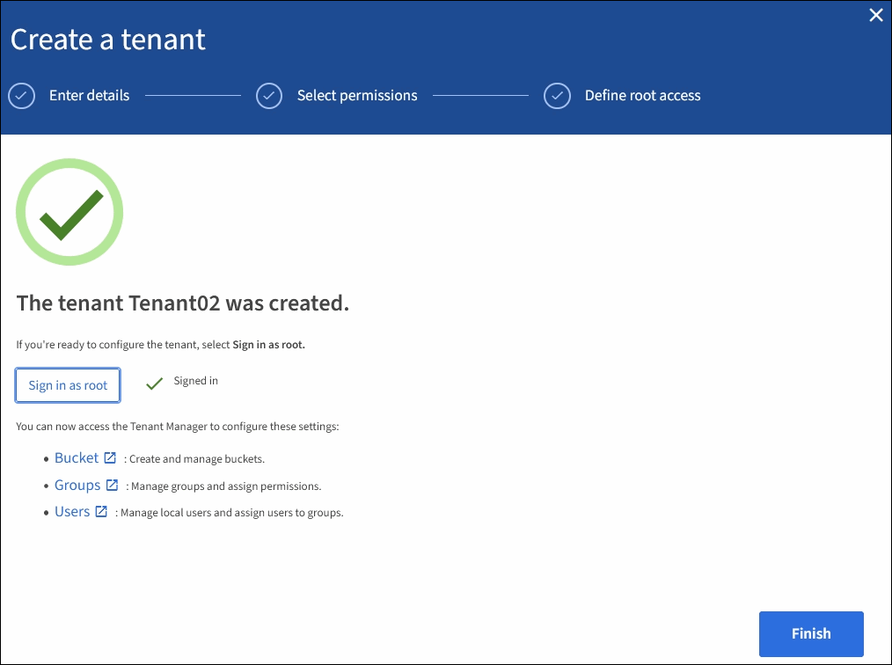

= Creating a tenant account if StorageGRID is not using SSO
:icons: font
:imagesdir: ../media/

[.lead]
When you create a tenant account, you specify a name, a client protocol, and optionally a storage quota. If StorageGRID is not using single sign-on (SSO), you must also specify whether the tenant account will use its own identity source and configure the initial password for the tenant's local root user.

.About this task

If the tenant account will use the identity source that was configured for the Grid Manager, and you want to grant Root Access permission for the tenant account to a federated group, you must have imported that federated group into the Grid Manager. You do not need to assign any Grid Manager permissions to this admin group. See the instructions for  xref:managing-admin-groups.adoc[managing admin groups].

.Steps

. In the *Display Name* text box, enter a display name for this tenant account.
+
Display names do not need to be unique. When the tenant account is created, it receives a unique, numeric Account ID.

. Select the client protocol that will be used by this tenant account, either *S3* or *Swift*.
. For S3 tenant accounts, keep the *Allow Platform Services* check box selected unless you do not want this tenant to use platform services for S3 buckets.
+
If platform services are enabled, a tenant can use features, such as CloudMirror replication, that access external services. You might want to disable the use of these features to limit the amount of network bandwidth or other resources a tenant consumes. See "`Managing platform services.`"

. In the *Storage Quota* text box, optionally enter the maximum number of gigabytes, terabytes, or petabytes that you want to make available for this tenant's objects. Then, select the units from the drop-down list.
+
Leave this field blank if you want this tenant to have an unlimited quota.
+
NOTE: A tenant's storage quota represents a logical amount (object size), not a physical amount (size on disk). ILM copies and erasure coding do not contribute to the amount of quota used. If the quota is exceeded, the tenant account cannot create new objects.
+
NOTE: To monitor each tenant account's storage usage, select *Usage*. Tenant accounts can also monitor their own storage usage from the Dashboard in the Tenant Manager or with the Tenant Management API. Note that a tenant's storage usage values might become out of date if nodes are isolated from other nodes in the grid. The totals will be updated when network connectivity is restored.

. If the tenant will manage its own groups and users, follow these steps.
 .. Select the *Uses Own Identity Source* check box (default).
+
NOTE: If this check box is selected and you want to use identity federation for tenant groups and users, the tenant must configure its own identity source. See the instructions for using tenant accounts.

 .. Specify a password for the tenant's local root user.
. If the tenant will use the groups and users configured for the Grid Manager, follow these steps.
 .. Unselect the *Uses Own Identity Source* check box.
 .. Do either or both of the following:
  *** In the Root Access Group field, select an existing federated group from the Grid Manager that should have the initial Root Access permission for the tenant.
+
NOTE: If you have adequate permissions, the existing federated groups from the Grid Manager are listed when you click the field. Otherwise, enter the group's unique name.

  *** Specify a password for the tenant's local root user.
. Click *Save*.
+
The tenant account is created.

. Optionally, access the new tenant. Otherwise, go to the step for  <<STEP_SIGN_IN_LATER,accessing the tenant later>>.
+
[cols="1a,2a" options="header"]
|===
| If you are...| Do this...
a|
Accessing the Grid Manager on a restricted port
a|
Click *Restricted* to learn more about accessing this tenant account.

The URL for the Tenant Manager has this format:

`https://_FQDN_or_Admin_Node_IP:port_/?accountId=_20-digit-account-id_/`

 ** `_FQDN_or_Admin_Node_IP_` is a fully qualified domain name or the IP address of an Admin Node
 ** `_port_` is the tenant-only port
 ** `_20-digit-account-id_` is the tenant's unique account ID

a|
Accessing the Grid Manager on port 443 but you did not set a password for the local root user
a|
Click *Sign In*, and enter the credentials for a user in the Root Access federated group.
a|
Accessing the Grid Manager on port 443 and you set a password for the local root user
a|
Go to the next step to <<STEP_SIGN_IN_AS_ROOT,sign in as root>>.
|===

. [[STEP_SIGN_IN_AS_ROOT]]Sign in to the tenant as root:
 .. From the Configure Tenant Account dialog box, click the *Sign in as root* button.
+

+
A green check mark appears on the button, indicating that you are now signed in to the tenant account as the root user.
+

 .. Click the links to configure the tenant account.
+
Each link opens the corresponding page in the Tenant Manager. To complete the page, see the instructions for using tenant accounts.

 .. Click *Finish*.

. [[STEP_SIGN_IN_LATER]]To access the tenant later:
+
[cols="1a,2a" options="header"]
|===
| If you are using...| Do one of these...
a|
Port 443
a|

 ** From the Grid Manager, select *Tenants*, and click *Sign in* to the right of the tenant name.
 ** Enter the tenant's URL in a web browser:
+
`https://_FQDN_or_Admin_Node_IP_/?accountId=_20-digit-account-id_/`
+

  *** `_FQDN_or_Admin_Node_IP_` is a fully qualified domain name or the IP address of an Admin Node
  *** `_20-digit-account-id_` is the tenant's unique account ID

a|
A restricted port
a|

 ** From the Grid Manager, select *Tenants*, and click *Restricted*.
 ** Enter the tenant's URL in a web browser:
+
`https://_FQDN_or_Admin_Node_IP:port_/?accountId=_20-digit-account-id_`
+

  *** `_FQDN_or_Admin_Node_IP_` is a fully qualified domain name or the IP address of an Admin Node
  *** `_port_` is the tenant-only restricted port
  *** `_20-digit-account-id_` is the tenant's unique account ID

+
|===

.Related information

xref:controlling-access-through-firewalls.adoc[Controlling access through firewalls]

xref:managing-platform-services-for-s3-tenant-accounts.adoc[Managing platform services for S3 tenant accounts]

xref:../tenant/index.adoc[Use a tenant account]
