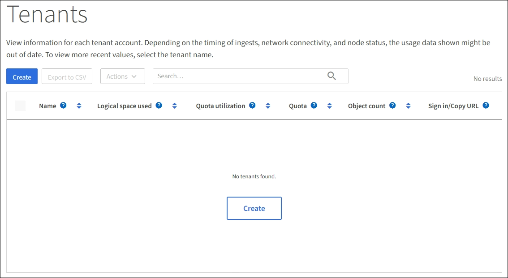

= Create a tenant account
:icons: font
:imagesdir: ../media/

[.lead]
You must create at least one tenant account to control access to the storage in your StorageGRID system.

The Grid Manager provides a wizard that takes you through the steps for creating a tenant account. The steps vary based on whether a xref:using-identity-federation.adoc[federated identity source] is configured and whether the Grid Manager account you use to create the tenant account belongs to an admin group with the Root Access permission.

.What you'll need

* You must be signed in to the Grid Manager using a xref:../admin/web-browser-requirements.adoc[supported web browser].
* You must have specific access permissions.

.Steps

. Select *Tenants*.
+

. Select *Create* and complete step 1 of the wizard as follows:
.. *Name*: Enter a name for the tenant account. Tenant names do not have to be unique. When the tenant account is created, it receives a unique, numeric account ID.
.. *Description* (optional): Enter a description that helps you identify the tenant
.. *Client type*: Select the client type of either *S3* or *Swift*.
.. *Storage quota* (optional): If you want this tenant to have a storage quota, enter a numerical value for the quota and select the correct units (GB, TB, or PB).
. Select *Continue* and complete step 2 of the wizard as follows:
.. Select the permissions for the tenant.
+
* If you are creating an S3 tenant account, select from the following permissions:
** Allow platform services
** Use own identity source (only visible if single sign-on is not being used)
** Allow S3 select
+
* If you are creating a Swift tenant account, select from the following permissions:
** Use own identity source (only visible if single sign-on is not being used)
. Select *Continue* and complete step 3 of the wizard as described in the following steps.
. If xref:configuring-sso.adoc[single sign-on] has been enabled for the StorageGRID system: