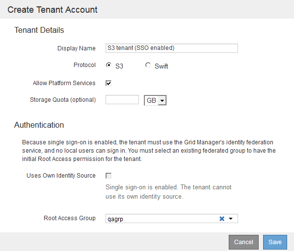

= Create a tenant account
:icons: font
:imagesdir: ../media/

[.lead]
You must create at least one tenant account to control access to the storage in your StorageGRID system.

.What you'll need

* You must be signed in to the Grid Manager using a xref:../admin/web-browser-requirements.adoc[supported web browser].
* You must have specific access permissions.

.Steps

. Select *Tenants*.
+
image::../media/tenant_accounts_page_blank.png[Tenant Accounts Page - Blank]

. Select *Create*.
+
The fields included on the *Create a tenant* page depend on whether single sign-on (SSO) has been enabled for the StorageGRID system.

 ** If SSO is not being used, the page looks like this.
+

 ** If SSO is enabled, the page looks like this.
+

.Related information

xref:using-identity-federation.adoc[Using identity federation]

xref:configuring-sso.adoc[Configuring single sign-on]
