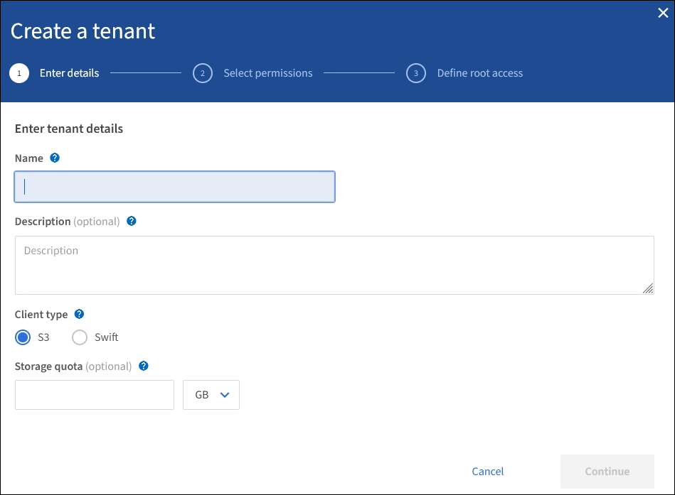
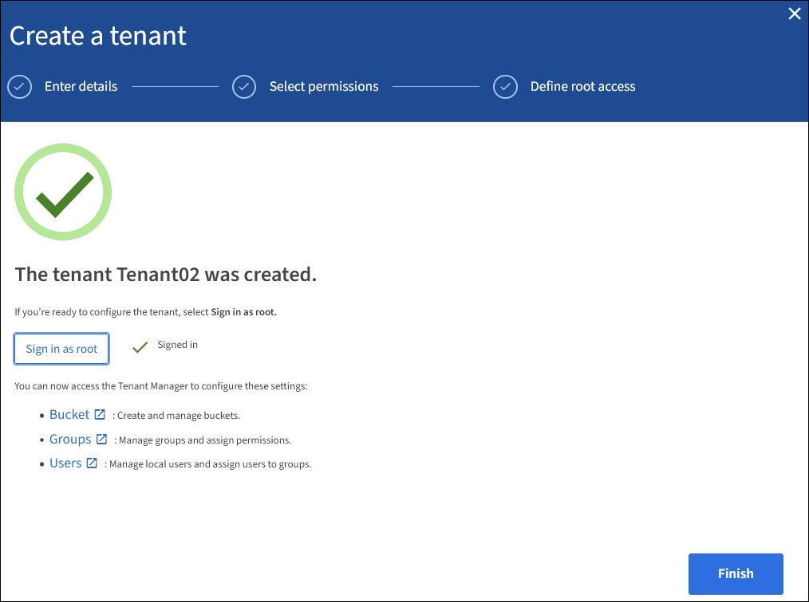

= Create tenant account
:icons: font
:imagesdir: ../media/

[.lead]
You must create at least one tenant account to control access to the storage in your StorageGRID system.

When you create a tenant account, you specify a name, a client protocol, and optionally a storage quota. If single sign-on (SSO) is enabled for StorageGRID, you also specify which federated group has Root access permission to configure the tenant account. If StorageGRID is not using single sign-on, you must also specify whether the tenant account will use its own identity source and configure the initial password for the tenant's local root user.

The Grid Manager provides a wizard that takes you through the steps for creating a tenant account. The steps vary based on whether xref:using-identity-federation.adoc[identity federation] and xref:configuring-sso.adoc[single sign-on] are configured and whether the Grid Manager account you use to create the tenant account belongs to an admin group with the Root access permission.

.What you'll need

* You are signed in to the Grid Manager using a xref:../admin/web-browser-requirements.adoc[supported web browser].
* You have specific access permissions.
* If the tenant account will use the identity source that was configured for the Grid Manager, and you want to grant Root access permission for the tenant account to a federated group, you have imported that federated group into the Grid Manager. You do not need to assign any Grid Manager permissions to this admin group. See the xref:managing-admin-groups.adoc[instructions for managing admin groups].

.Steps

. Select *TENANTS*.
. Select *Create* and enter the following information for the tenant:
.. *Name*: Enter a name for the tenant account. Tenant names do not have to be unique. When the tenant account is created, it receives a unique, numeric account ID.
.. *Description* (optional): Enter a description that helps you identify the tenant.
.. *Client type*: Select the client type of either *S3* or *Swift*.
.. *Storage quota* (optional): If you want this tenant to have a storage quota, enter a numerical value for the quota and select the correct units (GB, TB, or PB).
+

. Select *Continue* and configure the S3 or Swift tenant.

[role="tabbed-block"]
====

.S3 tenant
--

Select the appropriate permissions for the tenant. Some of these permissions have additional requirements. For details, see the online help for each permission.

* Allow platform services
* Use own identity source (selectable only if SSO is not being used)
* Allow S3 select (see xref:manage-s3-select-for-tenant-accounts.adoc[Manage S3 Select for tenant accounts])

--

.Swift tenant
--
If the tenant will use its own identity source, select *Use own identity source* (selectable only if SSO is not being used).

--

====

[start=4]
. Select *Continue* and define root access for the tenant account.

[role="tabbed-block"]
====

.Identity federation not configured
--

.. Enter a password for the local root user.
.. Select *Create tenant*.

--

.SSO enabled 
--

When SSO is enabled for StorageGRID, the tenant must use the identity source that was configured for the Grid Manager. No local users can sign in. You specify which federated group has Root access permission to configure the tenant account.

.. Select an existing federated group from the Grid Manager to have the initial Root access permission for the tenant.
+
NOTE: If you have adequate permissions, the existing federated groups from the Grid Manager are listed when you select the field. Otherwise, enter the group's unique name.

.. Select *Create tenant*.
 
--

.SSO not enabled
--
.. Complete the steps described in the table depending on whether the tenant will manage its own groups and users or use the identity source that was configured for the Grid Manager.
+
[cols="1a,3a" options="header"]
|===
| If the tenant will... | Do this...

|Manage its own groups and users
|
... Select *Use own identity source*.
+
*Note*: If this check box is selected and you want to use identity federation for tenant groups and users, the tenant must configure its own identity source. See the xref:../tenant/index.adoc[instructions for using tenant accounts].
+
... Specify a password for the tenant's local root user, then select *Create tenant*.
... Select *Sign in as root* to configure the tenant, or select *Finish* to configure the tenant later.

|Use the groups and users configured for the Grid Manager
|
... Do either or both of the following:
+
* Select an existing federated group from the Grid Manager that should have the initial Root access permission for the tenant.
+
*Note*: If you have adequate permissions, the existing federated groups from the Grid Manager are listed when you select the field. Otherwise, enter the group's unique name.
+
* Specify a password for the tenant’s local root user.

... Select *Create tenant*.

|===

--

====

[start=5]
. To sign in to the tenant now:
+
* If you are accessing the Grid Manager on a restricted port, select *Restricted* in the Tenant table to learn more about accessing this tenant account.
+
The URL for the Tenant Manager has this format:
+
`https://_FQDN_or_Admin_Node_IP:port_/?accountId=_20-digit-account-id_/`
+
 ** `_FQDN_or_Admin_Node_IP_` is a fully qualified domain name or the IP address of an Admin Node
 ** `_port_` is the tenant-only port
 ** `_20-digit-account-id_` is the tenant's unique account ID

+
* If you are accessing the Grid Manager on port 443 but you did not set a password for the local root user, in the Tenants table of the Grid Manager, select *Sign in*, and enter the credentials for a user in the Root access federated group.
+
* If you are accessing the Grid Manager on port 443 and you set a password for the local root user:

.. Select *Sign in as root* to configure the tenant now.
+
When you sign in, links appear for configuring buckets or containers, identity federation, groups, and users.
+

.. Select the links to configure the tenant account.
+
Each link opens the corresponding page in the Tenant Manager. To complete the page, see the xref:../tenant/index.adoc[instructions for using tenant accounts].

.. Otherwise, select *Finish* to access the tenant later.

. To access the tenant later:
+
[cols="1a,2a" options="header"]
|===
| If you are using...| Do one of these...

|Port 443
|
** From the Grid Manager, select *TENANTS*, and select *Sign in* to the right of the tenant name.
** Enter the tenant's URL in a web browser:
+
`https://_FQDN_or_Admin_Node_IP_/?accountId=_20-digit-account-id_/`
+

*** `_FQDN_or_Admin_Node_IP_` is a fully qualified domain name or the IP address of an Admin Node
*** `_20-digit-account-id_` is the tenant's unique account ID

|A restricted port
|
 ** From the Grid Manager, select *TENANTS*, and select *Restricted*.
 ** Enter the tenant's URL in a web browser:
+
`https://_FQDN_or_Admin_Node_IP:port_/?accountId=_20-digit-account-id_`
+

*** `_FQDN_or_Admin_Node_IP_` is a fully qualified domain name or the IP address of an Admin Node
*** `_port_` is the tenant-only restricted port
*** `_20-digit-account-id_` is the tenant's unique account ID

|===

.Related information

* xref:controlling-access-through-firewalls.adoc[Control access through firewalls]

* xref:manage-platform-services-for-tenants.adoc[Manage platform services for S3 tenant accounts]

