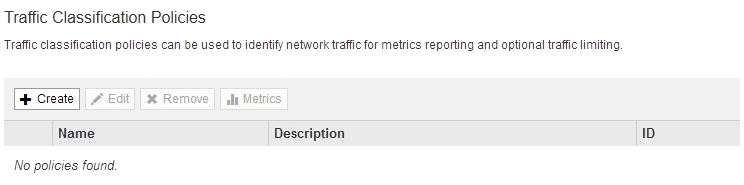
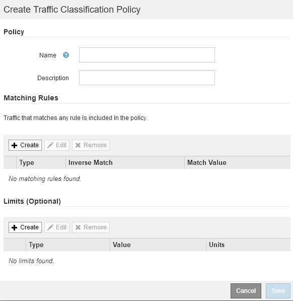
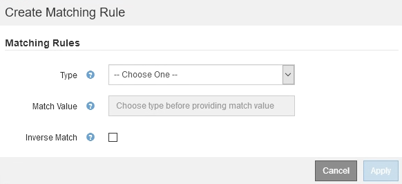
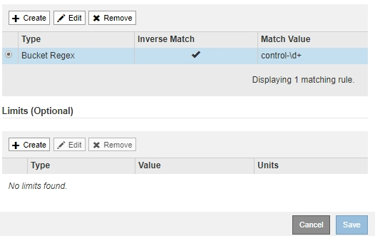
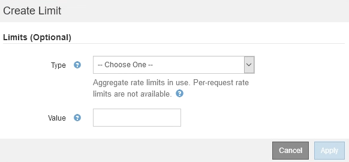
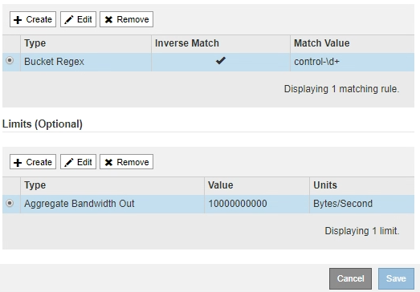
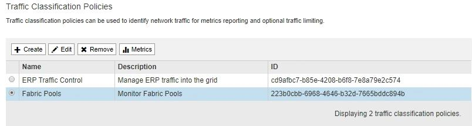

= Create traffic classification policies
:icons: font
:imagesdir: ../media/

[.lead]
You create traffic classification policies if you want to monitor, and optionally limit, network traffic by bucket, tenant, IP subnet, or load balancer endpoint. Optionally, you can set limits for a policy based on bandwidth, the number of concurrent requests, or the request rate.

.What you'll need

* You are signed in to the Grid Manager using a xref:../admin/web-browser-requirements.adoc[supported web browser].
* You have the Root access permission.
* You have created any load balancer endpoints you want to match.
* You have created any tenants you want to match.

.Steps

. Select *CONFIGURATION* > *Network* > *Traffic classification*.
+
The Traffic Classification Policies page appears.
+

. Select *Create*.
+
The Create Traffic Classification Policy dialog box appears.
+

. In the *Name* field, enter a name for the policy.
+
Enter a descriptive name so you can recognize the policy.

. Optionally, add a description for the policy in the *Description* field.
+
For example, describe what this traffic classification policy applies to and what it will limit.

. Create one or more matching rules for the policy.
+
Matching rules control which entities will be affected by this traffic classification policy. For example, select Tenant if you want this policy to apply to the network traffic for a specific tenant. Or select Endpoint if you want this policy to apply to the network traffic on a specific load balancer endpoint.

 .. Select *Create* in the *Matching Rules* section.
+
The Create Matching Rule dialog box appears.
+

 .. From the *Type* drop-down, select the type of entity to be included in the matching rule.
 .. In the *Match Value* field, enter a match value based on the type of entity you chose.
  *** Bucket: Enter a bucket name.
  *** Bucket Regex: Enter a regular expression that will be used to match a set of bucket names.
+
The regular expression is unanchored. Use the {caret} anchor to match at the beginning of the bucket name, and use the $ anchor to match at the end of the name.

  *** CIDR: Enter an IPv4 subnet, in CIDR notation, that matches the desired subnet.
  *** Endpoint: Select an endpoint from the list of existing endpoints. These are the load balancer endpoints you defined on the Load Balancer Endpoints page. See xref:configuring-load-balancer-endpoints.adoc[Configure load balancer endpoints].
  *** Tenant: Select a tenant from the list of existing tenants. Tenant matching is based on the ownership of the bucket being accessed. Anonymous access to a bucket matches the tenant that owns the bucket.
 .. If you want to match all network traffic _except_ traffic consistent with the Type and Match Value just defined, select the *Inverse* check box. Otherwise, leave the check box unselected.
+
For example, if you want this policy to apply to all but one of the load balancer endpoints, specify the load balancer endpoint to be excluded, and select *Inverse*.
+
IMPORTANT: For a policy containing multiple matchers where at least one is an inverse matcher, be careful not to create a policy that matches all requests.

 .. Select *Apply*.
+
The rule is created and is listed in the Matching Rules table.
+

 .. Repeat these steps for each rule you want to create for the policy.
+
NOTE: Traffic that matches any rule is handled by the policy.

. Optionally, create limits for the policy.
+
NOTE: Even if you do not create limits, StorageGRID collects metrics so that you can monitor network traffic that matches the policy.

 .. Select *Create* in the *Limits* section.
+
The Create Limit dialog box appears.
+

 .. From the *Type* drop-down, select the type of limit you want to apply to the policy.
+
In the following list, *In* refers to traffic from S3 or Swift clients to the StorageGRID load balancer, and *Out* refers to traffic from the load balancer to S3 or Swift clients.

  *** Aggregate Bandwidth In
  *** Aggregate Bandwidth Out
  *** Concurrent Read Requests
  *** Concurrent Write Requests
  *** Per-Request Bandwidth In
  *** Per-Request Bandwidth Out
  *** Read Request Rate
  *** Write Requests Rate
+
[NOTE]
====
You can create policies to limit aggregate bandwidth or to limit per-request bandwidth. However, StorageGRID cannot limit both types of bandwidth at the same time. Aggregate bandwidth limits might impose an additional minor performance impact on non-limited traffic.
====
+
For bandwidth limits, StorageGRID applies the policy that best matches the type of limit set. For example, if you have a policy that limits traffic in only one direction, then traffic in the opposite direction will be unlimited, even if there is traffic that matches additional policies that have bandwidth limits. StorageGRID implements "`best`" matches for bandwidth limits in the following order:
+
  **** Exact IP address (/32 mask)
  **** Exact bucket name
  **** Bucket regex
  **** Tenant
  **** Endpoint
  **** Non-exact CIDR matches (not /32)
  **** Inverse matches

 .. In the *Value* field, enter a numerical value for the type of limit you chose.
+
The expected units are shown when you select a limit.

 .. Select *Apply*.
+
The limit is created and is listed in the Limits table.
+

 .. Repeat these steps for each limit you want to add to the policy.
+
For example, if you want to create a 40 Gbps bandwidth limit for an SLA tier, create an Aggregate Bandwidth In limit and an Aggregate Bandwidth Out limit and set each one to 40 Gbps.
+
NOTE: To convert megabytes per second to gigabits per second, multiply by eight. For example, 125 MB/s is equivalent to 1,000 Mbps or 1 Gbps.

. When you are finished creating rules and limits, select *Save*.
+
The policy is saved and is listed in the Traffic Classification Policies table.
+

+
S3 and Swift client traffic is now handled according to the traffic classification policies. You can view traffic charts and verify that the polices are enforcing the traffic limits you expect. See xref:viewing-network-traffic-metrics.adoc[View network traffic metrics].
