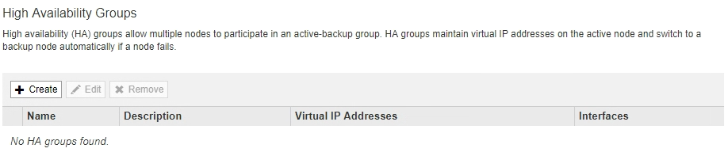
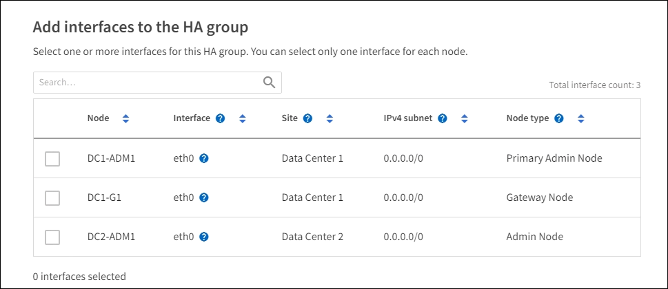
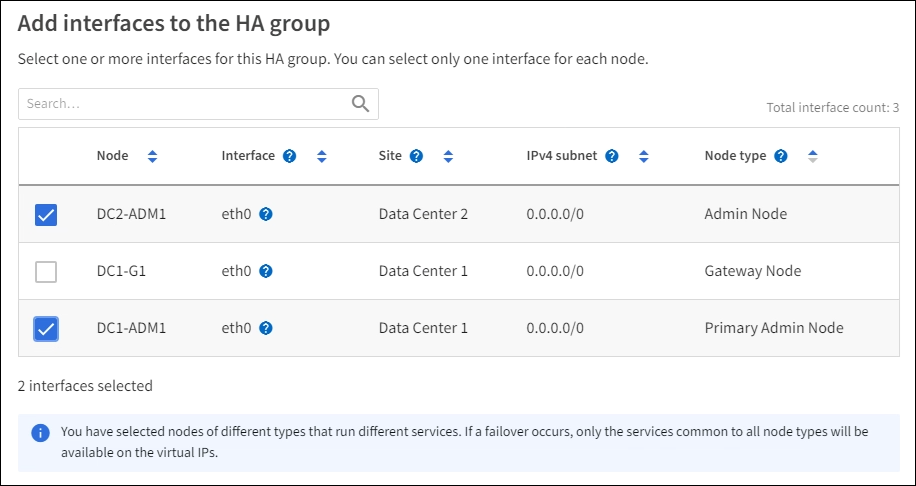
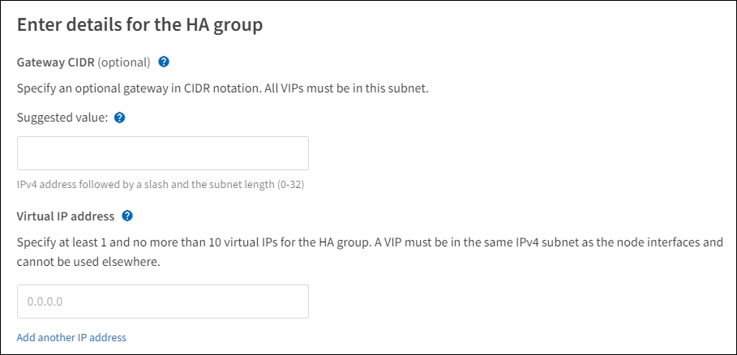

= Creating a high availability group
:icons: font
:imagesdir: ../media/

[.lead]
You can create one or more high availability (HA) groups to provide highly available access to the services on Admin Nodes or Gateway Nodes.

* You must be signed in to the Grid Manager using a supported browser.
* You must have the Root Access permission.

An interface must meet the following conditions to be included in an HA group:

* The interface must be for a Gateway Node or an Admin Node.
* The interface must belong to the Grid Network (eth0) or the Client Network (eth2).
* The interface must be configured with fixed or static IP addressing, not with DHCP.

. Select *Configuration* > *Network Settings* > *High Availability Groups*.
+
The High Availability Groups page appears.
+

. Click *Create*.
+
The Create High Availability Group dialog box appears.

. Type a name and, if desired, a description for the HA group.
. Click *Select Interfaces*.
+
The Add Interfaces to High Availability Group dialog box appears. The table lists eligible nodes, interfaces, and IPv4 subnets.
+

+
An interface does not appear in the list if its IP address is assigned by DHCP.

. In the *Add to HA group* column, select the check box for the interface you want to add to the HA group.
+
Note the following guidelines for selecting interfaces:

 ** You must select at least one interface.
 ** If you select more than one interface, all of the interfaces must be on either the Grid Network (eth0) or on the Client Network (eth2).
 ** All interfaces must be in the same subnet or in subnets with a common prefix.
+
IP addresses will be restricted to the smallest subnet (the one with the largest prefix).

 ** If you select interfaces on different types of nodes, and a failover occurs, only the services common to the selected nodes will be available on the virtual IPs.
  *** Select two or more Admin Nodes for HA protection of the Grid Manager or the Tenant Manager.
  *** Select two or more Admin Nodes, Gateway Nodes, or both for HA protection of the Load Balancer service.
  *** Select two or more Gateway Nodes for HA protection of the CLB service.
+
NOTE: The CLB service is deprecated.

+

. Click *Apply*.
+
The interfaces you selected are listed in the Interfaces section of the Create High Availability Group page. By default, the first interface in the list is selected as the Preferred Master.
+

. If you want a different interface to be the preferred Master, select that interface in the *Preferred Master* column.
+
The preferred Master is the active interface unless a failure occurs that causes the VIP addresses to be reassigned to a Backup interface.
+
NOTE: If the HA group provides access to the Grid Manager, you must select an interface on the primary Admin Node to be the preferred Master. Some maintenance procedures can only be performed from the primary Admin Node.

. In the Virtual IP Addresses section of the page, enter one to 10 virtual IP addresses for the HA group. Click the plus sign (image:../media/icon_plus_sign_black_on_white_old.png[Plus Sign]) to add multiple IP addresses.
+
You must provide at least one IPv4 address. Optionally, you can specify additional IPv4 and IPv6 addresses.
+
IPv4 addresses must be within the IPv4 subnet shared by all of the member interfaces.

. Click *Save*.
+
The HA Group is created, and you can now use the configured virtual IP addresses.

*Related information*

http://docs.netapp.com/sgws-115/topic/com.netapp.doc.sg-install-rhel/home.html[Red Hat Enterprise Linux or CentOS installation]

http://docs.netapp.com/sgws-115/topic/com.netapp.doc.sg-install-vmw/home.html[VMware installation]

http://docs.netapp.com/sgws-115/topic/com.netapp.doc.sg-install-ub/home.html[Ubuntu or Debian installation]

xref:managing_load_balancing.adoc[Managing load balancing]
