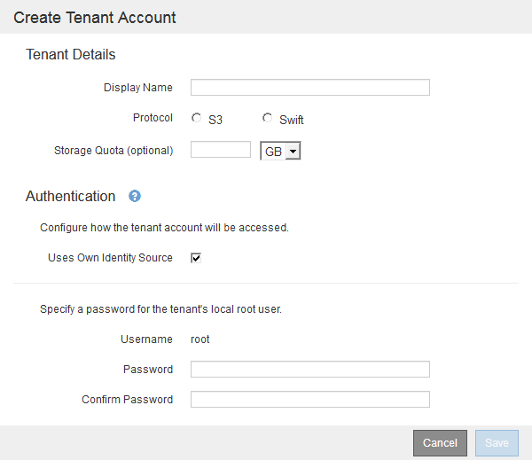

= Creating a tenant account
:icons: font
:imagesdir: ../media/

[.lead]
You must create at least one tenant account to control access to the storage in your StorageGRID system.

* You must be signed in to the Grid Manager using a supported browser.
* You must have specific access permissions.

. Select *Tenants*.
+
The Tenant Accounts page appears and lists any existing tenant accounts.
+
image::../media/tenant_accounts_page_blank.png[Tenant Accounts Page - Blank]

. Select *Create*.
+
The Create Tenant Account page appears. The fields included on the page depend on whether single sign-on (SSO) has been enabled for the StorageGRID system.

 ** If SSO is not being used, the Create Tenant Account page looks like this.
+

 ** If SSO is enabled, the Create Tenant Account page looks like this.
+
image::../media/create_tenant_account_sso.gif[Create Tenant Account SSO enabled]

.Related information

link:using_identity_federation.md#[Configuring identity federation]

xref:configuring_sso.adoc[Configuring single sign-on]
