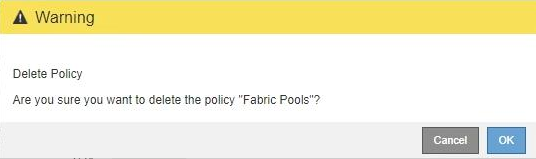

= Delete a traffic classification policy
:icons: font
:imagesdir: ../media/

[.lead]
If you no longer need a traffic classification policy, you can delete it.

.What you'll need

* You must be signed in to the Grid Manager using a xref:../admin/web-browser-requirements.adoc[supported web browser].
* You must have the Root Access permission.

.Steps

. Select *CONFIGURATION* > *Network* > *Traffic classification*.
+
The Traffic Classification Policies page appears, and the existing policies are listed in the table.
+
image::../media/traffic_classification_policies_main_screen_w_examples.png[Traffic Classification Policy Examples]

. Select the radio button to the left of the policy you want to delete.
. Click *Remove*.
+
A Warning dialog box appears.
+

. Click *OK* to confirm that you want to delete the policy.
+
The policy is deleted.
