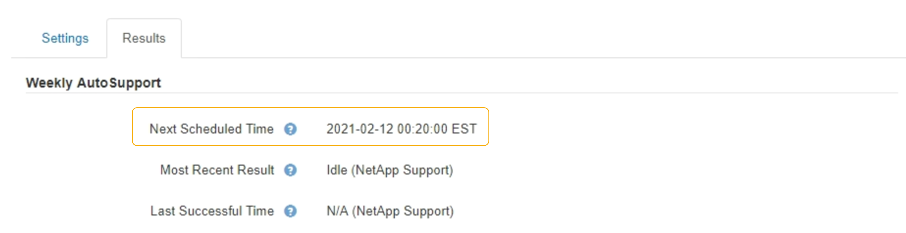
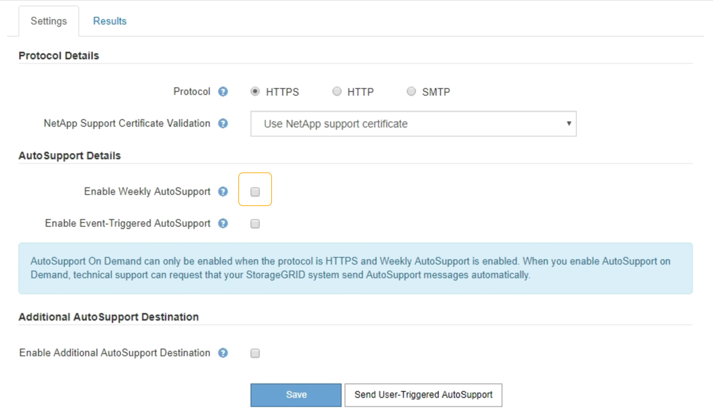

= Disabling weekly AutoSupport messages
:icons: font
:imagesdir: ../media/

[.lead]
By default, the StorageGRID system is configured to send an AutoSupport message to NetApp Support once a week.

.What you'll need

* You must be signed in to the Grid Manager using a supported browser.
* You must have the Root Access or Other Grid Configuration permission.

.About this task

To determine when the weekly AutoSupport message is sent, see the *Next Scheduled Time* under *Weekly AutoSupport* on the *AutoSupport* > *Results* page. 

You can disable the automatic sending of an AutoSupport message at any time.

.Steps

. Select *Support* > *Tools* > *AutoSupport*.
+
The AutoSupport page appears with the *Settings* tab selected.

. Clear the *Enable Weekly AutoSupport* check box.
+

. Select *Save*.
