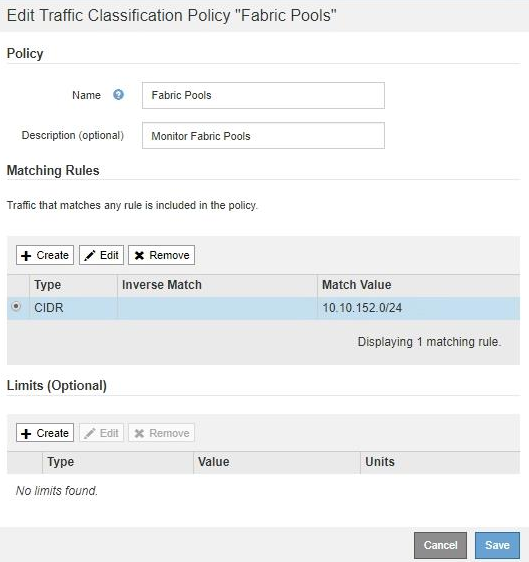

= Edit a traffic classification policy
:icons: font
:imagesdir: ../media/

[.lead]
You can edit a traffic classification policy to change its name or description, or to create, edit, or delete any rules or limits for the policy.

.What you'll need

* You are signed in to the Grid Manager using a xref:../admin/web-browser-requirements.adoc[supported web browser].
* You have the Root access permission.

.Steps

. Select *CONFIGURATION* > *Network* > *Traffic classification*.
+
The Traffic Classification Policies page appears, and the existing policies are listed in the table.
+
image::../media/traffic_classification_policies_main_screen_w_examples.png[Traffic Classification Policy Examples]

. Select the radio button to the left of the policy you want to edit.
. Select *Edit*.
+
The Edit Traffic Classification Policy dialog box appears.
+

. Create, edit, or remove matching rules and limits as needed.
 .. To create a matching rule or limit, select *Create*, and follow the instructions for creating a rule or creating a limit.
 .. To edit a matching rule or limit, select the radio button for the rule or limit, select *Edit* in the *Matching Rules* section or the *Limits* section, and follow the instructions for creating a rule or creating a limit.
 .. To remove a matching rule or limit, select the radio button for the rule or limit, and select *Remove*. Then, select *OK* to confirm that you want to remove the rule or limit.
. When you are finished creating or editing a rule or a limit, select *Apply*.
. When you are finished editing the policy, select *Save*.
+
The changes you made to the policy are saved, and network traffic is now handled according to the traffic classification policies. You can view traffic charts and verify that the polices are enforcing the traffic limits you expect.
