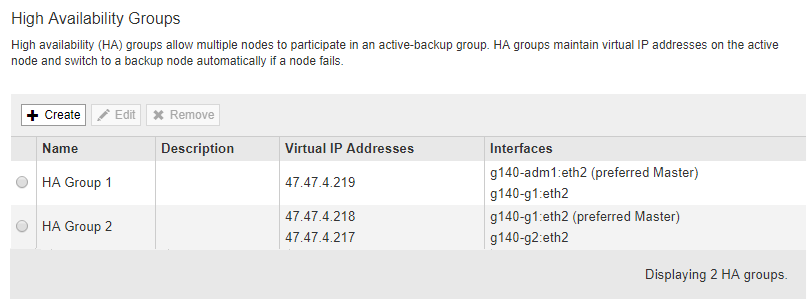
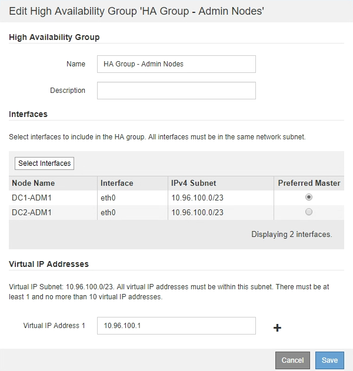

= Editing a high availability group
:icons: font
:imagesdir: ../media/

[.lead]
You can edit a high availability (HA) group to change its name and description, add or remove interfaces, or add or update a virtual IP address.

.What you'll need

* You must be signed in to the Grid Manager using a xref:../admin/web_browser_requirements.adoc[supported web browser].
* You must have the Root Access permission.

.About this task

Some of the reasons for editing an HA group include the following:

* Adding an interface to an existing group. The interface IP address must be within the same subnet as other interfaces already assigned to the group.
* Removing an interface from an HA group. For example, you cannot start a site or node decommission procedure if a node's interface for the Grid Network or the Client Network is used in an HA group.

.Steps

. Select *Configuration* > *Network Settings* > *High Availability Groups*.
+
The High Availability Groups page appears.
+

. Select the HA group you want to edit, and click *Edit*.
+
The Edit High Availability Group dialog box appears.

. Optionally, update the group's name or description.
. Optionally, click *Select Interfaces* to change the interfaces for the HA Group.
+
The Add Interfaces to High Availability Group dialog box appears.
+
image::../media/ha_group_add_interfaces.png[HA Groups Add Interfaces]
+
An interface does not appear in the list if its IP address is assigned by DHCP.

. Select or unselect the check boxes to add or remove interfaces.
+
Note the following guidelines for selecting interfaces:

 ** You must select at least one interface.
 ** If you select more than one interface, all of the interfaces must be on either the Grid Network (eth0) or on the Client Network (eth2).
 ** All interfaces must be in the same subnet or in subnets with a common prefix.
+
IP addresses will be restricted to the smallest subnet (the one with the largest prefix).

 ** If you select interfaces on different types of nodes, and a failover occurs, only the services common to the selected nodes will be available on the virtual IPs.
  *** Select two or more Admin Nodes for HA protection of the Grid Manager or the Tenant Manager.
  *** Select two or more Admin Nodes, Gateway Nodes, or both for HA protection of the Load Balancer service.
  *** Select two or more Gateway Nodes for HA protection of the CLB service.
+
NOTE: The CLB service is deprecated.

. Click *Apply*.
+
The interfaces you selected are listed in the Interfaces section of the page. By default, the first interface in the list is selected as the Preferred Master.
+

. If you want a different interface to be the preferred Master, select that interface in the *Preferred Master* column.
+
The preferred Master is the active interface unless a failure occurs that causes the VIP addresses to be reassigned to a Backup interface.
+
NOTE: If the HA group provides access to the Grid Manager, you must select an interface on the primary Admin Node to be the preferred Master. Some maintenance procedures can only be performed from the primary Admin Node.

. Optionally, update the virtual IP addresses for the HA group.
+
You must provide at least one IPv4 address. Optionally, you can specify additional IPv4 and IPv6 addresses.
+
IPv4 addresses must be within the IPv4 subnet shared by all of the member interfaces.

. Click *Save*.
+
The HA Group is updated.
