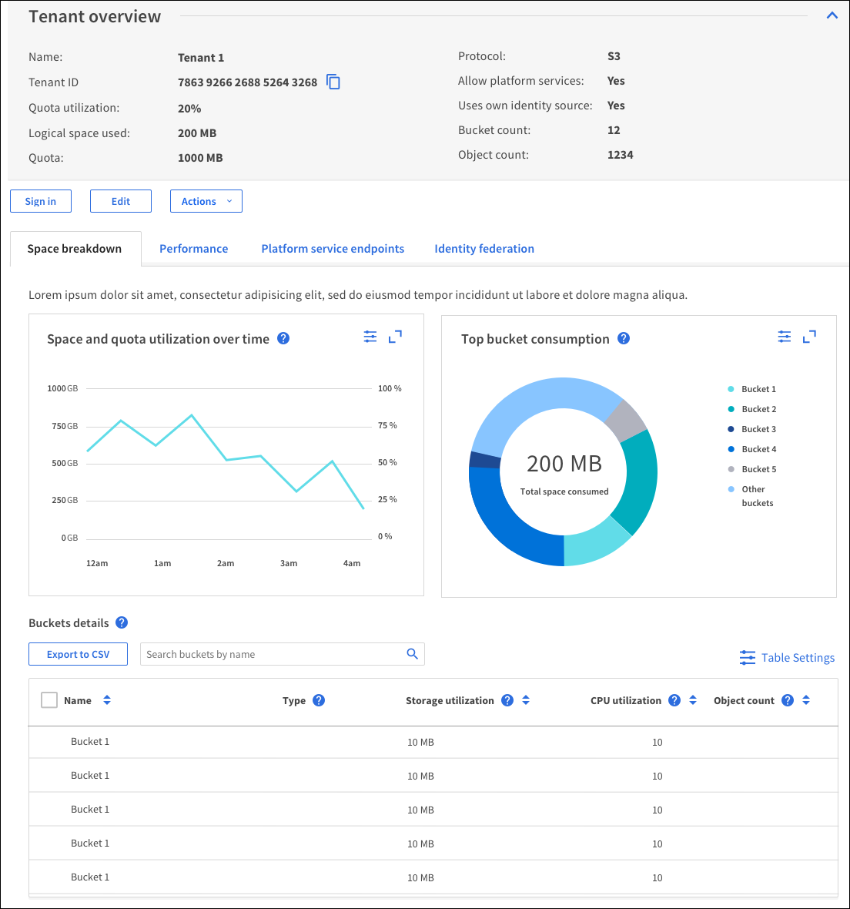

= Editing a tenant account
:icons: font
:imagesdir: ../media/

[.lead]
You can edit a tenant account to change the display name, change the identity source setting, allow or disallow platform services, or enter a storage quota.

* You must be signed in to the Grid Manager using a supported browser.
* You must have specific access permissions.

. Select *Tenants*.
+
The Tenant Accounts page appears and lists all existing tenant accounts.
+
image::../media/tenant_accounts_page.png[Tenant Accounts page]

. Select the tenant account you want to edit.
+
If your system includes more than 20 items, you can specify how many rows are shown on each page at one time. Use the search box to search for a tenant account by display name or tenant ID.

. Select *Edit*.
+
The Edit Tenant Account page appears. This example is for a grid that does not use single sign-on (SSO). This tenant account has not configured its own identity source.
+

. Change the values for the fields as required.
 .. Change the display name for this tenant account.
 .. Change the setting of the *Allow Platform Services* check box to determine whether the tenant account can use platform services for their S3 buckets.
+
IMPORTANT: If you disable platform services for a tenant who is already using them, the services that they have configured for their S3 buckets will stop working. No error message is sent to the tenant. For example, if the tenant has configured CloudMirror replication for an S3 bucket, they can still store objects in the bucket, but copies of those objects will no longer be made in the external S3 bucket that they have configured as an endpoint.

 .. For *Storage Quota*, change the number of maximum number of gigabytes, terabytes, or petabytes available for this tenant's objects, or leave the field blank if you want this tenant to have an unlimited quota.
+
A tenant's storage quota represents a logical amount (object size), not a physical amount (size on disk). ILM copies and erasure coding do not contribute to the amount of quota used.
+
NOTE: To monitor each tenant account's storage usage, select *Usage*. Tenant accounts can also monitor their own usage from the Dashboard in the Tenant Manager or with the Tenant Management API. Note that a tenant's storage usage values might become out of date if nodes are isolated from other nodes in the grid. The totals will be updated when network connectivity is restored.

 .. Change the setting of the *Uses Own Identity Source* check box to determine whether the tenant account will use its own identity source or the identity source that was configured for the Grid Manager.
+
NOTE: If the *Uses Own Identity Source* check box is:

  *** Disabled and checked, the tenant has already enabled its own identity source. A tenant must disable its identity source before it can use the identity source that was configured for the Grid Manager.
  *** Disabled and unchecked, SSO is enabled for the StorageGRID system. The tenant must use the identity source that was configured for the Grid Manager.
. Select *Save*.

.Related information

xref:managing_platform_services_for_s3_tenant_accounts.adoc[Managing platform services for S3 tenant accounts]

http://docs.netapp.com/sgws-115/topic/com.netapp.doc.sg-tenant-admin/home.html[Using tenant accounts]
