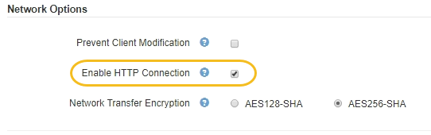

= Enable HTTP for client communications
:icons: font
:imagesdir: ../media/

[.lead]
By default, client applications use the HTTPS network protocol for all connections to Storage Nodes or to the deprecated CLB service on Gateway Nodes. You can optionally enable HTTP for these connections, for example, when testing a non-production grid.

.What you'll need

* You are signed in to the Grid Manager using a xref:../admin/web-browser-requirements.adoc[supported web browser].
* You have specific access permissions.

.About this task

Complete this task only if S3 and Swift clients need to make HTTP connections directly to Storage Nodes or to the deprecated CLB service on Gateway Nodes.

You do not need to complete this task for clients that only use HTTPS connections or for clients that connect to the Load Balancer service (because you can configure each Load Balancer endpoint to use either HTTP or HTTPS). See the information on configuring load balancer endpoints for more information.

See xref:summary-ip-addresses-and-ports-for-client-connections.adoc[Summary: IP addresses and ports for client connections] to learn which ports S3 and Swift clients use when connecting to Storage Nodes or to the deprecated CLB service using HTTP or HTTPS

IMPORTANT: Be careful when enabling HTTP for a production grid because requests will be sent unencrypted.

.Steps

. Select *CONFIGURATION* > *System* > *Grid options*.
. In the Network Options section, select the *Enable HTTP Connection* check box.
+

. Select *Save*.

.Related information

* xref:configuring-load-balancer-endpoints.adoc[Configure load balancer endpoints]

* xref:../s3/index.adoc[Use S3]

* xref:../swift/index.adoc[Use Swift]
